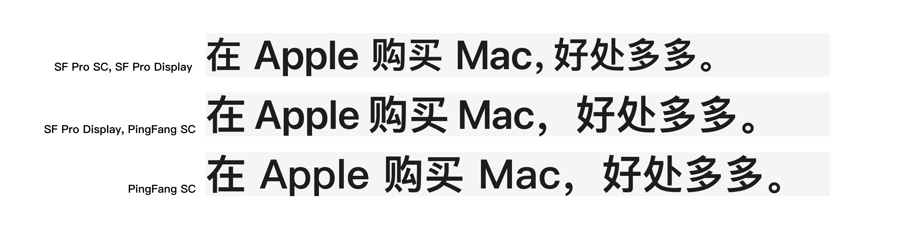

# Apple 官网排版细节鉴赏

## 直观预览

> 文章配图：三种字体栈的显示效果对比（SF Pro SC / 苹方 SC / 系统默认）。全文共 6 张对比图，均来自原博客 img.skywt.net。

## 一句话价值

一篇对 Apple 中国官网排版细节的源码级拆解：定制 SF Pro SC 字体、0.5–0.6 倍标点宽、nowrap 换行保护、标题视觉校正、中西文空距——每个结论都有源码证据，可直接复现。

## AI 选用指南

| 项目 | 选用说明 |
| --- | --- |
| 优先选用条件 | 做中文网页、落地页、官网时需要具体的排版实现方法（字体栈怎么写、标点怎么处理、换行怎么保护、带标点的居中标题怎么做视觉校正）；或想建立一套"中文页面排版验收清单"。 |
| 不适合或暂缓条件 | 只需要选字体、不涉及排版实现时用处有限；文章是鉴赏分析不是手把手教程，部分 CSS 需要从文字描述中自己提炼。 |
| 复用方式 | 套用方法、视觉参考 |
| 输入与产出 | 当前页面的排版问题（中西文混排不协调、标点显宽、词语被换行打断、居中标题视觉偏左）→ 可直接套用的具体做法（字体栈思路、标点宽度倍数、nowrap 保护词、标题标点不占宽、text-autospace / pangu.js）。 |
| 首次读取入口 | [本卡](./Apple官网排版细节鉴赏-2026-10-06.md) →「内容摘要」；原文 https://skywt.cn/blog/apple-typography-details |
| 同类选择依据 | 库内暂无中文排版/字体专项收藏；原文引用的 W3C《中文排版需求》是规范层面的互补阅读（尚未收录，可后续补充）。 |
| 接入前提与待核实项 | SF Pro SC 是 Apple 非公开定制字体，不可直接使用，只能借鉴思路（用苹方 / 系统字体栈模拟）；text-autospace 的浏览器支持度实施前需复核；文章采用 BY-NC 4.0 许可，转载引用需遵守。 |
| 检索词 | 排版 字体 Apple 官网 typography 中文排版 标点 换行 SF Pro 字体栈 text-autospace 盘古之白 视觉校正 |

> 核查记录：整理于 2026-10-06，基于浏览器实地读取原文全文（文章发布于 2026-10-05，作者为博主 SkyWT 本人，许可 BY-NC 4.0，页面标注"非 AI 生成"）。配图为原文 6 张对比图之一（字体栈对比），已存 `_附件/收藏预览/`。各节技术细节（类名、数值、做法）均来自原文，未实测验证 Apple 官网当前源码。

## 内容摘要

作者定期逛 Apple 官网学习其网页实现，本文梳理排版细节（看源码时又发现了新细节）：

1. **定制的 Web 字体**：简体中文官网字体栈首位是一款名为「SF Pro SC」的网络字体，iOS/macOS 未内置也无公开资料。作者推断这是 Apple 为简体中文官网定制的非公开字体：字形与苹方 SC 相同但做过微调，仅含汉字和部分标点；西文 fallback 到 SF Pro Display。可视为"专门为了和 SF Pro 混排而优化的简体中文字体"，两点调整：中文字型更小、全角标点字符宽度更窄。
2. **中文字型更小**：中西文混排时西文看起来偏小（如「在 Apple 购买 Mac」中"买"比 M 高），SF Pro SC 基于苹方 SC 缩小了汉字字型做视觉校正。对比思路：作者博客用的思源宋体是把西文部分调大来实现协调——一个调小汉字、一个调大西文，两种思路都成立。
3. **全角标点字符宽度更窄**：官网标点看似半角，实为在字体层面把全角标点宽度调为字宽的 0.5–0.6 倍，避免大字号标题中分句间视觉空隙过大产生不连贯感（如「在 Apple 购买 Mac，好处多多。」）。
4. **换行控制—避免孤行**：段落末尾单个字成新一行会造成视觉不平衡；Apple 把段落最后一个词用 nowrap 的 span 包裹保护（如环境责任页「碳排放。」）。
5. **换行控制—保护会被换行打断的词语**：教育页「伙伴。」「教育。」「创造。」等词被 nowrap 保护；作者对比三种容器宽度（large 860px / medium 600px / small 330px）下的渲染，确认 Apple 针对每种宽度精确保护了行末会被打断的词。
6. **换行控制—响应式换行**：显式插入如 ` ` 的换行符，仅在 small 尺寸换行（如「想升级，时机正正好。」大中屏一行、小屏两行），配合 s-p / l-p 类处理不同字号的标点。
7. **英文产品名用不换行空格**：所有带空格的产品名在源码中都用 `&nbsp;` 连接（如 iPhone&nbsp;18&nbsp;Pro&nbsp;Max），避免被自动换行打断。
8. **标题居中视觉校正**：全角标点主体居左下角，带标点的标题居中时整体视觉偏左，字号越大越明显。Apple 至少三种校正方式：行末标点用 `position: absolute` 的 span 包裹使其不占计算宽度；标题左侧加 0.5em padding；标点后加 `margin-right: -0.6rem` 的不可见 span（``）。
9. **中文与西文字符间的空距**：引用 W3C《中文排版需求》6.3.3，汉字与西文/数字间用不多于四分之一个汉字宽的字距。Web 平台近两年主流浏览器才普及 `text-autospace: normal`；Apple 官网采用文案中人工加空格（应是内部文案规范），文末推荐 pangu.js。
10. **文案本地化**：为规避政治敏感风险，大陆官网把「9 月 18 日发售」特别处理为「本月 18 日发售」（普通日期不处理），作者评价"做到了变态的地步"。
11. **结论**：世界上没有第二个品牌网站能做到这种程度的排版和本地化细节；这种细节凝聚成 Apple 独一无二的品牌价值，背后是工作人员的职业态度。

## 为什么值得收藏

1. **罕见的中文网页排版一手拆解**：不是泛泛谈"字体很重要"，而是具体到字体栈、标点宽度倍数、nowrap 保护词、标题校正三种做法，每一步都有源码证据（`small`、`center-symbol`、s-p/l-p 等类名）。
2. **可直接复现**：做法都是 CSS/文案层面的，不依赖 Apple 私有资源（SF Pro SC 本体除外，但思路可用系统字体模拟）。
3. **时效性强**：2026-10-05 发布，基于最新 Apple.cn（iPhone 18 Pro / iPhone Duo 时期页面）。
4. **信源干净**：个人博主原创，页面标注"非 AI 生成"，许可 BY-NC 4.0 明确。
5. **对味**：排版细节正是区分"模板感"和"品质感"的地方，和"反 AI 味、要细节"的审美一致；做中文页面时这是一份现成的验收清单。

## 未来可以怎么用

- 做中文落地页/官网时，按这套清单过一遍排版：字体栈 → 标点宽度 → 换行保护 → 标题居中校正 → 中西文空距。
- glint.red 或自己项目的中西文混排：上 `text-autospace: normal` 或 pangu.js。
- 标题带标点居中时的三种视觉校正做法直接套用。
- 作为 Codex 生成中文页面时的排版约束输入（"按 Apple 官网排版细节检查一遍"）。
- 反向做内容：像作者一样定期拆解大厂官网细节，本身就是 X / 小红书的设计类内容选题。

## 原始内容 / 链接

- 原文：https://skywt.cn/blog/apple-typography-details
- 标题：Apple 官网排版细节鉴赏；作者：SkyWT（博主本人）；发布：2026-10-05；许可：BY-NC 4.0；标注非 AI 生成。
- 配图 6 张（alt）：三种字体栈的显示效果对比 / Source Serif 系列字体栈对比 / 官网版本与去除换行保护版本的对比 / 未进行视觉校正的标题 / 进行了视觉校正的标题 / iPhone 18 Pro 的发售日期文案。已保存第 1 张作预览，其余见原文。
- 文中引用的外部页面（Apple 官网环境责任/教育/Apple Pay/隐私/iPhone Duo 页面、9 月 16 日网页存档）未点击验证。
- 未登录、无付费墙；X 原帖等社交媒体内容未涉及。

## 相关联想

- W3C《中文排版需求》6.3.3（被原文引用，尚未收录，可后续补充为规范层面的互补阅读）。
- pangu.js（"盤古之白"）：中西文之间自动加空格的 JS 库，文末有笑话典故。
- 和库里「品牌设计上下文参考库：brands-design-md」互补：一个管"字怎么排"，一个管"视觉语言怎么定"。
- 和「Vibe Coding 视觉词典」同属"做页面前先查"的参考系：一个管结构布局，一个管排版细节。

## 适合反向调用的场景

- 中文页面排版总觉得"差点意思"，有哪些可以照着改的具体细节？
- 中西文混排不协调、标点显宽、标题居中偏左，有什么现成的处理方法？
- 有没有大厂官网级别的中文排版检查清单？
