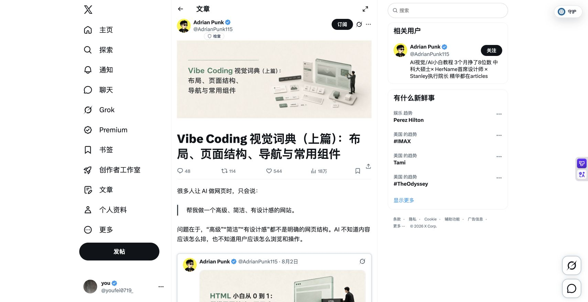

# Vibe Coding 视觉词典：布局、结构、导航与组件

## 直观预览



> X 原帖首屏截图。原文通过 40 个界面术语和示例提示词，将模糊审美要求转换为明确的结构与交互决策。

> [!summary] 一句话价值
> 将“高级、简洁、有设计感”拆成页面布局、内容结构、导航和交互组件四层可执行决策，是写 AI 前端需求前很实用的中文词典与教程。

## 内容摘要

Adrian Punk 的《Vibe Coding 视觉词典（上篇）》把网页设计拆为四层：

| 层级 | 要回答的问题 | 内容 |
| --- | --- | --- |
| 页面布局 Layout | 内容怎样占据屏幕？ | 卡片、瀑布流、Bento、分屏、Grid、侧边栏等 |
| 页面结构 Page Structure | 用户先看什么、如何读完整页？ | 单页、多页、落地页、案例页、Hero、FAQ、Footer 等 |
| 导航 Navigation | 用户怎样移动、切换和返回？ | 固定导航、汉堡菜单、面包屑、锚点、Tabs、分页等 |
| 组件 UI Components | 点击、输入、展开和反馈怎样发生？ | Modal、Drawer、Accordion、Toast、Form、Lightbox 等 |

原帖共有 40 个词条，每个词条说明概念、适用场景并给出 prompt。真正值得复用的不是逐项照抄，而是每次做页面前先把四层选择写清，避免让 AI 用默认卡片网格和无目的动效填满页面。

## 详细复用教程

### 1. 先写设计 Brief，再选择术语

不要从“帮我做一个漂亮网站”开始。先补全下列 7 行，后续每个决策都以它为约束：

```text
目标：页面希望用户完成什么唯一关键动作？
受众：谁在什么场景、用什么设备访问？
内容：核心信息有几类、每类大约多少条？
层级：哪件事必须在首屏出现？
页面类型：单一转化页、内容站、作品集、工具后台，还是项目详情？
品牌气质：克制 / 编辑感 / 工具感 / 活泼；分别要避免什么？
约束：技术栈、断点、可访问性、性能、已有组件库。
```

例如 glint.red 的产品功能页：`目标是预约演示；受众为设计和产品负责人；首屏先说明问题与产品价值；案例有 3 个；桌面优先但手机可读；使用已有组件；不使用夸张渐变或无意义轮播。`

### 2. 按“结构 -> 布局 -> 导航 -> 组件”的顺序做决策

1. **先选页面结构**：内容少且只有一个目标，用 Landing Page；项目需要讲过程，用 Case Study；长期更新，用 Multi-page Website。
2. **再选布局**：内容同级且要扫描，用 Card-based Layout；主次差异大，用 Bento Grid；图像比例不统一，用 Masonry。
3. **再选导航**：入口少用 Sticky Navbar 或 Anchor Link；层级深才用 Sidebar 或 Breadcrumb；手机端先保证可达，再追求动画。
4. **最后选组件**：每个组件必须对应用户任务。必须打断操作才用 Modal；保留上下文看详情用 Drawer；保存结果用 Toast。
5. **把质量约束写进 prompt**：断点、键盘支持、焦点、`prefers-reduced-motion`、图片尺寸、空状态都是硬要求，不是附注。

### 3. 40 个术语速查与选型边界

#### 页面布局 Layout

| 术语 | 何时选用 | 不适合 |
| --- | --- | --- |
| Card-based Layout | 多个同层级项目、文章、商品要快速扫描 | 强叙事或主次极明显的首页 |
| Masonry Layout | 图片或作品封面高度不同，要保留原比例 | 严格行列对齐的数据列表 |
| Bento Grid | 首页要同时露出主项目、能力、状态和入口 | 所有格子同样重要的内容 |
| Split-screen Layout | 首屏要同时承载文字价值和视觉演示 | 手机端无法重新编排的场景 |
| CSS Grid Layout | 存在二维主从关系、杂志排版或 Dashboard | 只需一行元素对齐的局部布局 |
| Flexbox | 导航、按钮组、标签、卡片内部的一维对齐 | 整页复杂二维排布 |
| Sidebar Layout | 文档、后台、筛选或文章目录需长期可见 | 移动端信息很少的简单页面 |
| Dashboard Layout | 高频任务、指标、表格和活动记录并存 | 品牌故事或单一转化页 |
| Responsive Layout | 所有公开页面必须具备的多状态布局 | 只把桌面整体等比缩小 |
| Full-bleed Layout | 沉浸式首屏或章节节奏切换 | 正文对比度无法保证时 |

#### 页面结构 Page Structure

| 术语 | 何时选用 | 关键提醒 |
| --- | --- | --- |
| Single-page Website | 内容少、目标单一、适合连续讲述 | 用锚点与语义化 section，不要做假多页 |
| Multi-page Website | 内容长期增长、项目或文章详情独立 | Header、Footer、活跃导航必须一致 |
| Landing Page | 预约、注册、购买、下载等单一转化 | CTA 文案和行动统一，减少岔路 |
| Case Study Page | 需要证明过程与决策，不只是晒结果 | 讲清背景、职责、过程、结果与复盘 |
| Hero Section | 首页第一屏解释身份、价值、下一步 | 先给真实产品/作品信号，不要空泛大标题 |
| Feature Grid | 并列卖点解释产品能力 | 说明用户得到的结果，不只列功能名 |
| Sticky Storytelling | 长页面逐步解释同一主题 | 不能只为炫技，移动端有正常阅读顺序 |
| Timeline | 有明确先后顺序的历程、流程、版本 | 无时间关系的并列信息 |
| FAQ Section | 用户反复问相同疑虑或规则 | 用真实问题，答案保持可扫描 |
| Footer | 补充导航、联系、法律和收尾 CTA | 关键转化入口不能只放页脚 |

#### 导航与切换 Navigation

| 术语 | 何时选用 | 关键提醒 |
| --- | --- | --- |
| Sticky Navbar | 长页面或多区块要随时跳转 | 预留锚点滚动偏移，避免遮挡 |
| Hamburger Menu | 移动端收纳低频导航 | 可关闭、可键盘操作、焦点不丢失 |
| Breadcrumb | 内容层级深、用户需要返回上级 | 不用于只有一级的普通落地页 |
| Anchor Link | 单页内跳转固定区块 | 支持 reduced motion，标记当前区块 |
| Tabs | 同一层级的视图切换 | 使用 `tablist`、`tab`、`tabpanel` 和方向键 |
| Sidebar Navigation | 后台、文档、设置等入口多且层级深 | 手机端转 Drawer 或折叠入口 |
| Mega Menu | 产品矩阵或资源中心分类多 | 点击打开，不依赖 hover；支持 Esc |
| Bottom Navigation | 移动端高频切换 3-5 个核心入口 | 考虑安全区域，桌面端通常不显示 |
| Pagination | 大量列表要稳定 URL 和回退 | 用真实链接或 URL 参数，不只靠前端状态 |
| Back to Top | 长文章、案例或文档 | 不抢主操作；处理焦点与 reduced motion |

#### 常用组件 UI Components

| 术语 | 应解决的任务 | 最小实现要求 |
| --- | --- | --- |
| Modal | 必须先处理或确认的任务 | 原生 `dialog`；焦点陷阱、Esc、关闭后焦点返回 |
| Drawer | 查看详情、筛选或移动导航，保留上下文 | 背景不可误操作；移动端可由底部弹出 |
| Accordion | FAQ、移动菜单、分组筛选 | 触发器用 `button`，更新 `aria-expanded` |
| Tooltip | 补充图标或术语的短说明 | keyboard focus 同样可见；不承载关键内容 |
| Toast | 保存、复制等非阻断反馈 | `aria-live`；错误信息不要过快消失 |
| Carousel | 有限位置展示精选项目或截图 | 默认不自动播放；支持暂停、键盘和触摸 |
| Lightbox | 放大查看作品图或截图 | Esc 关闭、锁定背景滚动、准确 alt 文本 |
| Form | 联系、订阅、搜索、设置 | 可见 label、错误状态、loading 和成功反馈 |
| Command Palette | 效率工具或复杂站点的键盘跳转 | `Cmd/Ctrl + K`、上下选择、Enter、Esc |
| Floating Action Button | 移动端或后台唯一主要创建动作 | 不遮挡底部导航，避开安全区域 |

### 4. 可直接复用的 AI 提示词骨架

先替换方括号内容，再提交给 coding agent；不需要的组件直接删除。

```text
请为[产品/项目]实现一个[单页 / 多页 / Dashboard / 案例研究]网站。

目标与受众：
- 唯一关键行动：[注册 / 预约 / 阅读 / 创建]
- 目标用户：[用户是谁、访问场景]
- 首屏必须回答：[是什么]、[核心价值]、[下一步行动]

页面结构：
- 顺序：[Hero -> 价值证明 -> 功能/案例 -> FAQ -> CTA -> Footer]
- 选择 [Landing Page / Case Study / Multi-page]，原因是[内容与目标]。

布局：
- 使用 [Bento Grid / Card-based Layout / CSS Grid] 展示[内容]。
- 桌面：[列数或比例]；768px 以下：[布局变化]；640px 以下：[布局变化]。
- [保留图片原比例 / 不使用等高卡片 / 不使用绝对定位拼主布局]。

导航与组件：
- 使用 [Sticky Navbar / Anchor Link / Sidebar]；移动端使用[Hamburger/Drawer]。
- 仅实现这些组件：[Form、Accordion、Toast]，每个组件的触发条件是[说明]。

质量约束：
- 语义化 HTML、CSS Grid/Flexbox；键盘可达且焦点可见。
- 动画尊重 `prefers-reduced-motion`；图片提供 `width`、`height`、`alt`，非首屏图片 lazy-load。
- 不使用无意义轮播、自动播放媒体、超大装饰性渐变或营销式空洞文案。
```

### 5. 两个可直接执行的组合

**产品落地页**：`Landing Page + Split-screen Hero + Feature Grid + Sticky Navbar + FAQ + Form/Toast`。让首屏、价值证明、案例、FAQ 和最终 CTA 都服务于一个转化目标。

**内容型个人作品集**：`Multi-page Website + Card-based Layout + Case Study + Breadcrumb + Pagination + Lightbox`。让作品列表可扫描、每个项目可讲过程、文章与项目都能长期增长。

### 6. 实现后的验收清单

- 首屏 5 秒内看出页面目标、对象和下一步行动。
- 每块内容有明确层级；没有为填满页面而重复卡片。
- 在 1440px、768px、390px 下检查布局状态，不出现横向滚动。
- 键盘可走到导航、Tabs、Modal、表单和关闭按钮；焦点可见。
- Modal/Drawer/Carousel/Toast 有关闭、错误或空状态；动画尊重 reduced motion。
- 图片和首屏资源不拖慢加载；正文、按钮和背景有足够对比度。
- 最后让 AI 按四层自检：结构、布局、导航、组件是否各自承担了正确职责。

## 为什么值得收藏

1. 将审美形容词翻译为可验证 UI 决策，适合在调用 Codex、Cursor 或 Claude Code 前澄清需求。
2. 四层框架避免常见错误：先选卡片样式，最后才发现内容结构和导航根本不成立。
3. 原帖同时强调响应式、语义、键盘操作、焦点、`prefers-reduced-motion` 和图片加载，教程不只停在视觉表面。
4. 与 [[UI元素命名视觉词典-NameThatUI-2026-07-18]] 互补：NameThatUI 负责给单个组件命名，本卡负责把整个页面组织为能工作的体验。

## 未来可以怎么用

1. 新开前端任务时，先复制「7 行 Brief」和「AI 提示词骨架」，再要求 Agent 给出选型理由。
2. 评审页面时按四层打标签：问题究竟在结构、布局、导航还是组件，避免笼统地说“不够高级”。
3. 为 glint.red 建立内容页、转化页、项目详情页和工具后台的固定结构与导航组合。
4. 与 [[设计工程AI技能库-emilkowalski-Skills-2026-07-02]] 一起使用：本卡负责选型与描述，后者负责实现后的质感、动效和可访问性审查。

## 原始内容 / 链接

- 原帖：[Vibe Coding 视觉词典（上篇）：布局、页面结构、导航与常用组件](https://x.com/AdrianPunk115/status/2084538166577602899?s=20)
- 作者：Adrian Punk（[@AdrianPunk115](https://x.com/AdrianPunk115)）
- 发布时间：`2026-08-04 15:13`（X 页面显示）
- 收录时页面数据：48 回复、114 转帖、544 喜欢、1,291 书签、181,913 次观看；这些数字会随时间变化。
- 本地预览：`Vibe-Coding视觉词典-Adrian-Punk-2026-08-05.png`，1710 x 880。

## 相关联想

1. 可以将 40 个词条做成项目启动问卷：选目标、内容量和设备，再选结构、布局、导航与组件，最后自动生成带禁止项和验收标准的前端 brief。
2. 可为 Vault 增加“页面模式”索引，把落地页、Dashboard、作品集、文档站按结构而不是按网站来源聚合。
3. 对 AI 前端协作而言，视觉语言不该只是一段风格形容词，还应包含禁止项、断点、组件边界和验收项。

## 适合反向调用的场景

- 我想做一个落地页，应该如何选择页面结构、布局和导航？
- 帮我把模糊的 AI 前端需求改成可执行的提示词。
- Modal、Drawer、Tooltip、Toast 分别在什么时候用？
- 帮我评审一个页面，到底是信息架构、布局还是组件选型有问题？
- 给 glint.red 设计一个响应式产品页，并遵守可访问性和性能约束。
