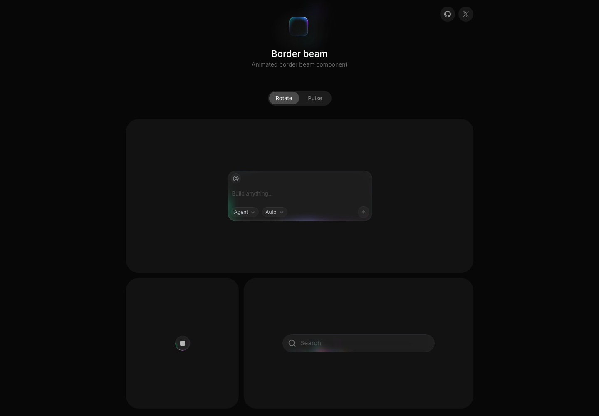

# React 发光边框动效组件：Border Beam

## 直观预览

> Border Beam 官网首屏截图，直观看它的发光边框 CTA / 卡片强调效果。

## 一句话价值

一个轻量 React 发光边框光束组件，适合给按钮、卡片、定价模块和 CTA 增加局部高亮与流动感。

## AI 选用指南

| 项目 | 选用说明 |
| --- | --- |
| 优先选用条件 | 已有按钮或卡片，只需要沿边框移动的光束强调主 CTA、选中项或方案卡。 |
| 不适合或暂缓条件 | 需要完整表单、导航系统或全屏背景时不选；阅读密集区不默认加持续高亮。 |
| 复用方式 | 视觉参考 |
| 输入与产出 | 目标组件、强调状态、颜色与节奏 → 边框效果规格及待验证实现。 |
| 首次读取入口 | [本卡](./React发光边框动效组件-Border-Beam-2026-07-07.md) →「直观预览」 |
| 同类选择依据 | Border Beam 解决边框强调；收藏按钮卡提供局部代码；Paper Shaders 用于背景与图像效果。 对照：[收藏按钮流光高亮效果](../收藏按钮流光高亮效果-2026-07-02.md)、[零依赖着色器效果库：Paper Shaders](../../04-工具网站/在线工具/零依赖着色器效果库-Paper-Shaders-2026-07-03.md)。 |
| 接入前提与待核实项 | 原卡没有保存可安装源码或确认版本；先从官网获取实现与许可，再决定复制源码或自行实现。 |
| 检索词 | Border Beam 发光边框 环绕光束 CTA 卡片强调 |

> 选用说明整理于 2026-09-20：适用与比较为基于收藏证据的建议；正文中的版本、数量、价格与功能范围按原收录时间理解。本次未安装或运行所收藏的工具，当前环境安装状态另查。未对外部来源作全量实时复核。

## 内容摘要

Border Beam 是 Jakub Antalik 做的 React 动效组件页面，页面标题为 `Border Beam – Animated border beam component for React`。官网描述它是一个轻量 React 组件，用来渲染 animated glowing border beam effect，并支持多种尺寸、颜色变体和主题。

这个素材的核心价值在于“低侵入式强调”：不改变组件结构，只在边框层增加一条移动的发光光束，让卡片、按钮或输入框获得更强的焦点感。它适合放在需要引导用户点击、强调高级功能、突出当前选中状态或展示科技感的界面里。

## 为什么值得收藏

1. 发光边框是常见但容易做俗的效果，这个组件把效果控制在边框范围内，比较适合产品界面使用。
2. React 组件形式便于直接迁移或复刻，不只是静态灵感图。
3. 可用于按钮、卡片、pricing plan、上传框、登录入口、命令面板等多个高频 UI 场景。
4. 对 glint.red 这类需要局部质感和 CTA 记忆点的页面有直接参考价值。

## 未来可以怎么用

- 给主 CTA 按钮加一层低频流动边框，强化“可点击”和“推荐操作”。
- 给重点卡片或 Pro 方案卡做环绕光束，作为定价页视觉差异。
- 给 AI 工具、命令面板、上传区域做聚焦态边框，提升科技感但不干扰内容阅读。
- 复刻成自己的 `BorderBeam` 组件，并抽出 `duration`、`color`、`size`、`borderRadius` 等配置。
- 和 Dynamic Island Header、收藏按钮流光效果一起整理成“小面积动效组件库”。

## 原始内容 / 链接

- 链接：https://beam.jakubantalik.com/
- 来源平台：Border Beam 官网
- 作者或账号：Jakub Antalik
- 页面标题：Border Beam – Animated border beam component for React
- 页面描述：A lightweight React component that renders an animated glowing border beam effect. Supports multiple sizes, color variants, and themes.

## 相关联想

- 可归入“边框动效 / CTA 高亮 / 卡片强调”三个复用方向。
- 后续可以继续收集一组局部强调动效：发光边框、流光按钮、悬浮 Header、粒子反馈。
- 如果要做组件实现，优先用 CSS motion path、mask、伪元素或 Framer Motion，避免用过重的 canvas/WebGL。

## 适合反向调用的场景

- 有没有适合按钮或卡片的发光边框动效？
- React 页面想加一个轻量高级感边框效果。
- glint.red 的 CTA 或重点功能卡片怎么做得更醒目？
- 想整理一组可复用的小面积 UI 动效组件。
