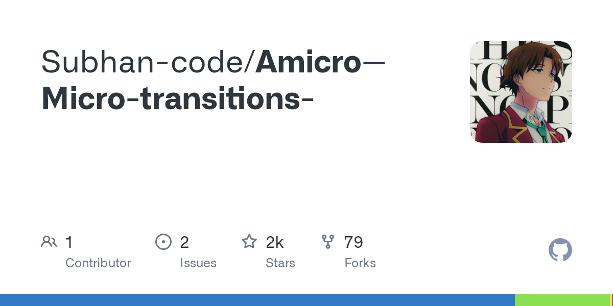

# React 微交互与过渡组件库：Amicro

## 直观预览

> Amicro GitHub OG 预览图；另保留项目 logo、官网 HTML、README、registry、许可证和源码 zip 快照。

## 一句话价值

一个基于 Motion 的 React 微交互、过渡动画和卡片布局开源组件库，支持 CLI 或 shadcn registry 按需把源码复制进项目。

## 内容摘要

Amicro（npm 包 `@subhanhq/amicro`）把常见的入场、悬停、文字、光标、加载和卡片编排效果整理成可直接接入的 TSX 组件。官网描述其轻量、可 tree-shake，并支持一条 CLI 命令添加组件；仓库 README 则提供 npm、Yarn、pnpm 安装方式，以及 `init` / `add` 命令。

它的差异点不只是动画展示，而是 copy-to-code：组件源码进入当前代码库，便于继续改样式、时长、弹簧参数和业务状态。registry 中同时包含 Fade、Slide、Zoom、Magnetic Button、Tilt Card、Text Reveal、滚动进度和 reduced-motion 等组件、hooks 与 presets。

卡片布局是项目的特色集合，包括 ARC、Long ARC、Linear Spread、Corner Fan、Stamp Arc、Cascade Stagger、Scatter Desk Deal、Wheel Radial Fan、Interactive Carousel、CoverFlow 和 Time Machine Stack，适合把多张内容卡组织成具有空间感的展示结构。

## 为什么值得收藏

1. 把“微交互灵感”变成可以复制、改造和纳入项目版本控制的源码，而不是只能截图参考。
2. 与 Motion、Tailwind CSS、React 18/19 和 shadcn/ui 生态衔接，适合现有前端工作流。
3. 组件覆盖从基础状态反馈到卡片编排，能为落地页、作品集、AI 工具和产品后台提供局部质感。
4. MIT 许可证降低了研究和二次开发门槛，但仍应在实际发布前检查依赖及各文件许可证。

## 未来可以怎么用

- 用 `fade-in`、`fade-up`、`text-reveal` 做页面首屏和分段内容的克制入场。
- 用 `magnetic-button`、`tilt-card` 或 `card-hover` 强化一个关键 CTA 或重点卡片，不要让全站每个元素都动。
- 用 ARC、CoverFlow、Time Machine Stack 做作品集、案例库、截图集或产品能力展示。
- 将 `use-scroll-progress`、`use-reduced-motion` 与页面滚动、长任务状态和无障碍回退组合成统一动效契约。
- 先用 registry 试装一个组件，再根据业务语义重命名、限制触发范围、补键盘操作和 `prefers-reduced-motion` 回退。

## 原始内容 / 链接

- 官网：[https://amicro.vercel.app/](https://amicro.vercel.app/)
- GitHub：[https://github.com/Subhan-code/Amicro--Micro-transitions-](https://github.com/Subhan-code/Amicro--Micro-transitions-)
- npm：[https://www.npmjs.com/package/@subhanhq/amicro](https://www.npmjs.com/package/@subhanhq/amicro)
- 典型 CLI：`npx @subhanhq/amicro@latest init`、`npx @subhanhq/amicro@latest add download-button`
- shadcn registry 示例：`npx shadcn add @amicro/fade-in`、`npx shadcn add @amicro/magnetic-button`
- 当前核验仓库 HEAD：`07adc1640084940f045875e2bb1b682c90f30c3c`
- 本地预览：`_附件/收藏预览/Amicro-2026-08-23-og.png`、`_附件/收藏预览/Amicro-2026-08-23.jpg`
- 本地快照：`_附件/网页快照/Amicro-2026-08-23/`

## 相关联想

- 与 [网页动画库：Motion](网页动画库-Motion-2026-08-22.md) 的关系：Motion 是底层动画引擎，Amicro 是面向具体 UI 场景的可复制组件与编排示例。
- 与 [shadcn 动画 React 组件库：SmoothUI](../组件/Shadcn动画React组件库-SmoothUI-2026-08-22.md) 组合时，可分别承担更广的动效原语与更完整的区块参考。
- 与 [生成式 UI 加载动效 React 组件库：Generative Loaders](生成式UI加载动效React组件库-Generative-Loaders-2026-08-10.md) 组合，可把 loading、processing、success 和 error 状态做成连续反馈。

## 适合反向调用的场景

- 我需要给 React / Next.js / Vite 页面添加一个可控的微交互或过渡组件。
- 我需要作品集、落地页或产品展示中的弧形卡片、3D 卡片堆和 carousel 参考。
- 我想让 Codex 按“触发状态、动效目的、持续时间、reduced-motion 回退、禁用位置”生成前端动效 brief。
- 我需要一个 MIT、源码可复制、支持 CLI 和 shadcn registry 的 React 动效候选库。
