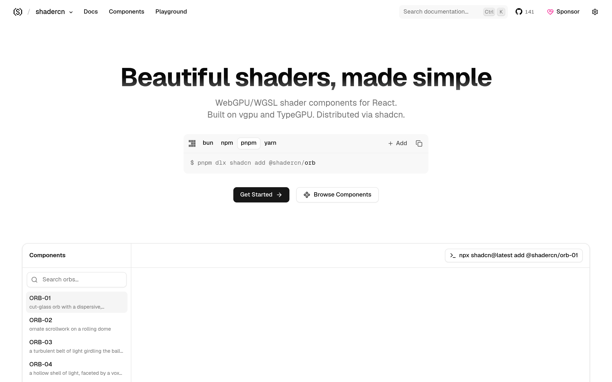

# React 着色器组件库：shadercn

## 直观预览

> shadercn 官网首页（1440×900）："Beautiful shaders, made simple"——WebGPU/WGSL 着色器 React 组件，基于 vgpu 与 TypeGPU，走 shadcn registry 分发。

## 一句话价值

把 WebGPU/WGSL 着色器做成 React 组件，走 shadcn registry 一条命令接入（`pnpm dlx shadcn add @shadercn/orb`）——"shadcn，但 for shaders"。

## AI 选用指南

| 项目 | 选用说明 |
| --- | --- |
| 优先选用条件 | React 项目想要高质量着色器视觉（光球、流体、扭曲背景），且团队已在用 shadcn 生态；想要 WebGPU 而非传统 GLSL 方案。 |
| 不适合或暂缓条件 | 非 React 项目不适合；目标用户有大量旧设备（WebGPU 兼容性）时暂缓；只需要静态背景时杀鸡用牛刀。 |
| 复用方式 | 安装依赖（shadcn registry）、视觉参考 |
| 输入与产出 | 一条 shadcn add 命令 → 可直接用的着色器 React 组件（含 ORB-01 切面光球、ORB-02 滚动穹顶纹饰等）。 |
| 首次读取入口 | [本卡](./React着色器组件库-shadercn-2026-10-07.md) →「内容摘要」；官网 https://shadercn.run（含 Docs / Components / Playground）。 |
| 同类选择依据 | 库内已有 [Paper Shaders](../../04-工具网站/在线工具/零依赖着色器效果库-Paper-Shaders-2026-07-03.md)：要零依赖片段/GLSL、图像滤镜和 Logo 动画，用 Paper Shaders；要 React 组件化、WebGPU 新管线，用 shadercn。两者互补不重复。 |
| 接入前提与待核实项 | MIT；需 WebGPU 可用环境；未在本机安装/运行验证，组件数量与质量以官网为准。 |
| 检索词 | shadercn shader React 组件 WebGPU WGSL shadcn 着色器 ORB 光球 |

> 核查记录：整理于 2026-10-07，基于官网首页 + GitHub（shadcn-labs/shadercn，2026-08-28 创建，收录时 144 stars，TypeScript，MIT，作者 Aniket Pawar）。官网提供 llms.txt 与 agent skill（/.well-known/agent-skills/site-skill.md）。未安装运行。

## 内容摘要

shadercn（https://shadercn.run）是一个 WebGPU/WGSL 着色器 React 组件库，slogan 是 "Beautiful shaders, made simple"。

- **技术栈**：基于 vgpu 与 TypeGPU（WebGPU 的类型化封装），走 shadcn registry 分发，接入方式就是 `pnpm dlx shadcn add @shadercn/orb`。
- **组件**：以 ORB 系列为主，如 ORB-01（带色散的切面玻璃光球）、ORB-02（滚动穹顶上的繁复涡卷纹饰）、ORB-03（环绕球体的湍流光带）、ORB-04（体素切面的中空光壳）——都是"高级感拉满"的 3D 光效球体。
- **站点结构**：Docs / Components / Playground，有组件搜索（"Search orbs…"），可在线预览。
- **仓库**：github.com/shadcn-labs/shadercn，2026-08-28 建仓，收录时 144 stars，MIT，TypeScript。作者 Aniket Pawar（也在 Designeer 的 design engineers 榜单上，标注为 shadcn 生态的前端工程师）。
- 官网自带 llms.txt 和 agent skill 描述，方便 AI 读取。

## 为什么值得收藏

1. **和现有收藏形成组合**：库里已有 Paper Shaders（零依赖/GLSL/图像滤镜），shadercn 是另一条技术路线（React 组件/WebGPU/3D 光球）——"看效果"和"装组件"两条路都齐了。
2. **接入成本极低**：shadcn registry 一条命令，不用啃 WebGPU/WGSL 底层。
3. **够新**：2026-08-28 才建仓，WebGPU 着色器组件化还是新鲜事，先收先用。
4. **对味**：ORB 系列那种"切面玻璃光球"质感，正好是反模板、要细节的审美。

## 未来可以怎么用

- 落地页/品牌站 hero 区：ORB 光球当主视觉，比静态图/视频背景更轻。
- 和 hairline（等距线框）、live-panel（终端风架构图）搭配，做"技术感拉满"的内容视觉。
- 给 xiegao2.0 或作品集站做氛围背景。
- 学 WebGPU 着色器时当现成案例拆。

## 原始内容 / 链接

- 官网：https://shadercn.run（Docs / Components / Playground）
- 仓库：https://github.com/shadcn-labs/shadercn（MIT，144 stars，2026-08-28 创建）
- 作者：Aniket Pawar（https://www.aniketpawar.com）
- 发现链：X @VibeEverything 推文 → Designeer（designeer.xyz）Shaders 分组 → 本站
- 未安装运行；组件实际效果以官网 Playground 为准。

## 相关联想

- [零依赖着色器效果库：Paper Shaders](../../04-工具网站/在线工具/零依赖着色器效果库-Paper-Shaders-2026-07-03.md)：同属着色器视觉，技术路线互补（GLSL 零依赖 vs WebGPU React 组件）
- [等距线框插画生成 Skill：hairline](../等距线框插画生成Skill-hairline-2026-10-07.md)：都是"给页面加高级感"的视觉弹药
- shadcn 生态正在"万物皆组件化"：着色器都有 registry 了，值得留意下一个被组件化的视觉品类

## 适合反向调用的场景

- React 项目想加一个高质量的 3D 光球/流体背景，有没有开箱即用的组件？
- 我收藏过哪些着色器/视觉特效资源？GLSL 和 WebGPU 路线各有什么？
- shadcn 生态除了 UI 组件，还有什么好玩的 registry？
