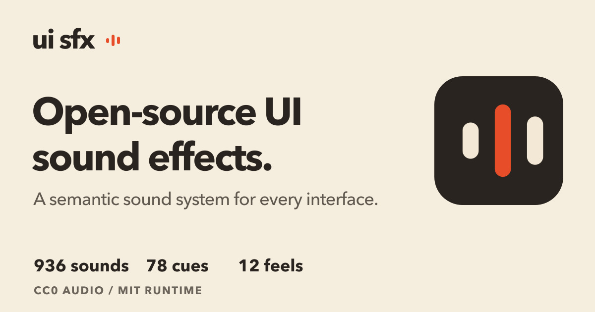

# UI 音效设计与开源音效库：UISFX

## 直观预览



> UISFX 官网 OG 预览图。它是一个面向 Web、移动端、SaaS、教育、媒体和游戏的开源界面音效库。

## 一句话价值

把界面事件映射为可理解、可切换、可关闭的声音语言：936 个音效覆盖 78 个语义 cue、12 种声音风格，并同时提供零依赖 Web Audio 运行时与 MP3/Ogg 资源。

## 内容摘要

UISFX（UI SFX）由 Yuki Capital / Romain Simon 维护，官网定位为 open-source UI sound design library。当前公开 manifest 标注版本 `0.4.0`，包含 12 个 pack、78 个 cue、936 个音频资产；官网页面的产品 schema 也明确了 72 个 one-shot 与 6 个 seamless loop。

语义目录按 13 类组织：Input、Selection、Navigation、Editing、Movement、Communication、Feedback、Progress、Loops、Media、System、Reward、Commerce。常用 cue 包括 `hover`、`press`、`select`、`open`、`copy`、`success`、`error`、`complete`、`loading`、`processing`、`notification`、`purchase` 等，名称描述“发生了什么”，而不是按钮长什么样。

12 种 pack 是 `minimal`、`soft`、`glass`、`arcade`、`mechanical`、`organic`、`dreamy`、`scifi`、`rubber`、`cinematic`、`studio`、`zen`。例如 `minimal` 适合生产力和 SaaS，`scifi` 适合 AI / 空间界面，`studio` 适合音视频和创意工具，`zen` 适合阅读、写作和安静型产品。

许可边界清晰：代码 MIT，音频 CC0-1.0。包提供 `createUISFX()`、`play()`、`unlock()`、`setPack()`、`setVolume()`、`setEnabled()`、`stopAll()`、`destroy()` 和 `bindUISFX()` 等 API；浏览器应用应使用一个长期存在的客户端 player，不能在 SSR 或页面加载时自动播放。

## 为什么值得收藏

1. **把“声音”做成了可调用的语义系统**：比单独下载几个提示音更适合长期产品维护和 AI 辅助开发。
2. **覆盖面完整**：从输入、导航、编辑到异步进度、媒体、奖励和电商，能直接对应产品状态机。
3. **有风格切换而不是一套音色硬套全站**：可以先按产品气质选择 pack，再按事件选择 cue。
4. **实现边界写得足够工程化**：用户手势解锁、偏好持久化、SSR 安全、循环停止、取消与失败区分、无障碍视觉/文本反馈都被纳入 Agent 指南。
5. **适合做多感官交互规范的基准**：可和 Cuelume、Generative Loaders、Animated Buttons 等素材一起建立视觉、运动、声音三层反馈规则。

## 未来可以怎么用

- 给 glint.red 或工具型网站建立一个默认关闭、用户可开启的声音偏好；只给保存、复制、生成完成、错误、通知等高价值事件播放声音。
- AI 生成或长任务使用 `processing` / `loading` 循环，任务结束前停止循环，再播放 `complete` 或 `error`，不要把循环遗留在后台。
- 对开关、筛选、拖拽、排序、复制、撤销等确定性状态使用 `toggle-on`、`select`、`drop`、`reorder`、`copy`、`undo` 等语义 cue。
- 在 AI 产品里用 `scifi` 或 `studio` 做有限的产品人格实验，但保留文字、颜色、ARIA 和进度等非声音信号。
- 原生移动端、游戏或不支持 Web Audio 的环境可直接取包内 MP3/Ogg；Web 端优先使用运行时 API，减少静态资源管理。

## 原始内容 / 链接

- 官网：[https://uisfx.com/](https://uisfx.com/)
- UI 音效设计指南：[https://uisfx.com/ui-sound-design](https://uisfx.com/ui-sound-design)
- Coding-agent 指南：[https://uisfx.com/docs/agent-guide.md](https://uisfx.com/docs/agent-guide.md)
- 语义 manifest：[https://uisfx.com/uisfx-manifest.json](https://uisfx.com/uisfx-manifest.json)
- GitHub：[https://github.com/romainsimon/uisfx](https://github.com/romainsimon/uisfx)
- npm：[https://www.npmjs.com/package/uisfx](https://www.npmjs.com/package/uisfx)
- 本地快照：`_附件/网页快照/UISFX-2026-08-21/`
- 本地预览：`_附件/收藏预览/UISFX-2026-08-21.jpg`

### 最小接入示例

```bash
npm install uisfx
```

```ts
import { createUISFX } from 'uisfx'

const ui = createUISFX({
  pack: 'minimal',
  volume: 0.7,
  preferences: { key: 'product:sound' },
})

button.addEventListener('click', async () => {
  await ui.unlock() // 只在真实用户手势中解锁
  await saveChanges()
  ui.play('success')
})
```

### 长任务接入原则

```ts
const task = ui.play('processing')
try {
  await runTask()
  task?.stop()
  ui.play('complete')
} catch (error) {
  task?.stop()
  ui.play('error')
  throw error
}
```

实际项目还应在取消、超时、卸载、静音和 `finally` 中停止循环，并区分取消与真正失败，避免误报错误音效。

## 相关联想

- 和 [Web 交互音效库：Cuelume](../动效/Web交互音效库-Cuelume-2026-07-17.md) 对比：Cuelume 更轻、更偏实时合成；UISFX 更像完整的语义音效资产与产品接入规范。
- 和 [生成式 UI 加载动效 React 组件库：Generative Loaders](../动效/生成式UI加载动效React组件库-Generative-Loaders-2026-08-10.md) 组合：把视觉等待、语义播报和声音循环放进同一个异步状态契约。
- 和 [CSS 动画按钮库：Animated Buttons](../按钮/CSS动画按钮库-Animated-Buttons-2026-07-16.md) 组合：按钮的视觉状态、交互运动与声音状态分开设计，再按关键动作组合。
- 可抽象一套“事件 -> 视觉 -> 动效 -> 声音 -> 无障碍替代”的多感官反馈表，作为 Codex 生成产品界面的验收模板。

## 适合反向调用的场景

- 我想给网站或 SaaS 加一套不吵闹的 UI 声音系统。
- 我需要为 AI 生成、处理、成功、失败和取消状态设计声音反馈。
- 我想选择适合 AI、写作、媒体或游戏产品的音效风格。
- 我想找 MIT 代码、CC0 音频、可 npm 接入的开源 UI 音效库。
- 我想制定声音偏好、用户手势解锁、循环清理和无障碍替代规则。
