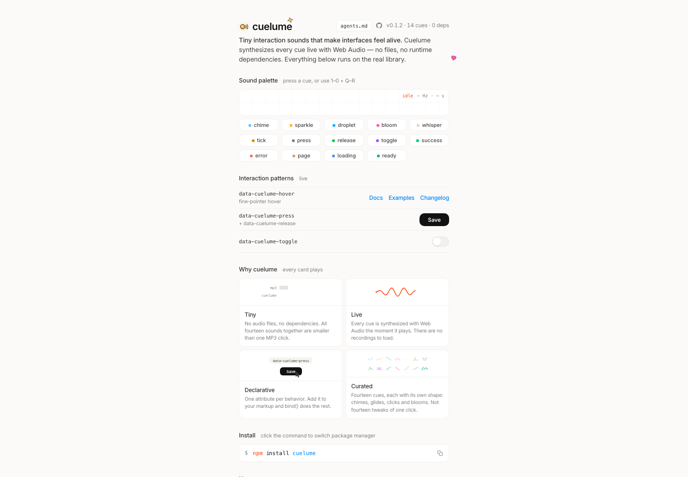

# Web 交互音效库：Cuelume

## 直观预览



> Cuelume 官网首屏截图，直观看它是一个给按钮、链接、开关和操作完成状态补充声音反馈的 Web 交互音效库。

## 一句话价值

一个专门为 Web 微交互准备的 14 个实时合成交互音效库，不依赖音频文件，适合给按钮、链接、开关、复制成功、加载完成等关键动作补充克制的声音反馈。

## 内容摘要

Cuelume 是 `Danilaa1/cuelume` 开源项目，官方描述是 `Curated interaction sounds for the web — synthesized live with zero runtime dependencies.` 它不是完整音频引擎，而是一套经过挑选的 Web 交互音效 palette：用 Web Audio API 实时合成声音，不需要 `.mp3` / `.wav` 文件，也没有运行时依赖。

它提供两种接入方式：

1. **声明式属性接入**：在 HTML 上加 `data-cuelume-hover`、`data-cuelume-press`、`data-cuelume-release`、`data-cuelume-toggle`，再调用一次 `bind()`。
2. **命令式播放**：在具体逻辑完成后调用 `play("success")`、`play("error")`、`play("ready")` 等。

当前 README 里列出的 14 个声音包括：`chime`、`sparkle`、`droplet`、`bloom`、`whisper`、`tick`、`press`、`release`、`toggle`、`success`、`error`、`page`、`loading`、`ready`。这些声音对应 hover、press、release、toggle、success、error、page、loading、ready 等实际界面场景。

项目当前读取到的 npm 包版本是 `0.1.2`，MIT 许可，ESM-only，目标是现代浏览器、ES modules 和 Web Audio API；服务端 import 安全，但声音只会在浏览器播放。

## 为什么值得收藏

1. **补了很多 UI 素材库缺失的一层：声音反馈**  
   之前收藏的素材大多是视觉、按钮、动效、图标、组件。Cuelume 补的是“听觉微交互”，对产品质感是另一条维度。

2. **实现方式很轻**  
   它不带音频文件，也没有运行时依赖。声音通过 Web Audio 实时合成，适合放进前端组件或实验性界面里试。

3. **API 很适合快速接入**  
   HTML 属性适合按钮、链接、开关这类通用交互；`play()` 适合复制成功、保存成功、加载完成、错误提示这类业务事件。

4. **默认行为考虑了克制边界**  
   README 里提到 hover 声音会被 150ms 全局节流，hover / press / release 需要 fine pointer，toggle 兼容点击、键盘和触摸；无效名称或浏览器阻止 Web Audio 时会静默 no-op。

5. **适合和已有动效收藏组合**  
   它可以和 Animated Buttons、Border Beam、Transitions.dev、Dynamic Island Header 一起组成“视觉 + 运动 + 声音”的微交互系统。

## 未来可以怎么用

- 给主 CTA、保存、复制、提交、生成、下载按钮补一层很轻的 `press` / `release` / `success` 声音。
- 给导航菜单或工具栏 hover 使用 `tick` 或 `chime`，但要严格控制频率，不适合全站每个元素都响。
- 给切换主题、开关设置、tab 切换使用 `toggle`，强化“状态已经改变”的感知。
- 给图片加载完成、AI 生成完成、内容 ready 状态使用 `ready` 或 `success`。
- 给可恢复错误使用 `error`，但应该非常克制，避免造成烦躁。
- 给 glint.red 这类需要记忆点和质感的页面，做一个可关闭的“声音反馈模式”，默认尊重用户偏好。

## 原始内容 / 链接

- 官网：[https://cuelume-site.pages.dev/](https://cuelume-site.pages.dev/)
- GitHub：[https://github.com/Danilaa1/cuelume](https://github.com/Danilaa1/cuelume)
- npm 包：`cuelume`
- 当前读取到的版本：`0.1.2`
- License：MIT
- 最近读取到的提交：`ce81ece 0.1.2`
- 技术栈：TypeScript、Web Audio API、ESM
- 运行时依赖：0
- 本地截图：[Cuelume-2026-07-17.png](../../_附件/收藏预览/Cuelume-2026-07-17.png)

### 基础用法

```html
<button data-cuelume-press data-cuelume-release>Save</button>
<a data-cuelume-hover="tick">Docs</a>
<button data-cuelume-toggle>Dark mode</button>
```

```ts
import { bind, play, setEnabled } from "cuelume";

bind();

await navigator.clipboard.writeText(text);
play("success");

setEnabled(false);
```

## 相关联想

- 和 `CSS 动画按钮库：Animated Buttons` 搭配：按钮 hover / press 做视觉变化，同时用 Cuelume 做很轻的声音反馈。
- 和 `React 发光边框动效组件：Border Beam` 搭配：重点 CTA 既有边框流光，也有成功音效，但只能在关键动作使用。
- 和 `Web 过渡动效参考库：Transitions.dev` 搭配：页面切换是视觉运动，Cuelume 可以补充页面 ready 或 action success。
- 和 `灵感 Header 动效：Dynamic Island` 搭配：悬浮导航切换时可以使用 `tick` 或 `toggle`，让状态变化更像系统级交互。
- 后续可以建立一条“可访问声音设计”规则：默认可关闭、避免频繁、仅用于高价值反馈、尊重系统/用户偏好。

## 适合反向调用的场景

- 我想给网站按钮、链接、开关增加轻量声音反馈，有没有参考？
- 我想让产品微交互更有质感，但不想引入音频文件。
- 我想做 AI 生成完成、复制成功、保存成功的声音提示。
- 我想给 glint.red 这类网站增加可关闭的交互音效模式。
- 我想找 Web Audio API 在 UI 微交互里的轻量应用样本。
