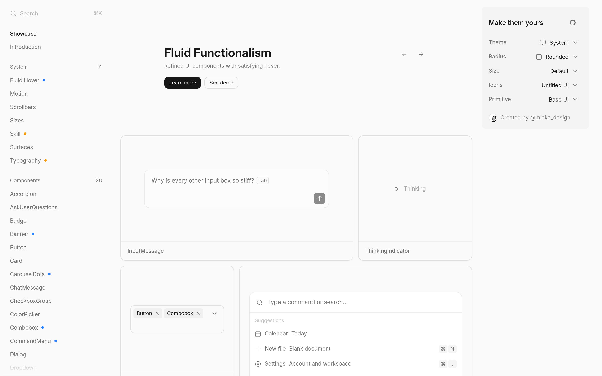

# 流体功能主义组件库：Fluid Functionalism

## 直观预览

> Fluid Functionalism 官网首页（1440×900）："Refined UI components with satisfying hover"——28 个组件的动效组件库，基于 shadcn/ui，1010 stars。

## 一句话价值

"动效是信息，不是装饰"：基于 shadcn/ui 的 28 组件动效库——spring physics 代替死 duration、proximity hover、状态连续性；1010 stars，MIT，还自带 Agent Skill 让 Codex 按它的规范写 UI。

## AI 选用指南

| 项目 | 选用说明 |
| --- | --- |
| 优先选用条件 | React/Next.js 项目想要"有质感的动效"而非装饰动画；做 AI 产品/聊天界面、运营后台这类"状态变化多"的界面；想让 Agent 按统一动效规范写 UI。 |
| 不适合或暂缓条件 | 纯静态页面不需要动效体系时太重；非 React 技术栈用不上；已有动效规范在用时先对比再决定。 |
| 复用方式 | 安装依赖（`npx shadcn@latest add @fluid/<组件>`）、Agent Skill、动效规范参考 |
| 输入与产出 | registry 命令 → 单个组件源码（含 spring 系统）；Skill → Agent 按规范写 UI 并做动效审计。 |
| 首次读取入口 | [本卡](./流体功能主义组件库-Fluid-Functionalism-2026-10-09.md) →「内容摘要」；官网 https://www.fluidfunctionalism.com（Docs / Skill / Showcase）。 |
| 同类选择依据 | 库内动效组件：Motion（底层动画库）vs Fluid Functionalism（"动效规范 + 组件"整套体系）；要"组件开箱"选它，要"底层能力"看 Motion。 |
| 接入前提与待核实项 | MIT；Next.js 15 + React 19 + Tailwind v4 + Framer Motion；Radix/Base UI 双底座；未在本机安装验证。 |
| 检索词 | Fluid Functionalism @fluid 弹簧动画 动效组件 shadcn Agent Skill proximity hover |

> 核查记录：整理于 2026-10-09，基于官网首页 + docs（motion/scrollbars/skill/typography）+ GitHub（mickadesign/fluid-functionalism，2026-02-13 创建，收录时 1010 stars，MIT）。未安装验证。

## 内容摘要

Fluid Functionalism（https://www.fluidfunctionalism.com）是 @micka_design 出品的动效组件库，核心理念"动效是信息而不是装饰"。

- **28 个组件**：Accordion、ChatMessage、CommandMenu、ThinkingIndicator、ThinkingSteps 等——AI/产品界面常用件齐全。
- **动效体系**：三档 spring（fast 0.08s / moderate 0.16s / slow 0.24s），"进入慢、退出快一档"；fluid hover（高亮跟随光标）；无组件自创 timing。
- **设计系统**：Motion、Fluid Hover、Scrollbars、Sizes、Surfaces、Typography 六个系统文档 + 组件文档。
- **接入**：`npx shadcn@latest registry add @fluid` + `npx shadcn@latest add @fluid/button`，按需取单个组件。
- **Agent Skill**：`/fluid-functionalism` skill——给 coding agent 组件 + 工艺规范，还能审计现有 UI 的动效。
- **技术栈**：Next.js 15 + React 19 + Tailwind v4 + Framer Motion，Radix/Base UI 双底座，图标 Untitled UI。
- **仓库**：github.com/mickadesign/fluid-functionalism，2026-02-13 建仓，收录时 1010 stars，MIT。

## 为什么值得收藏

1. **动效"有规范"**：库里动效组件不少，但 Fluid Functionalism 是第一个把"动效规范"讲透的（三档 spring、退出快一档、hover 即预览）——规范本身就能直接抄。
2. **AI 产品界面对口**：ChatMessage、ThinkingIndicator、ThinkingSteps——他做 xiegao2.0、bot 相关界面正好用得上。
3. **Agent Skill**：让 Codex 按规范写 UI + 审计动效，和他"工具不替我做判断、但要规范"的口味一致。
4. 1010 stars，社区认可。

## 未来可以怎么用

- xiegao2.0 产品化时的动效规范（三档 spring 直接抄）。
- 给 Codex 装 fluid-functionalism skill，写 UI 时自动按规范来。
- 晨报看板、素材库这类"状态变化多"的界面，用它的组件。
- [排版规则页](./排版规则-Fluid-Functionalism-Typography-2026-10-09.md)的 5 规则/5 no-gos 直接作为中文页面的排版检查清单。

## 原始内容 / 链接

- 官网：https://www.fluidfunctionalism.com
- 仓库：https://github.com/mickadesign/fluid-functionalism（MIT，1010 stars，2026-02-13 创建）
- 作者：@micka_design（x.com/micka_design）
- Skill：官网 /docs/skill（`/fluid-functionalism` skill）
- 未安装验证。

## 相关联想

- [排版规则：Fluid Functionalism Typography](./排版规则-Fluid-Functionalism-Typography-2026-10-09.md)：同一站点的排版规则页，5 规则 + 5 no-gos
- [网页动画库：Motion](../动效/网页动画库-Motion-2026-08-22.md)：底层动画库 vs 整套动效体系
- [React 着色器组件库：shadercn](../动效/React着色器组件库-shadercn-2026-10-07.md)：视觉特效 vs 交互动效规范

## 适合反向调用的场景

- React 项目想要一套有规范的动效，而不是每个组件各自动？
- "动效是信息不是装饰"具体怎么落地？
- 有没有让 Agent 按动效规范写 UI 的 Skill？
