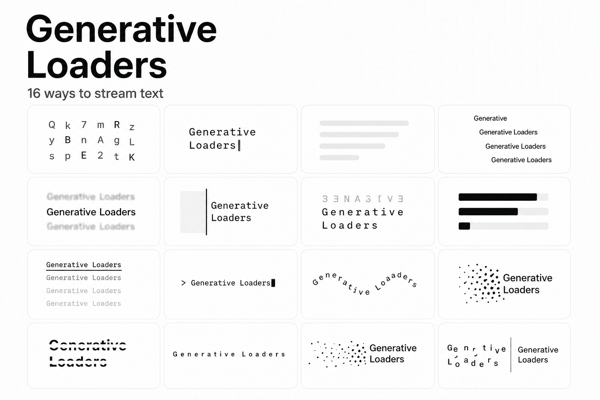

# 生成式 UI 加载动效 React 组件库：Generative Loaders

## 直观预览



> 官方预览图展示 16 种流式文本呈现方式，例如字符解码、打字机、骨架、擦除、终端、波形和碎片聚合。

## 一句话价值

一个专为 AI 生成等待态设计的 React 组件库，把“流式文本正在产生、按钮正在等待、图片正在生成”拆为可直接接入、具备无障碍语义的加载动效。

## 内容摘要

Generative Loaders 是 Kasturi Khanke 制作的 React 组件库，官网当前提供三组 Loader：`Text loaders` 16 个、`Inline loaders` 18 个、`Image loaders` 12 个。它把生成式产品常见但容易做得生硬的等待状态，转成有明确使用场景的三类组件：

- `TextLoader`：用于流式增长的回答文本，只对新接收的后缀做动画，避免每次更新都重播整段文字。
- `InlineLoader`：用于按钮、状态行或内容尚未开始返回前的短暂等待。
- `ImageLoader`：用于图像生成时预留的方形画框。

文档要求 React 18+ 与 Node.js 20+。安装包为 `generative-loaders`，并要求在应用入口导入一次 `generative-loaders/styles.css`。官网提供速度、暂停、重启动画控制，以及浅色/深色界面切换。

## 为什么值得收藏

1. 它不是通用转圈，而是围绕“内容逐步出现”的生成式体验设计，特别适合 AI 聊天、Agent 执行过程和图像生成。
2. 组件边界清楚，避免把流式正文、局部操作等待和图片占位混为同一种 loading。
3. 无障碍考虑较完整：流式文本使用礼貌的状态播报，行内 Loader 无 label 时避免重复播报，图像默认说明生成状态，并尊重 `prefers-reduced-motion`。
4. 视觉语言克制，适合作为动效参考或直接用于偏工具型的产品界面。

## 未来可以怎么用

- 做 AI 聊天时，把完整累计文本传给 `TextLoader`，而不是每收到一个 token 就重建整块内容。
- 发送按钮、工具调用、检索或引用生成时，用 `InlineLoader` 显示短促而明确的等待状态。
- 图片生成、封面生成和素材处理时，用 `ImageLoader` 先固定画幅，减少页面跳动。
- 从 46 种候选里只选一种与产品语气匹配的动效并保持一致，避免每个区域混用不同 loading 风格。

## 快速使用

```bash
npm install generative-loaders
```

```tsx
import { TextLoader } from "generative-loaders";
import "generative-loaders/styles.css";

export function Answer({ text }: { text: string }) {
  return <TextLoader text={text} variant="decode" />;
}
```

对流式响应，`text` 应传入“截至当前已经收到的完整文本”，由组件判定新追加的部分并施加动画。应用中只导入一次样式表；忘记导入 `generative-loaders/styles.css` 会导致 Loader 没有样式。

## 原始内容 / 链接

- 官网：[Generative Loaders](https://generativeloaders.com/)
- 文档：[https://generativeloaders.com/docs](https://generativeloaders.com/docs)
- GitHub：[kasturikhanke/generative-loaders](https://github.com/kasturikhanke/generative-loaders)
- npm：[`generative-loaders`](https://www.npmjs.com/package/generative-loaders)
- 本地首页快照：[index.html](../../_附件/网页快照/Generative-Loaders-2026-08-10/index.html)
- 本地文档快照：[docs.html](../../_附件/网页快照/Generative-Loaders-2026-08-10/docs.html)

## 相关联想

- 可与 [[Vibe-Coding视觉词典-布局结构导航组件-2026-08-05]] 结合：在前端需求中明确写出“流式正文”“行内等待”或“图像生成占位”，让 Agent 选择正确组件而不是默认 spinner。
- 可和 [[Web过渡动效参考库-Transitions-dev-2026-07-07]] 形成互补：前者关注页面和组件之间的过渡，Generative Loaders 关注内容生成期间的状态表达。

## 适合反向调用的场景

- 我做 AI 聊天或 Agent 产品，加载状态该如何分层？
- 我需要流式文本出现的动效，而不是普通转圈。
- 如何让图片生成占位不导致页面布局跳动？
- 有没有兼顾 `aria-live` 与减少动态效果偏好的 React loading 组件参考？
