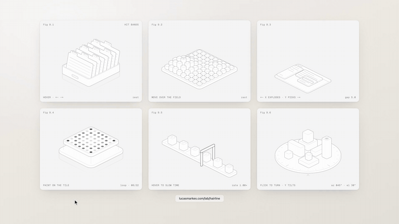

# 等距线框插画生成 Skill：hairline

## 直观预览

> 官方 hero 动图抽帧（800×450）：6 种等距线框插画（卡片托盘、柱阵、分层窗口、点阵、传送带、转盘），线条会随指针响应。

## 一句话价值

27 个"会回应指针"的等距线框 SVG 插画（零依赖，React 或纯 DOM），另附一个 Agent Skill（hairline-create）：给个想法就能按十条规则生成新的等距线框插画，输出单文件 HTML——做封面和展位图很对味。

## AI 选用指南

| 项目 | 选用说明 |
| --- | --- |
| 优先选用条件 | 需要风格统一、有设计感的封面 / 展位图 / hero 配图，想要"等距线框"这种非模板视觉；或想让 Agent 按固定规则批量生成同风格插画。 |
| 不适合或暂缓条件 | 需要彩色、写实、3D 渲染风格插画时不适合——hairline 只有单色线条风；只需要静态图时，它的指针交互是用不上（但可截帧当静态图用）。 |
| 复用方式 | 安装依赖（npm）、复制源码、读取 Skill、视觉参考 |
| 输入与产出 | 一个想法/隐喻（如"销售漏斗"）→ hairline-create 生成单文件 HTML（零依赖，含 intensity 滑杆与主题切换）；或直接 npm 安装调用 27 个现成图形。 |
| 首次读取入口 | [本卡](./等距线框插画生成Skill-hairline-2026-10-07.md) →「内容摘要」；Skill 说明 https://hairline.lucasmarkes.com/skill；安装 `npx skills add lucasmarkes/hairline`。 |
| 同类选择依据 | 库内暂无等距线框插画类收藏；与 live-panel（终端风动态架构图视频生成）分工：要"架构图讲故事"用 live-panel，要"产品感线框插画"用 hairline。 |
| 接入前提与待核实项 | MIT；npm 包零依赖，React 为可选 peer；Skill 需 Node 跑检查脚本；未在本机安装/运行验证，生成质量以实际产出为准。 |
| 检索词 | 等距插画 线框 isometric wireframe hairline 封面 展位图 SVG 插画生成 skill |

> 核查记录：整理于 2026-10-07，基于 GitHub README + 官网 skill 页（lucasmarkes/hairline，2026-10-01 创建，收录时约 776 stars，TypeScript，MIT）。X 原帖经官方 oEmbed 接口读取（@HeyHuazi，2026-10-06）："力荐这个 skill，可以生成这种等距的线框插画，贼适合用来当展位图和封面"。未安装运行；未触碰 X 站内登录与互动（账号安全规则）。

## 内容摘要

hairline 是 27 个等距（isometric）线框 SVG 插画，每个都会"回应指针"（如指针下的卡片立起、柱子升起、转盘随拨动旋转），通过 `intensity` 参数调节反应强度。

- **库**：`npm i @lucasmarkes/hairline`，零依赖，ESM；React 18+ 为可选 peer（`@lucasmarkes/hairline/react`）；也支持 shadcn registry 一键接入（读取主题 token）。纯 DOM 用法：`terrain(el)` + `update` / `destroy`。
- **27 个图形**：Riffle（卡片托盘）、Terrain（柱阵）、Exploded（分层窗口）、Phosphor（点阵）、Slow（传送带）、Turntable（转盘）、Keyboard、Elevator、Phone（分层手机）、Laptop、Terminal、Cabinet（刀片机架）、Branches（分支图）、Vault（保险库转盘）、Lockers、Padlock、Patch（配线架）、Dish（卫星锅）、Router、Loupe、Sieve、Rail、Plug 等——多为"科技产品感"物件。
- **Skill（hairline-create）**：给 coding agent 用的 skill，`/hairline-create <想法>`。流程：出 2–3 个一句话概念（物件 + 指针动作 + 读数）→ 选定后只写图形部分（引擎与页面直接拼入）→ 脚本按十条规则检查 + agent 在浏览器里看效果 → 交付页面与隐喻说明 → 可继续微调。产出 `hairline-<name>.html`：单文件、零依赖、双击即开，带 intensity 滑杆与主题切换。支持 Claude Code、Cursor、Codex。安装：`npx skills add lucasmarkes/hairline`。
- 官网展示了 7 个 skill 生成示例（含从公司 logo 出发的定制）。

## 为什么值得收藏

1. **对味**：等距线框风是"有设计感但不模板"的视觉语言，正好命中"反 AI 味、要细节"的审美；推荐人原话"贼适合用来当展位图和封面"。
2. **双重用法**：27 个现成图形开箱即用 + skill 可按想法生成新的——"拿来用"和"让 AI 画"两条路都通。
3. **工程质量好**：零依赖、MIT、shadcn registry 支持、单文件产出可直接双击打开，接入成本低。
4. **热度真实**：2026-10-01 建仓，6 天约 776 star。
5. 和库里 live-panel（终端风架构图视频）形成互补：一个管"架构叙事"，一个管"产品感插画"。

## 未来可以怎么用

- 给 xiegao2.0、bot 或其他项目做封面/展位图：先让 hairline-create 按主题生成几个，挑对味的。
- 文章/简报的题图：等距线框风做科技类封面很稳。
- 作为 Agent 生成视觉素材的 skill 之一，和 live-panel 搭配（架构图 + 插画）。
- 直接 npm 引入现成图形，做网页 hero 区的交互装饰。

## 原始内容 / 链接

- 仓库：https://github.com/lucasmarkes/hairline（MIT）
- 官网：https://hairline.lucasmarkes.com（可在线调 intensity 体验）
- Skill 说明：https://hairline.lucasmarkes.com/skill；安装：`npx skills add lucasmarkes/hairline`
- npm：@lucasmarkes/hairline；shadcn：`npx shadcn@latest add https://hairline.lucasmarkes.com/r/hairline.json`
- 推荐来源：X @HeyHuazi（2026-10-06）https://x.com/heyhuazi/status/2107473339124170929 —— 经官方 oEmbed 接口读取正文，未登录 X。
- 776 stars（收录时），TypeScript，2026-10-01 创建。
- 未安装运行；skill 生成质量以实际产出为准。

## 相关联想

- [终端风动态架构图生成器：live-panel-skill](../../04-工具网站/开源项目/终端风动态架构图生成器-live-panel-skill-2026-10-05.md)：同属"Agent 生成视觉产物"，分工为架构叙事 vs 产品感插画
- 做封面这件事本身可以产品化：固定风格（等距线框）+ 按主题生成，适合内容矩阵的视觉统一

## 适合反向调用的场景

- 我要做一张有设计感的封面/展位图，不想用模板，有什么现成方案？
- 能不能让 Agent 按我的想法生成同风格的线框插画？
- 网页 hero 区想要会跟指针互动的装饰，有什么轻量方案？
