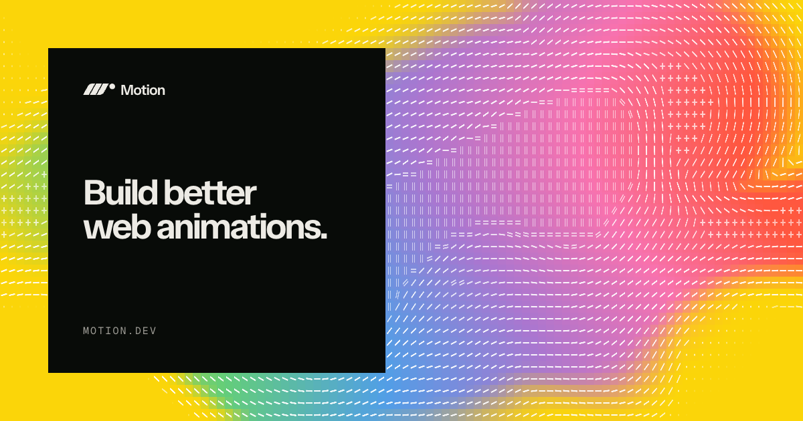

# 网页动画库：Motion

## 直观预览

> Motion 官网预览。该项目此前名为 Framer Motion，是面向 React、JavaScript 和 Vue 的生产级网页动画库。

## 一句话价值

一个 MIT 开源、面向 React / JavaScript / Vue 的网页动画引擎，适合从简单入场过渡到拖拽、手势、布局动画和高性能滚动联动。

## AI 选用指南

| 项目 | 选用说明 |
| --- | --- |
| 优先选用条件 | 需要实现自定义布局变化、拖拽手势、弹簧或滚动联动；按 JavaScript、React、Vue 选择对应入口。 |
| 不适合或暂缓条件 | 只想挑现成主题组件时先看组件库；原生 JavaScript 项目不能直接复制 React API。 |
| 复用方式 | 安装依赖 |
| 输入与产出 | 元素、状态变化与交互规则 → 自定义动画实现。 |
| 首次读取入口 | [本卡](./网页动画库-Motion-2026-08-22.md) →「内容摘要」；随后读取[本地历史资料](../../_附件/网页快照/Motion-2026-08-22/index.html)；[官方入口](https://motion.dev/docs/quick-start) |
| 同类选择依据 | Motion 是底层引擎；Amicro、beUI、SmoothUI 是已组织好的组件或配方；简单状态切换也可先用 CSS。 对照：[React 微交互与过渡组件库：Amicro](./React微交互与过渡组件库-Amicro-2026-08-23.md)、[动画 React 组件库：beUI](../组件/动画React组件库-beUI-2026-09-16.md)、[shadcn 动画 React 组件库：SmoothUI](../组件/Shadcn动画React组件库-SmoothUI-2026-08-22.md)。 |
| 接入前提与待核实项 | 2026-09-20 复核官方文档导航含 JavaScript、React、Vue；具体 API 和插件支持仍按目标版本确认。 |
| 检索词 | Motion Framer Motion animate layout drag scroll spring 原生JavaScript Vue |

> 选用说明整理于 2026-09-20：适用与比较为基于收藏证据的建议；正文中的版本、数量、价格与功能范围按原收录时间理解。本次未安装或运行所收藏的工具，当前环境安装状态另查。本次另作官方页面复核：官方文档：JavaScript、React、Vue 分入口；未测试各框架实现。

## 内容摘要

Motion（此前为 Framer Motion）当前官网标注版本 `13.1.0`，强调 production-grade、微小体积与 hybrid engine：将 JavaScript 动画能力和浏览器硬件加速 API 结合。核心包括独立 transform、硬件加速 scroll-linked motion、`hover` / `press` / `drag` 手势、`layout` 布局动画、弹簧物理、`AnimatePresence` 退出动画、variants / stagger / timeline 编排，以及 motion values / transforms 的实时派生。

它是将动画行为写进产品状态和组件生命周期的开发库，而不是动效素材站。官网同时说明其文档、skills 和接口面向 coding agent 使用。

## 为什么值得收藏

1. 来源于 Framer Motion，覆盖从简单到复杂的常见 UI 动画。
2. React、JavaScript、Vue 可共用概念与文档示例。
3. 可以把进入、退出、布局、拖拽、滚动和 reduced-motion 统一成组件契约。

## 未来可以怎么用

- React 产品中用 `layout` 处理筛选、列表重排、面板展开等位置变化。
- 弹窗、toast、抽屉和动态列表用短时进入 / 退出动画，并尊重 `prefers-reduced-motion`。
- 与 UISFX、Generative Loaders 组合，把视觉状态、长任务等待与声音偏好变为同一套反馈规则。

## 原始内容 / 链接

- 官网：[https://motion.dev/](https://motion.dev/)
- 文档：[https://motion.dev/docs](https://motion.dev/docs)
- 来源帖文：[https://x.com/csaba_kissi/status/2090328699992432716](https://x.com/csaba_kissi/status/2090328699992432716)
- License：MIT（官网声明）
- 本地预览：`_附件/收藏预览/Motion-2026-08-22.png`
- 本地快照：`_附件/网页快照/Motion-2026-08-22/index.html`

## 相关联想

- 与 Transitions.dev 偏动效参考 / CSS 规则不同，Motion 用于将动画写进状态管理和组件生命周期。

## 适合反向调用的场景

- 我想实现 React、Vue 或原生网页的平滑 UI 动画。
- 我需要给弹窗、列表、布局变换或拖拽交互加生产级动画。
