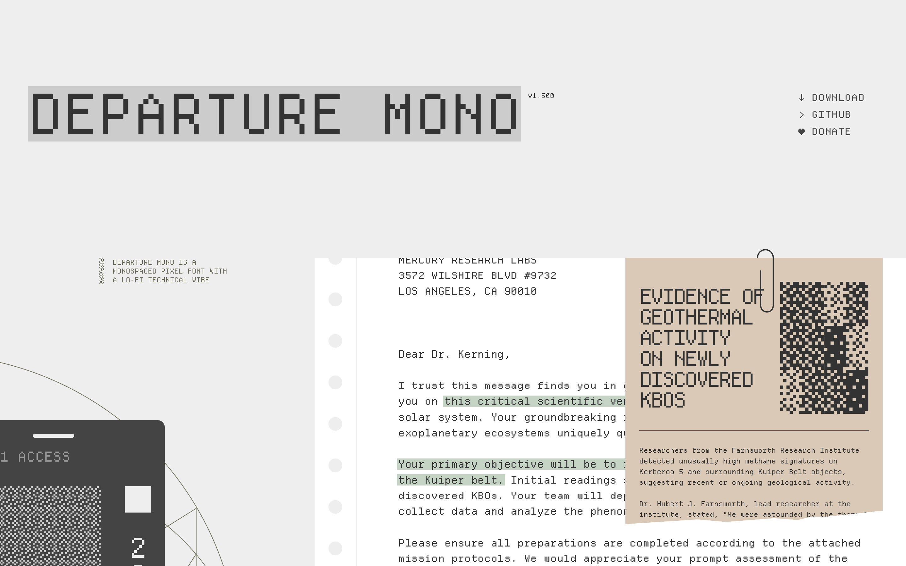

# 像素风终端等宽字体：Departure Mono

## 直观预览

> Departure Mono 官网（1440×900）：整站就是字体 specimen——"DEPARTURE MONO v1.500"，monospaced pixel font，lo-fi 技术味拉满。

## 一句话价值

像素风等宽字体，lo-fi 技术味，OFL 开源（v1.500）——给终端、代码场景和像素风项目用的"味道字体"。

## AI 选用指南

| 项目 | 选用说明 |
| --- | --- |
| 优先选用条件 | 想要像素/lo-fi/复古技术味的标题字、终端字体、代码字体；做像素风、终端风项目需要对味的等宽字体。 |
| 不适合或暂缓条件 | 正文阅读、正式商务场景不适合——像素字体易读性差，它是"味道"不是"正餐"。 |
| 复用方式 | 下载字体文件、使用 |
| 输入与产出 | 官网 Download → 字体文件（OFL 许可），装到系统或项目里。 |
| 首次读取入口 | [本卡](./像素风终端等宽字体-Departure-Mono-2026-10-07.md) →「内容摘要」；官网 https://departuremono.com（Download / GitHub / Donate）。 |
| 同类选择依据 | 库内暂无像素风字体类收藏；与 [Fontsource](./开源字体npm自托管-Fontsource-2026-10-07.md) 分工：Fontsource 是"装字体的渠道"，Departure Mono 是"具体的一款味道字体"。 |
| 接入前提与待核实项 | OFL 许可（商用友好）；未下载验证字体文件。 |
| 检索词 | Departure Mono 像素字体 pixel font 等宽字体 monospace 终端字体 lo-fi |

> 核查记录：整理于 2026-10-07，基于官网首页（v1.500，OFL 许可，有 Download / GitHub / Donate 入口）。未下载验证。

## 内容摘要

Departure Mono（https://departuremono.com）是一款像素风等宽字体。

- **风格**：monospaced pixel font，官网自述 "a lo-fi technical vibe"——低保真技术味，字母都是像素块拼的。
- **版本**：v1.500，持续迭代中。
- **许可**：OFL（SIL Open Font License），开源免费，商用友好。
- **获取**：官网直接 Download，也有 GitHub 和 Donate 入口。
- 官网本身就是一个字体 specimen 页：大标题、信件排版、终端窗口，全用这款字体展示——"吃自己狗粮"式展示。

## 为什么值得收藏

1. **味道对**：像素 + 等宽 + 终端，正中"终端风"审美（参考刚收的 live-panel 终端风架构图）。
2. **OFL 开源**：商用无压力，拿来就用。
3. **具体可落地**：不是"字体灵感"，是能下载装上的真字体。

## 未来可以怎么用

- 终端/编辑器字体美化（他天天泡终端）。
- 像素风、复古技术风项目的标题字。
- 封面/展位图的装饰标题（和 hairline 等距线框风意外的搭）。
- live-panel 那种终端风视频里当字幕/标题字体。

## 原始内容 / 链接

- 官网：https://departuremono.com（v1.500，OFL）
- 发现链：X @VibeEverything 推文 → Designeer（designeer.xyz）Type 分组 → 本站
- 未下载验证字体文件。

## 相关联想

- [开源字体 npm 自托管：Fontsource](./开源字体npm自托管-Fontsource-2026-10-07.md)：渠道 vs 单品
- [终端风动态架构图生成器：live-panel-skill](../../../04-工具网站/开源项目/终端风动态架构图生成器-live-panel-skill-2026-10-05.md)：终端风视觉 + 像素终端字体，味道一致

## 适合反向调用的场景

- 有没有像素风/复古技术味的等宽字体推荐？
- 终端想换个有味道的字体，有什么开源选择？
- 我收藏过哪些字体？
