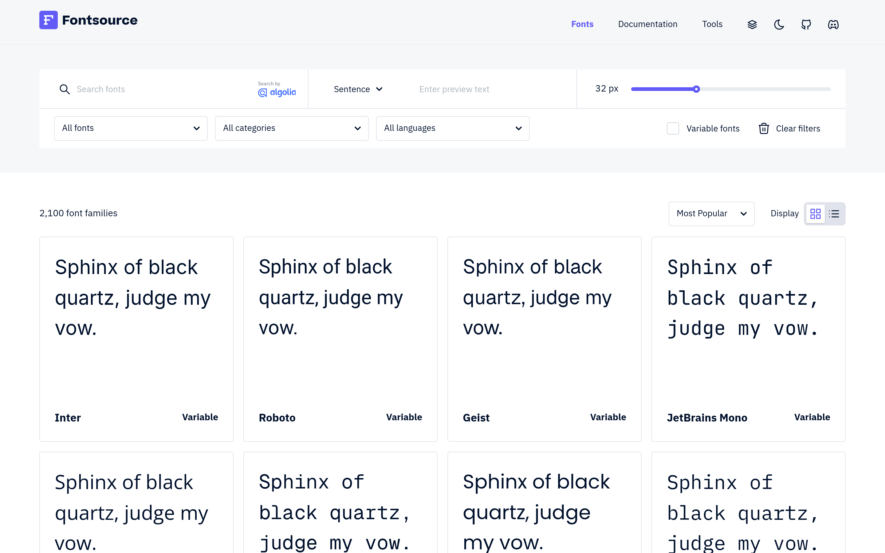

# 开源字体 npm 自托管：Fontsource

## 直观预览

> Fontsource 官网（1440×900）：2100+ 字体家族，可按分类/语言/是否 variable 筛选，一键复制 npm 安装命令。

## 一句话价值

2100+ 开源字体全部打成 npm 包：`npm i @fontsource/xxx` 就自托管到项目里，不再依赖 Google Fonts 外链（快、私密、离线可用）。

## AI 选用指南

| 项目 | 选用说明 |
| --- | --- |
| 优先选用条件 | 前端项目需要用开源字体，且在意加载速度、隐私（不调 Google）或离线可用；想一次装好、版本锁定。 |
| 不适合或暂缓条件 | 要用商业字体（Fontsource 只收开源字体）时不适合；纯静态页面、字体无所谓时没必要引入。 |
| 复用方式 | 安装依赖（npm） |
| 输入与产出 | 字体名 → `npm install @fontsource/<name>` + 一行 import，字体文件随项目走。 |
| 首次读取入口 | [本卡](./开源字体npm自托管-Fontsource-2026-10-07.md) →「内容摘要」；官网 https://fontsource.org（搜索 + 筛选）。 |
| 同类选择依据 | 库内暂无字体自托管方案类收藏；与 [Departure Mono](./像素风终端等宽字体-Departure-Mono-2026-10-07.md) 分工：Fontsource 是"装字体的渠道"，Departure Mono 是"具体的某款字体"。 |
| 接入前提与待核实项 | MIT（项目本身）；每款字体的具体许可（OFL/Apache 等）以该字体页标注为准，商用前核对。 |
| 检索词 | Fontsource 字体自托管 npm 开源字体 Google Fonts 替代 variable font |

> 核查记录：整理于 2026-10-07，基于官网首页 + GitHub（fontsource/fontsource，2020-05 创建，收录时 6170 stars，TypeScript，MIT）。未安装验证。

## 内容摘要

Fontsource（https://fontsource.org）把开源字体做成整齐的 npm 包，让你自托管字体文件。

- **规模**：2100+ 字体家族，Inter、Roboto、JetBrains Mono、Geist、Space Grotesk、Noto Sans SC 等都在。
- **用法**：`npm install @fontsource/inter`，然后 `import '@fontsource/inter'`——字体文件打包进项目，不再请求 Google Fonts。
- **筛选**：按分类（无衬线/衬线/等宽…）、语言、是否 variable font 筛选，官网直接给安装命令。
- **好处**：快（无第三方请求）、私密（不向 Google 暴露访客）、离线可用、版本锁定。
- **仓库**：github.com/fontsource/fontsource，2020-05 建仓，6170 stars，MIT——老牌稳定项目。

## 为什么值得收藏

1. **实用**：任何前端项目都可能用到，一条命令解决字体自托管。
2. **符合他的工程审美**：本地优先、不依赖外部服务——和他"反模板、要掌控"的口味一致。
3. **老牌稳定**：6 年项目，6170 star，不是昙花一现的玩具。

## 未来可以怎么用

- xiegao2.0、落地页、作品集站的字体方案：先来这里挑，再 npm 装。
- 需要中文开源字体时筛 Noto Sans SC 等（注意体积，按需引入子集）。
- 和 Utopia 搭配：Fontsource 管"用什么字体"，Utopia 管"字号怎么随屏幕缩放"。

## 原始内容 / 链接

- 官网：https://fontsource.org
- 仓库：https://github.com/fontsource/fontsource（MIT，6170 stars，2020-05 创建）
- 发现链：X @VibeEverything 推文 → Designeer（designeer.xyz）Type 分组 → 本站
- 未安装验证；单款字体许可商用前核对。

## 相关联想

- [流式响应排版计算器：Utopia](./流式响应排版计算器-Utopia-2026-10-07.md)：字体（Fontsource）+ 字号系统（Utopia）= 完整排版方案
- [像素风终端等宽字体：Departure Mono](./像素风终端等宽字体-Departure-Mono-2026-10-07.md)：具体字体案例

## 适合反向调用的场景

- 项目里想用开源字体，但不想调 Google Fonts，有什么办法？
- 我收藏过哪些字体相关的资源？
- 怎么做字体的版本锁定和离线可用？
