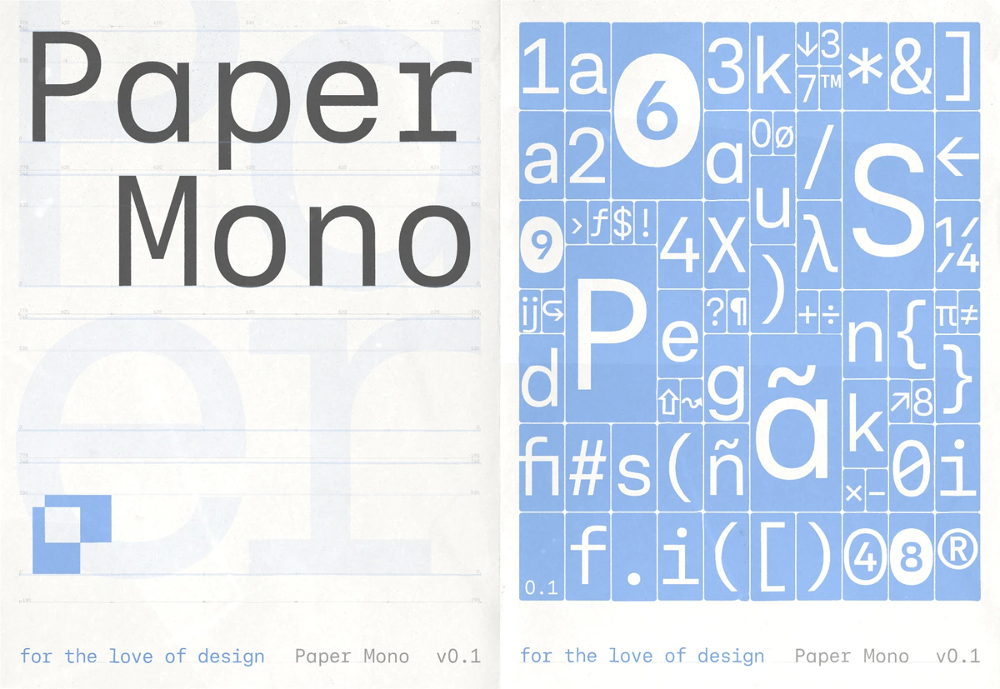

# 开源等宽字体：Paper Mono

## 直观预览

> Paper Mono 官方 specimen（1200×827，取自 GitHub 仓库 readme）：等宽字体大标题 + 字符网格展示，v1.0。

## 一句话价值

paper.design 出品的免费开源等宽字体（OFL，v1.0）——和 Paper Shaders 同一团队的手笔，1366 stars，代码/终端场景的正经选择。

## AI 选用指南

| 项目 | 选用说明 |
| --- | --- |
| 优先选用条件 | 需要一款有设计感的开源等宽字体（代码编辑器、终端、等宽排版场景）；信任 paper.design 出品。 |
| 不适合或暂缓条件 | 要像素/复古味时用 Departure Mono；要正式人文感时另选；正文字体不适合等宽。 |
| 复用方式 | 下载字体文件、使用 |
| 输入与产出 | 官网 Download → 字体文件（OFL），装到系统或项目里。 |
| 首次读取入口 | [本卡](./开源等宽字体-Paper-Mono-2026-10-09.md) →「内容摘要」；官网 https://paper.design/mono（Download / Open in Paper）。 |
| 同类选择依据 | 库内已有 [Departure Mono](./像素风终端等宽字体-Departure-Mono-2026-10-07.md)：要像素 lo-fi 味用 Departure Mono；要正经现代等宽用 Paper Mono。 |
| 接入前提与待核实项 | OFL 许可（SIL Open Font，商用友好）；未下载验证字体文件。 |
| 检索词 | Paper Mono 等宽字体 monospace paper.design 开源字体 OFL 代码字体 |

> 核查记录：整理于 2026-10-09，基于官网（v1.0，Download / Open in Paper 入口）+ GitHub（paper-design/paper-mono，2025-08 创建，收录时 1366 stars，OFL）。官网截图服务两次超时，预览图取自仓库 readme 的官方 specimen。未下载验证。

## 内容摘要

Paper Mono（https://paper.design/mono）是 paper.design 推出的免费开源等宽字体家族。

- **出品方**：paper.design——就是库里 Paper Shaders 的那个团队，"for the love of design"。
- **版本**：v1.0，持续迭代。
- **许可**：SIL Open Font License（OFL），开源免费，商用友好。
- **获取**：官网 Download，或去 GitHub 仓库拿字体文件。
- **仓库**：github.com/paper-design/paper-mono，2025-08 建仓，收录时 1366 stars。
- 官网是个 specimen 式单页：大标题、字符网格、度量参数展示，字体本身即广告。

## 为什么值得收藏

1. **出品方可信**：paper.design 的 Paper Shaders 已经在库里且评价高，同团队字体值得收。
2. **1366 stars 背书**：不是小众自嗨，是有社区认可的开源字体。
3. **和 Departure Mono 互补**：一个正经现代等宽，一个像素 lo-fi——等宽字体两个味道都齐了。
4. **OFL 商用无压力**。

## 未来可以怎么用

- 代码编辑器/终端字体（和他天天泡终端的场景直接相关）。
- 等宽排版场景：数据展示、代码块、ASCII 风设计。
- 和 Departure Mono 按项目气质二选一。

## 原始内容 / 链接

- 官网：https://paper.design/mono（v1.0，Download / Open in Paper）
- 仓库：https://github.com/paper-design/paper-mono（OFL，1366 stars，2025-08 创建）
- 未下载验证字体文件。

## 相关联想

- [像素风终端等宽字体：Departure Mono](./像素风终端等宽字体-Departure-Mono-2026-10-07.md)：同为等宽，味道不同，二选一
- [零依赖着色器效果库：Paper Shaders](../../04-工具网站/在线工具/零依赖着色器效果库-Paper-Shaders-2026-07-03.md)：同一团队出品
- [开源字体 npm 自托管：Fontsource](./开源字体npm自托管-Fontsource-2026-10-07.md)：装字体的渠道

## 适合反向调用的场景

- 有没有设计感强的开源等宽字体推荐？
- paper.design 除了 Paper Shaders 还出过什么？
- 我收藏过哪些等宽字体？各适合什么场景？
