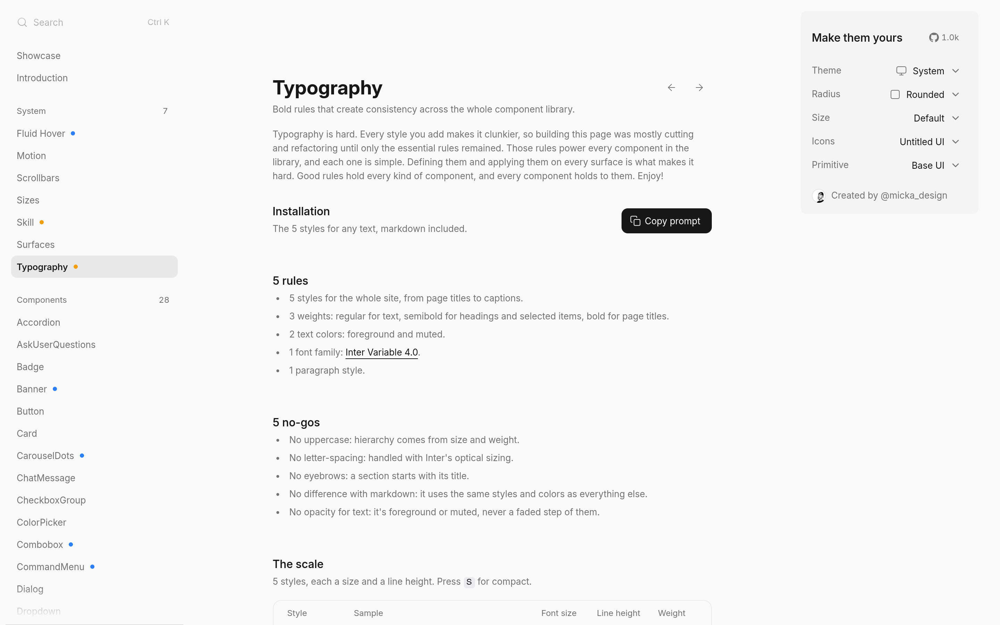

# 排版规则：Fluid Functionalism Typography

## 直观预览

> docs/typography 页面（1440×900）："Bold rules that create consistency across the whole component library"——5 rules + 5 no-gos，附 Copy prompt 按钮。

## 一句话价值

一套"靠删减得来的"排版规则：全站 5 种字阶、3 档字重、2 种文字色、1 套字体（Inter Variable 4.0）；外加 5 条 no-gos（不用大写、不用字间距、不用 eyebrow……）——直接当中文页面的排版检查清单用。

## AI 选用指南

| 项目 | 选用说明 |
| --- | --- |
| 优先选用条件 | 做中文/英文页面排版时需要一套"少即是多"的检查清单；给 Agent 写排版 prompt 需要明确规则。 |
| 不适合或暂缓条件 | 品牌表达需要强烈个性的页面（这套规则是克制的）；已有排版规范在用时先对比。 |
| 复用方式 | 套用方法（5 rules + 5 no-gos 当验收清单）、提示词参考（页面的 Copy prompt） |
| 输入与产出 | 规则清单 → 页面排版验收：字阶/字重/颜色/字体是否收敛到规则内。 |
| 首次读取入口 | [本卡](./排版规则-Fluid-Functionalism-Typography-2026-10-09.md) →「内容摘要」；原页 https://www.fluidfunctionalism.com/docs/typography（含 Copy prompt）。 |
| 同类选择依据 | 库内排版类：[Apple 官网排版细节鉴赏](../交互细节/Apple官网排版细节鉴赏-2026-10-06.md)（源码级中文排版拆解）vs 本页（英文极简规则）；一个管"中文细节"、一个管"整体收敛"，搭配用。 |
| 接入前提与待核实项 | 规则原文英文，中文页面套用时需按中文习惯微调（如标点挤压）；Inter Variable 4.0 的 opsz 轴是关键。 |
| 检索词 | Fluid Functionalism Typography 排版规则 5 rules no-gos Inter Variable 字阶 |

> 核查记录：整理于 2026-10-09，基于原页面全文（5 rules + 5 no-gos + The scale）。页面文字为英文，规则转述为中文。

## 内容摘要

Fluid Functionalism 的排版文档页（/docs/typography），作者自述"building this page was mostly cutting and refactoring until only the essential rules remained"。

**5 rules：**
1. 全站 5 种字阶（style），从 page title 到 caption。
2. 3 档字重：regular 正文、semibold 标题/选中项、bold 页面标题。
3. 2 种文字色：foreground 和 muted。
4. 1 套字体：Inter Variable 4.0。
5. 1 种段落样式。

**5 no-gos：**
1. 不用大写：层级靠字号和字重，不靠 uppercase。
2. 不用字间距：交给 Inter 的 optical sizing。
3. 不用 eyebrow（小眉题）：section 直接以标题开头。
4. markdown 不搞特殊：和正文同字阶同色。
5. 文字不用 opacity 降级：只有 foreground 或 muted，没有中间态。

另有 "The scale"（5 styles × 字号/行高表，按 S 切换 compact）和一键 Copy prompt（把规则喂给 Agent）。

## 为什么值得收藏

1. **"靠删减得来的"规则**：不是加法是减法——5/3/2/1/1，简单到能背下来，执行成本低。
2. **和 Apple 排版鉴赏互补**：那篇是中文源码级细节，这篇是整体收敛哲学——一个管细节、一个管大局。
3. **Copy prompt**：规则本身就是给 Agent 的 prompt，拿来即用。
4. 他的设计铁律要求"从收藏里找设计语言"——这套可以直接进以后的页面验收清单。

## 未来可以怎么用

- 中文页面上线前的排版验收清单（对照 Apple 篇做细节）。
- 给 Codex 写页面的 prompt 里附这 5+5 条。
- glint.red、wuyu.uk 的排版收敛参考。

## 原始内容 / 链接

- 原页：https://www.fluidfunctionalism.com/docs/typography
- 所属站点：[流体功能主义组件库：Fluid Functionalism](../动效/流体功能主义组件库-Fluid-Functionalism-2026-10-09.md)

## 相关联想

- [流体功能主义组件库：Fluid Functionalism](../动效/流体功能主义组件库-Fluid-Functionalism-2026-10-09.md)：同一站点，组件库本体
- [Apple 官网排版细节鉴赏](../交互细节/Apple官网排版细节鉴赏-2026-10-06.md)：中文排版细节 vs 英文极简规则，搭配用
- [流式响应排版计算器：Utopia](./流式响应排版计算器-Utopia-2026-10-07.md)：字号缩放工具 vs 排版规则

## 适合反向调用的场景

- 页面字阶太多太乱，有没有一套"少即是多"的排版规则？
- 给 Agent 写排版 prompt，有没有现成的规则文本？
- Inter 字体的 optical sizing 怎么用在排版里？
