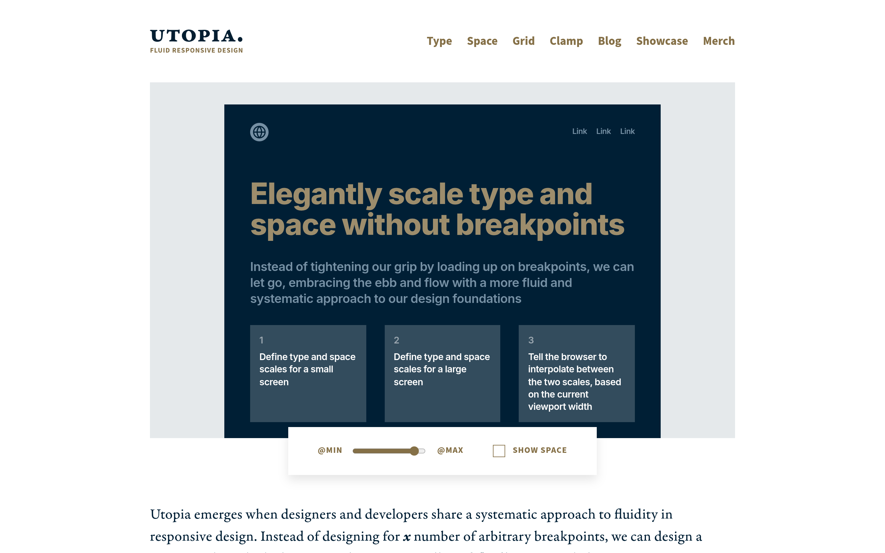

# 流式响应排版计算器：Utopia

## 直观预览

> Utopia 官网（1440×900）："Elegantly scale type and space without breakpoints"——定义大小屏两套字号/间距比例，生成 CSS clamp() 实现流式缩放。

## 一句话价值

流式排版计算器：定好"小屏一套字号、大屏一套字号"，它生成 CSS `clamp()` 让字号和间距随视口**平滑缩放**——不用写一堆断点。

## AI 选用指南

| 项目 | 选用说明 |
| --- | --- |
| 优先选用条件 | 做响应式落地页/品牌站，想要字号间距随屏幕优雅缩放而非跳变；想建立一套字号/间距的设计 token。 |
| 不适合或暂缓条件 | 后台管理系统（固定布局、断点够用）时收益不大；设计稿本身就是固定尺寸、不考虑多端时用不上。 |
| 复用方式 | 使用工具（在线计算生成 CSS）、套用方法（流式排版思想） |
| 输入与产出 | 小屏/大屏两套字号与间距比例 → 一段 CSS（clamp 表达式 + 自定义属性），直接贴进项目。 |
| 首次读取入口 | [本卡](./流式响应排版计算器-Utopia-2026-10-07.md) →「内容摘要」；官网 https://utopia.fyi（Type / Space / Grid / Clamp 计算器）。 |
| 同类选择依据 | 库内暂无流式排版工具类收藏；与 [Apple 官网排版细节鉴赏](../../交互细节/Apple官网排版细节鉴赏-2026-10-06.md) 分工：Apple 那张是"鉴赏排版细节"，Utopia 是"生成排版代码"。 |
| 接入前提与待核实项 | 在线工具，无需安装；生成的 CSS 兼容性（clamp 主流浏览器均支持）；未实际生成验证。 |
| 检索词 | Utopia 流式排版 fluid typography clamp CSS 响应式字号 space scale |

> 核查记录：整理于 2026-10-07，基于官网首页（Type / Space / Grid / Clamp 四个计算器）。原话："Utopia is not a product, a plugin, or a framework. It's a memorable/pretentious word we use to refer to a way of thinking about fluid responsive design." 未实际生成验证。

## 内容摘要

Utopia（https://utopia.fyi）是一套"流式响应排版"的思想 + 在线计算器。

- **思想**：别再堆断点（breakpoints）了——为小屏和大屏各定义一套字号/间距比例，让浏览器在两者之间按视口宽度**插值**，元素按比例流式缩放。
- **工具**：Type（流式字号）、Space（流式间距）、Grid、Clamp 四个计算器，输出 CSS 自定义属性 + `clamp()` 表达式，复制即用。
- **好处**：代码少、设计开发协作顺（同一套比例）、视觉和谐一致。
- 原话："Utopia is not a product, a plugin, or a framework"——它首先是一种排版思想，计算器只是落地手段。

## 为什么值得收藏

1. **思想比工具值钱**："不用断点做响应式"这个思路本身就值得收，计算器是附赠。
2. **和他的审美对得上**：反模板、要细节——流式排版正是"细节控"的排版方案。
3. **和刚收的 Apple 排版鉴赏联动**：一张讲"排版细节长什么样"，一张讲"排版代码怎么生成"，一鉴赏一落地。

## 未来可以怎么用

- 落地页/品牌站：用 Utopia 生成整套流式字号和间距 token，一次定义、多端自适应。
- 和 Fontsource 搭配：字体文件（Fontsource）+ 字号系统（Utopia）= 完整排版方案。
- 做设计系统时，把流式比例写进 design tokens。

## 原始内容 / 链接

- 官网：https://utopia.fyi（含 Type / Space / Grid / Clamp 计算器）
- 发现链：X @VibeEverything 推文 → Designeer（designeer.xyz）Type 分组 → 本站
- 未实际生成验证。

## 相关联想

- [开源字体 npm 自托管：Fontsource](./开源字体npm自托管-Fontsource-2026-10-07.md)：字体 + 字号系统，排版双件套
- [Apple 官网排版细节鉴赏](../../交互细节/Apple官网排版细节鉴赏-2026-10-06.md)：鉴赏 vs 生成，一体两面

## 适合反向调用的场景

- 响应式页面字号断点写了一堆，有没有更优雅的方案？
- 我想定一套字号/间距的设计 token，有什么工具？
- 我收藏过哪些排版相关的资源？
