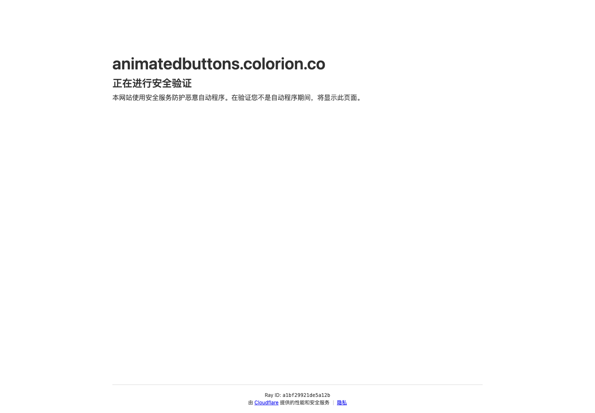

# CSS 动画按钮库：Animated Buttons

## 直观预览

> Animated Buttons 首屏截图，直观看 CSS 动画按钮的样式和交互方向。

## 一句话价值

一个开源 CSS 动画按钮参考库，适合给 CTA、表单提交、下载、订阅、购买等关键操作补充轻量微交互。

## AI 选用指南

| 项目 | 选用说明 |
| --- | --- |
| 优先选用条件 | 现有页面只缺 CTA、下载或提交按钮的 CSS hover、按下等视觉效果。 |
| 不适合或暂缓条件 | 业务 loading、成功或错误状态仍需自行连接；不是完整表单系统。 |
| 复用方式 | 视觉参考；复制代码 |
| 输入与产出 | 按钮语义、尺寸、品牌颜色 → 局部 CSS 按钮效果。 |
| 首次读取入口 | [本卡](./CSS动画按钮库-Animated-Buttons-2026-07-16.md) →「直观预览」 |
| 同类选择依据 | Animated Buttons 便于挑不同按钮效果；收藏按钮卡针对收藏反馈；Border Beam 只做边框强调。 对照：[收藏按钮流光高亮效果](../收藏按钮流光高亮效果-2026-07-02.md)、[React 发光边框动效组件：Border Beam](../动效/React发光边框动效组件-Border-Beam-2026-07-07.md)。 |
| 接入前提与待核实项 | 复制前查看具体按钮源码和许可；静态 hover 示例不能证明键盘或触屏行为完整。 |
| 检索词 | Animated Buttons CSS按钮 hover press CTA 下载按钮 |

> 选用说明整理于 2026-09-20：适用与比较为基于收藏证据的建议；正文中的版本、数量、价格与功能范围按原收录时间理解。本次未安装或运行所收藏的工具，当前环境安装状态另查。未对外部来源作全量实时复核。

## 内容摘要

Animated Buttons 是 Colorion 提供的 CSS 动画按钮资源，用户备注为“开源 CSS 动画按钮”。这类素材适合在界面里解决一个很具体的问题：按钮不只是静态矩形，而是能通过 hover、active、loading、success 等状态给用户明确反馈。

它更适合作为局部组件参考，而不是整站视觉风格。用得好可以提升点击欲望和操作确认感；用得过度会让界面变吵。因此未来给 Codex 使用时，应限定应用场景：只给主 CTA、关键转化按钮、上传/生成/下载按钮做动画，不要让所有按钮一起动。

## 为什么值得收藏

1. 按钮是高频交互入口，动画按钮可以直接提升界面反馈和转化感。
2. CSS 实现门槛低，适合快速迁移到现有前端项目里。
3. 对 AI 生成界面很有用：可以明确要求 Codex 参考某类按钮动效，而不是泛泛说“高级一点”。
4. 可以和 Border Beam、收藏按钮流光高亮效果一起整理成“局部强调组件库”。

## 未来可以怎么用

- 给 landing page 的主 CTA 增加 hover、流光、边框、填充或箭头位移动效。
- 给 AI 生成、上传、下载、提交按钮做 loading / success / disabled 状态。
- 做按钮设计规范时，区分 primary、secondary、danger、ghost、icon button 的动效强度。
- 让 Codex 只在关键按钮上使用动画，普通操作按钮保持克制。

## 原始内容 / 链接

- 官网：[https://animatedbuttons.colorion.co/](https://animatedbuttons.colorion.co/)
- 用户提供短链：[https://t.co/DixL0ioh4o](https://t.co/DixL0ioh4o)
- 类型：开源 CSS 动画按钮资源
- 用户备注：开源 CSS 动画按钮

## 相关联想

- 和 Border Beam 搭配：Border Beam 更适合重点卡片和 CTA 边框，Animated Buttons 更适合按钮本体交互。
- 和 Transitions.dev 搭配：按钮是局部动效，Transitions.dev 更偏页面/组件切换动效。
- 可以把按钮动效按“hover、press、loading、success、danger confirm”继续拆成细分索引。

## 适合反向调用的场景

- 我想让网站 CTA 按钮更有点击反馈。
- 我想给 Codex 一个按钮动画参考，而不是让它随便发挥。
- 我想整理一套前端按钮状态和微交互规范。
- 我想给生成、上传、下载这类动作做更明确的状态变化。
