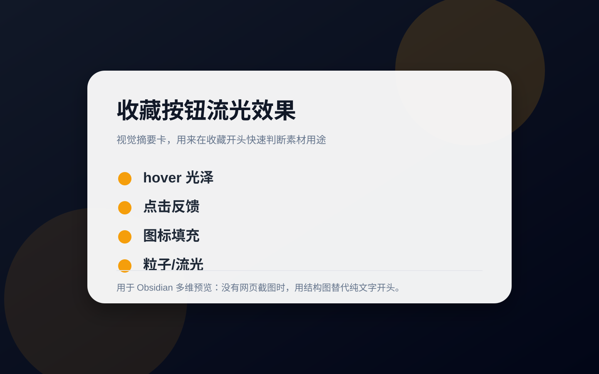

# 收藏按钮流光高亮效果

## 直观预览



> 视觉摘要卡：用于提示这是一类收藏/点赞按钮的流光反馈素材。


> [!summary] 一句话价值
> 适合给收藏、点赞、关注这类高频按钮增加明显但不厚重的反馈感，能快速做出“被点亮”的视觉记忆点。

## AI 选用指南

| 项目 | 选用说明 |
| --- | --- |
| 优先选用条件 | 内容产品需要收藏、点赞的流光高亮与图标反馈，想从已保存片段开始改。 |
| 不适合或暂缓条件 | 不能把视觉切换当成真正的收藏持久化；不适合代替整个按钮体系。 |
| 复用方式 | 复制代码；视觉参考 |
| 输入与产出 | 按钮状态、成功失败结果、项目样式 → 调整后的收藏按钮片段。 |
| 首次读取入口 | [本卡](./收藏按钮流光高亮效果-2026-07-02.md) →「原始内容 / 链接」 |
| 同类选择依据 | 本卡有具体片段；Animated Buttons 提供多种按钮方向；Border Beam 用于纯边框强调。 对照：[CSS 动画按钮库：Animated Buttons](./按钮/CSS动画按钮库-Animated-Buttons-2026-07-16.md)、[React 发光边框动效组件：Border Beam](./动效/React发光边框动效组件-Border-Beam-2026-07-07.md)。 |
| 接入前提与待核实项 | 先检查片段 HTML/CSS 与项目结构，补业务事件、键盘语义、重复点击处理；来源许可需按实际用途核实。 |
| 检索词 | 收藏按钮 点赞 流光 高亮 Uiverse 收藏成功 |

> 选用说明整理于 2026-09-20：适用与比较为基于收藏证据的建议；正文中的版本、数量、价格与功能范围按原收录时间理解。本次未安装或运行所收藏的工具，当前环境安装状态另查。未对外部来源作全量实时复核。

## 内容摘要

这段代码的核心是按钮文字上的流光扫过效果，通过渐变文字和循环动画制造轻微发亮感。虽然它本身不是完整的“气泡喷发”粒子动画，但很适合作为收藏按钮反馈的第一层视觉，再往外叠加气泡、粒子或爱心喷发效果就能升级成更完整的交互。

## 为什么值得收藏

1. 实现成本低，纯 CSS 就能先做出明显反馈。
2. 很适合承接“收藏成功”“已点赞”“已关注”这类状态变化。
3. 可以单独使用，也可以作为更复杂按钮动效的基础层。
4. 适合迁移到作品集、内容产品、活动页 CTA、卡片收藏入口等场景。

## 未来可以怎么用

1. 用在内容产品里的收藏按钮，让点击后的反馈更有情绪。
2. 和气泡、粒子、星点、爱心喷发效果叠加，做成完整的收藏成功动效。
3. 抽成按钮状态模板，复用到点赞、关注、加入愿望单、立即领取等按钮。
4. 在品牌页或活动页里做轻量 CTA 强化，提升按钮的记忆点。

## 原始内容 / 链接

来源说明：`From Uiverse.io by neerajbaniwal`

```css
/* From Uiverse.io by neerajbaniwal */
.btn-shine {
  position: absolute;
  top: 50%;
  left: 50%;
  transform: translate(-50%, -50%);
  padding: 12px 48px;
  color: #fff;
  background: linear-gradient(to right, #9f9f9f 0, #fff 10%, #868686 20%);
  background-position: 0;
  -webkit-background-clip: text;
  -webkit-text-fill-color: transparent;
  animation: shine 3s infinite linear;
  animation-fill-mode: forwards;
  -webkit-text-size-adjust: none;
  font-weight: 600;
  font-size: 16px;
  text-decoration: none;
  white-space: nowrap;
  font-family: "Poppins", sans-serif;
}
@-moz-keyframes shine {
  0% {
    background-position: 0;
  }
  60% {
    background-position: 180px;
  }
  100% {
    background-position: 180px;
  }
}
@-webkit-keyframes shine {
  0% {
    background-position: 0;
  }
  60% {
    background-position: 180px;
  }
  100% {
    background-position: 180px;
  }
}
@-o-keyframes shine {
  0% {
    background-position: 0;
  }
  60% {
    background-position: 180px;
  }
  100% {
    background-position: 180px;
  }
}
@keyframes shine {
  0% {
    background-position: 0;
  }
  60% {
    background-position: 180px;
  }
  100% {
    background-position: 180px;
  }
}
```

## 相关联想

1. 可以把文字流光改成图标流光，让星标、心形、书签图标更有“被激活”的感觉。
2. 如果后续补一层 `::before` 或 `::after` 粒子，就能往“气泡喷发”方向继续扩展。
3. 适合和收藏数量跳动、图标填充、轻微缩放组合成一套完整反馈。

## 适合反向调用的场景

1. 我收藏过哪些按钮或动效参考？
2. 有哪些素材适合给收藏按钮增加反馈感？
3. 我想给 glint.red 或内容产品做一个更有记忆点的 CTA，可以借用什么？
4. 有没有适合继续扩展成点赞/收藏成功动画的基础样式？
