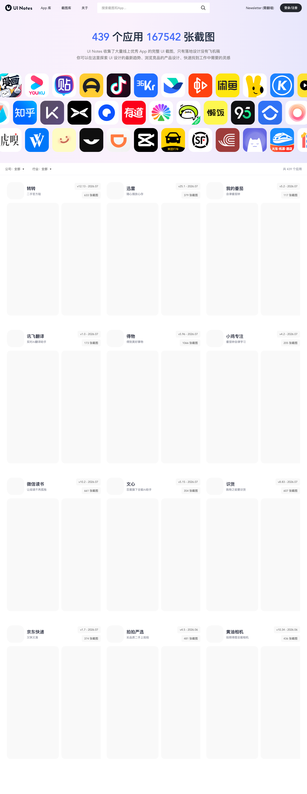

# UI 设计真实产品灵感库：UI Notes

## 直观预览

> UI Notes 首页首屏截图。页面展示其应用库、截图库、搜索入口和 App 图标墙，能直观看到它是一个真实产品 UI 截图灵感库。

## 一句话价值

UI Notes 是一个中文真实产品 UI 设计灵感库，收集线上 App 的完整 UI 截图，适合查找中文应用界面、竞品流程、移动端组件和真实落地设计参考。

## AI 选用指南

| 项目 | 选用说明 |
| --- | --- |
| 优先选用条件 | 要研究中文移动 App 的真实页面、竞品流程与组件出现的上下文。 |
| 不适合或暂缓条件 | 找可安装 Web 组件、源代码或桌面后台基座时不优先选。 |
| 复用方式 | 视觉参考 |
| 输入与产出 | 产品类型、用户任务、目标流程 → 有来源的截图样本和流程分析。 |
| 首次读取入口 | [本卡](./UI设计真实产品灵感库-UI-Notes-2026-07-27.md) →「内容摘要」 |
| 同类选择依据 | UI Notes 看真实 App 流程；Component Gallery 比较组件模式；NameThatUI 用于命名。 对照：[界面组件设计案例库：Component Gallery](../组件/界面组件设计案例库-Component-Gallery-2026-07-16.md)、[UI 元素命名视觉词典：NameThatUI](../组件/UI元素命名视觉词典-NameThatUI-2026-07-18.md)。 |
| 接入前提与待核实项 | 在线目录、访问范围和截图覆盖需按目标案例查看；截图只作为设计研究，不能代表可用源码。 |
| 检索词 | UI Notes 中文App 移动端 截图 竞品 搜索 发布 会员流程 |

> 选用说明整理于 2026-09-20：适用与比较为基于收藏证据的建议；正文中的版本、数量、价格与功能范围按原收录时间理解。本次未安装或运行所收藏的工具，当前环境安装状态另查。未对外部来源作全量实时复核。

## 内容摘要

UI Notes 官网标题是 `UI Notes - 真实产品 UI 设计灵感库`。首页显示当前收录 `439 个应用`、`167542 张截图`，主张是“只有落地设计没有飞机稿”。它提供 `App 库`、`截图库`、搜索入口，以及按公司和行业筛选应用的能力。

网站的价值不在于单张漂亮截图，而在于它按真实 App 和真实功能流程组织界面案例。用户可以从 App 维度浏览一个产品的完整界面，也可以从截图库搜索具体页面和组件灵感。首页筛选维度包括公司和行业，行业覆盖工具、购物、社交、摄影与录像、生活、效率、娱乐等类别。

关于页说明 UI Notes 由 UI 设计师 mx 设计并开发，于 2021 年底上线，目标是成为国内完整实用的 UI 设计灵感网站。它明确反对只看 Dribbble / Behance 飞机稿的问题，强调可用于真实项目、按 App 维度查看完整功能、每周更新线上 App，并通过较细的界面分类和搜索帮助快速找到灵感。

## 为什么值得收藏

1. 它专注真实上线 App，不是概念稿，适合做可落地的 UI / UX 参考。
2. 中文应用覆盖价值高，能补足 Mobbin、Pttrns 等海外 UI 灵感站缺少中文产品语境的问题。
3. 按 App 维度浏览完整功能，适合拆解注册登录、首页、搜索、详情页、发布流、会员、支付、设置等完整 UX 流程。
4. 按公司和行业筛选，适合做竞品调研、行业设计趋势观察和功能模式对比。
5. 给 Codex 做产品界面时，可以作为“真实界面案例来源”，避免只生成漂亮但不贴业务的卡片堆叠。

## 未来可以怎么用

- 做移动端 App 或 Web App 页面前，先去 UI Notes 找同类产品的真实界面流程。
- 做中文产品设计时，优先参考里面的中文信息密度、按钮文案、导航结构、空状态和运营位处理。
- 做竞品分析时，按 App 维度截取完整流程，再让 Codex 总结页面结构、组件模式和可复用交互。
- 做抖音热点脚本网站时，可用它参考内容产品、视频产品、搜索筛选、素材库、模板库和导出页的真实界面组织方式。
- 做 glint.red 或其他工具型产品时，可把它和 BoardUI、Component Gallery、NameThatUI 搭配：先找真实案例，再确定组件学名，最后落地成产品界面。

## 原始内容 / 链接

- 官网：[https://uinotes.com/](https://uinotes.com/)
- 关于页：[https://uinotes.com/about](https://uinotes.com/about)
- 页面标题：`UI Notes - 真实产品 UI 设计灵感库`
- 官网描述：UI Notes 收集大量线上优秀 App 的完整 UI 截图，只有落地设计没有飞机稿。
- 首页观察时间：2026-07-27
- 首页显示：`439 个应用`、`167542 张截图`
- 核心入口：`App 库`、`截图库`、搜索截图和 App、公司筛选、行业筛选
- 创建者：关于页显示由 UI 设计师 mx 设计并开发
- 上线时间：关于页显示 2021 年底上线

## 相关联想

- 和 [[Dashboard设计系统-BoardUI-2026-07-09]] 的关系：BoardUI 偏 SaaS dashboard 组件语言，UI Notes 偏真实中文 App 流程与移动端案例。
- 和 [[界面组件设计案例库-Component-Gallery-2026-07-16]] 的关系：Component Gallery 帮助确定组件模式，UI Notes 提供真实 App 中的落地案例。
- 和 [[UI元素命名视觉词典-NameThatUI-2026-07-18]] 的关系：NameThatUI 负责组件学名和交互边界，UI Notes 负责找实际产品如何使用这些组件。
- 和 [[现代React组件库-HeroUI-2026-07-23]] 的关系：UI Notes 可做设计参考，HeroUI 可做 React 前端实现基座。
- 和 [[AI提示词视频编辑器-ChatCut-2026-07-12]] 的关系：如果要做视频脚本、素材库或剪辑工具，可先在 UI Notes 查同类中文产品的真实流程。

## 适合反向调用的场景

- 我想找中文 App 的真实 UI / UX 参考。
- 我要做一个移动端或工具型产品，有没有不是飞机稿的界面灵感库？
- 帮我从收藏里找适合做竞品界面分析的资源。
- Codex 要做页面前，有没有可以先参考真实产品流程的网站？
- 我想拆解某类 App 的首页、搜索、详情、发布、会员或设置流程。
