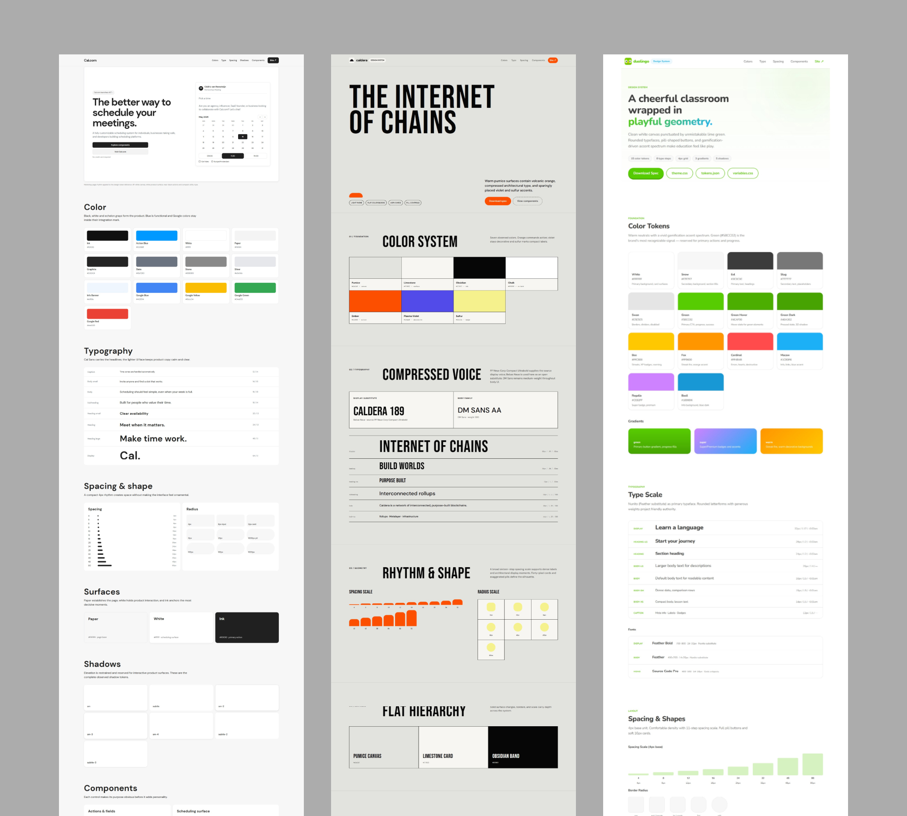

# 品牌设计上下文参考库：brands-design-md

## 直观预览

> 项目仓库自带的预览拼图，展示 Cal.com、Caldera、Duolingo 三套品牌参考页，可直观看到每套资料对色彩、排版、间距、形状和组件语言的结构化呈现。

## 一句话价值

`brands-design-md` 把 69 个知名品牌的公开视觉语言整理成适合人和 AI 共同读取的 `DESIGN.md`、设计令牌、CSS 变量、主题样式、截图与网页预览，可在做界面前快速建立具体的品牌风格上下文。

## 内容摘要

这是 `ricocc` 整理的开源品牌设计参考库。项目不是只收集好看的网页截图，而是为每个品牌建立一套可查询、可比较、可直接用于设计与前端实现的资料目录。

截至 2026-08-03，README 列出 69 个品牌，包括 Airbnb、Apple、Cal.com、Claude、Cursor、Duolingo、Figma、Linear、Nike、Notion、PostHog、Raycast、Spotify、Tesla、Vercel 等。部分标记为 `Inspired` 的条目是非官方风格参考，需要和品牌官网及官方规范交叉验证。

典型品牌目录包含：

- `DESIGN.md`：品牌视觉方向、色彩、字体、字号、行高、间距、圆角、栅格、组件和应避免的做法。
- `preview.html`：可直接在浏览器中查看的视觉预览。
- `cover_<domain>.webp`：对应品牌官网的截图封面。
- `tokens.json`：结构化设计令牌。
- `variables.css`：CSS 自定义属性。
- `theme.css`：可复用主题样式。

它提出的 `DESIGN.md` 可以理解为一种便携的“设计上下文文档”：比单张灵感截图更结构化，又比完整官方设计系统更轻量，适合直接提供给 Codex、Claude Code 等 AI coding agent 作为页面视觉约束。

## 为什么值得收藏

1. 同时提供视觉预览、文字规则和实现层令牌，能把“看起来像某品牌”转成可执行的设计约束。
2. `DESIGN.md` 的结构很适合 AI 辅助设计与编程，可减少模型只凭模糊风格词猜颜色、间距和组件形态的问题。
3. 69 个品牌可以横向比较，适合研究同一类界面在不同品牌气质下如何处理色彩、排版、圆角、密度和按钮。
4. `tokens.json`、`variables.css`、`theme.css` 提供从参考到实现的桥梁，适合搭建项目级设计令牌或快速验证视觉方向。
5. 每个品牌都保留截图和独立预览，先扫描视觉，再深入读文档，查找成本低。
6. 项目明确说明这些资料是基于公开信息的非官方整理，不可替代品牌官网和官方设计规范，这个边界值得保留。

## 未来可以怎么用

- 启动新网站或产品界面前，先挑 2-3 个气质接近的品牌，对比它们的 `DESIGN.md` 和预览，再形成自己的视觉 brief。
- 给 Codex 做页面时，选取目标品牌的 `DESIGN.md` 作为上下文，同时明确“借鉴设计语言，不复制商标、文案和受保护资产”。
- 从 `tokens.json`、`variables.css` 中提取色彩、字体、间距和圆角候选，改造成项目自己的 design tokens。
- 做 glint.red 时，可对比 Linear、Raycast、Vercel、Stripe-inspired 等方向，选择更匹配的密度、对比度和组件节奏。
- 做竞品或品牌研究时，用统一目录结构比较不同品牌对导航、按钮、卡片、表单和内容宽度的处理。
- 建立自己的 `DESIGN.md` 模板，把品牌气质、令牌、组件规则、布局节奏和禁用项沉淀成 AI 可调用规范。

## 原始内容 / 链接

- GitHub：[https://github.com/ricocc/brands-design-md](https://github.com/ricocc/brands-design-md)
- 作者：`ricocc`
- 默认分支：`master`
- 收藏时 HEAD：`5a8f61c5c72e4431876f518ae761165291471153`
- README 统计：69 个品牌（观察时间：2026-08-03）
- 英文 README 快照：[README-2026-08-03.md](../../_附件/项目备份/brands-design-md/README-2026-08-03.md)
- 中文 README 快照：[README-zh-CN-2026-08-03.md](../../_附件/项目备份/brands-design-md/README-zh-CN-2026-08-03.md)
- 源码快照：[brands-design-md-source-2026-08-03.zip](../../_附件/项目备份/brands-design-md/brands-design-md-source-2026-08-03.zip)
- 远程引用快照：[refs-2026-08-03.txt](../../_附件/项目备份/brands-design-md/refs-2026-08-03.txt)
- 许可提醒：收藏时源码根目录未发现独立 `LICENSE` 文件。README 虽称其为开源项目，但品牌名称、商标和相关视觉资产仍归各自权利人所有；实际复用前应核查项目最新许可与品牌使用规范。

## 相关联想

- 和 [[UI设计真实产品灵感库-UI-Notes-2026-07-27]] 的关系：UI Notes 提供真实中文 App 流程截图，brands-design-md 更侧重品牌视觉规则、令牌和 AI 上下文。
- 和 [[UI元素命名视觉词典-NameThatUI-2026-07-18]] 的关系：NameThatUI 帮助说清组件是什么，brands-design-md 帮助说清组件应该呈现什么品牌气质。
- 和 [[现代React组件库-HeroUI-2026-07-23]] 的关系：前者提供视觉方向和令牌参考，后者可以承担 React 界面的组件实现。
- 和 [[网站复刻真源码优先方法论-web-clone-2026-07-09]] 的关系：可以把品牌资料作为设计证据的一部分，但仍应以目标官网、真实源码和视觉验收为准。

## 适合反向调用的场景

- 我要给新产品确定品牌视觉方向，收藏里有哪些可比较的品牌参考？
- 给 Codex 做页面时，有没有可直接作为设计上下文的资料？
- 我想参考 Linear、Vercel、Raycast、Notion 或 Duolingo 的设计语言。
- 怎样把品牌截图进一步整理成颜色、排版、间距和组件规则？
- 我需要一套 `DESIGN.md` 或 design tokens 的结构参考。
- glint.red 的界面可以从哪些品牌风格里选方向？
