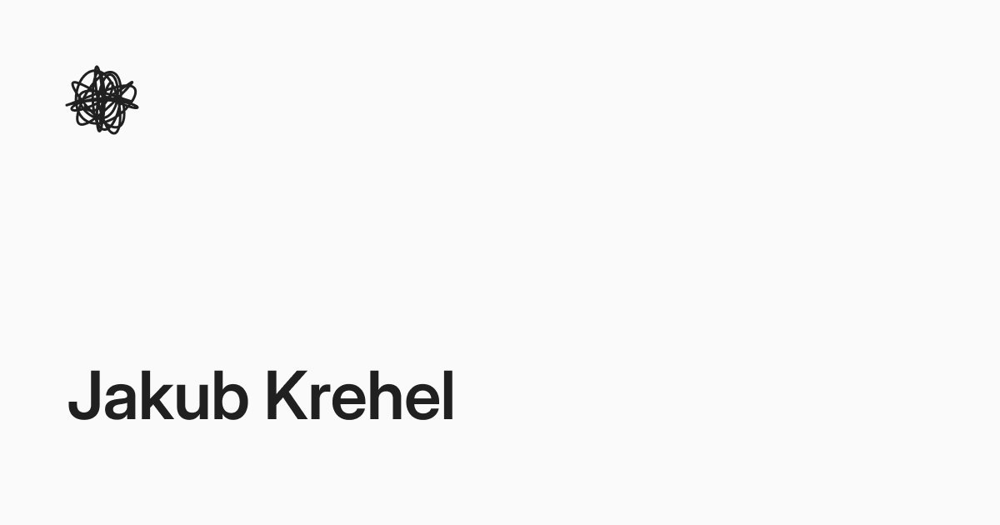

# 极简设计工程个人作品集：jakub.kr

## 直观预览

> 官网的 OG 分享图，以大字号姓名和手绘式个人标记构成极简识别面。另已保存首页 HTML 快照，用于回看完整的信息结构和内容入口。

## 一句话价值

`jakub.kr` 用克制的单栏布局把设计工程师的身份、项目、Skills、写作和 Newsletter 组织成一条清晰浏览路径，是一个适合独立创作者和设计工程师参考的极简个人作品集。

## 内容摘要

`jakub.kr` 是 Jakub Krehel 的个人作品集与内容主页。页面没有营销式大 Hero，也没有把每个项目包装成大型卡片，而是先用简短自述建立身份和价值观，再依次进入项目、Skills、写作与订阅。

Jakub 在网站上介绍自己是 Interfere 的 founding design engineer，此前曾在 OpenSea 和其他公司工作。他强调 craft、quality，以及通过作品让用户产生感受。这些人物信息在页面中承担的是作品集定位，而不是卡片的主要收藏对象。

首页把内容组织为四组：

- `Projects`：包括设计工程杂志 [Interfaces](https://interfaces.dev/) 和 OKLCH 指南 [oklch.fyi](https://www.oklch.fyi/)。
- `Skills`：提供 `/skills` 总入口，以及 `make-interfaces-feel-better`、`oklch-skill` 等可供 AI 使用的设计知识封装。
- `Writing`：持续写界面细节、手势与动效、AI 设计工程、shared layout animations、渐变和 OKLCH。
- `Newsletter`：用于发布新文章、设计工程资源和订阅者专属内容；2026-08-03 首页显示约 2,191 名其他订阅者。

首页列出的代表内容包括 `Less Is More, More or Less`、`Details That Make Interfaces Feel Better`、`Using Gestures in Motion`、`Drag Gestures on the Web`、`Using AI as a Design Engineer`、`How I Use Shared Layout Animations`、`Understanding Gradients` 和 `What Are OKLCH Colors?`。

## 为什么值得收藏

1. 页面信息层级很克制：身份说明之后直接进入项目、Skills、文章和 Newsletter，适合内容型个人作品集。
2. 通过小尺寸预览、简短描述、日期和分组标题控制信息密度，不依赖巨型图片或装饰性卡片。
3. 字体组合、灰阶、紧凑列表、克制阴影和细小 hover 反馈，形成安静但不单调的设计工程气质。
4. Projects、Skills、Writing 三类入口共同证明能力，避免作品集只展示成品截图而看不到方法、判断和持续输出。
5. Interfaces 和 oklch.fyi 分别承接媒体与工具，展示个人站如何把外部项目纳入统一叙事。
6. 文章主题聚焦界面细节、手势、动效、渐变和颜色，使网站内容与作者的设计工程定位高度一致。

## 未来可以怎么用

- 做个人作品集时复用“短自述 -> 项目 -> Skills -> 写作 -> Newsletter”的页面骨架。
- 展示设计工程能力时，不只放项目截图，同时加入交互实验、工具、文章和可调用 Skill。
- 做 glint.red 或其他前端产品时，参考其灰阶、字体、列表密度、紧凑预览和局部 hover 反馈。
- 研究 `make-interfaces-feel-better` 与 `oklch-skill`，学习如何在个人网站中呈现 AI 可调用能力。
- 写技术内容时借鉴他的选题尺度：围绕一个可感知的界面问题，给出原理、互动演示和实现细节。

## 原始内容 / 链接

- 个人网站：[https://jakub.kr/](https://jakub.kr/)
- RSS：[https://jakub.kr/api/rss](https://jakub.kr/api/rss)
- X：[https://x.com/jakubkrehel](https://x.com/jakubkrehel)
- GitHub：[https://github.com/jakubkrehel](https://github.com/jakubkrehel)
- LinkedIn：[https://www.linkedin.com/in/jakubkrehel/](https://www.linkedin.com/in/jakubkrehel/)
- Interfaces：[https://interfaces.dev/](https://interfaces.dev/)
- OKLCH 指南：[https://www.oklch.fyi/](https://www.oklch.fyi/)
- 首页 HTML 快照：[Jakub-Krehel-首页-2026-08-03.html](../../_附件/网页快照/Jakub-Krehel-首页-2026-08-03.html)
- 页面观察时间：2026-08-03
- 页面技术线索：Next.js 静态预渲染并部署于 Vercel；首页预加载 Inter、Open Runde、Berkeley Mono、Libre Baskerville、Heldane 等字体资源。

## 相关联想

- 和 [[设计工程AI技能库-emilkowalski-Skills-2026-07-02]] 的关系：两者都把设计工程经验转成 Agent Skills，可对比它们如何拆规则、示例和触发场景。
- 和 [[Web过渡动效参考库-Transitions-dev-2026-07-07]] 的关系：Transitions.dev 偏可浏览的过渡案例，Jakub Krehel 的内容更强调交互原理、手势和设计判断。
- 和 [[配色对比度检测工具-Colorable-2026-07-07]] 的关系：Colorable 偏对比度验收，Jakub 的 OKLCH 内容更适合建立现代颜色系统和感知一致性。
- 和 [[品牌设计上下文参考库-brands-design-md-2026-08-03]] 的关系：brands-design-md 提供品牌级风格上下文，Jakub 的写作与 Skills 可以补充界面细节和实现质量。

## 适合反向调用的场景

- 有没有克制、单栏、不靠大图堆叠的个人作品集参考？
- 个人网站怎样同时呈现项目、Skills、写作和 Newsletter？
- 设计工程师的作品集怎样展示方法与持续输出，而不只是成品截图？
- glint.red 可以参考哪些安静、紧凑的界面结构和交互细节？
- 如何把文章、工具和 Agent Skill 组织进同一个个人品牌网站？
