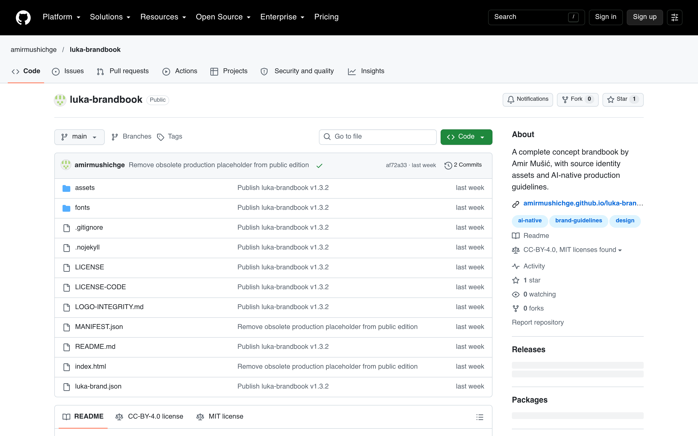

# 概念品牌手册：Luka brandbook

## 直观预览

> GitHub 仓库页（1440×900）：amirmushichge/luka-brandbook——虚构咖啡品牌 Luka 的完整概念品牌手册，含在线版、离线 HTML、素材包下载。

## 一句话价值

一套"AI 原生"的完整品牌手册开源项目：虚构咖啡品牌 Luka 的 logo/字体/色彩/摄影规范 + 生产指南，附 luka-brand.json（给 agent 读的紧凑品牌包）——品牌规范怎么写才能被 AI 直接用，看这一套就够了。

## AI 选用指南

| 项目 | 选用说明 |
| --- | --- |
| 优先选用条件 | 需要参考"品牌手册长什么样"；想看品牌规范如何写成 agent 可读的 JSON（luka-brand.json）；做 AI 生图需要品牌一致性约束时。 |
| 不适合或暂缓条件 | 只是找 logo 灵感时内容偏多；虚构品牌，视觉资产不能直接商用（CC BY 4.0 需署名）。 |
| 复用方式 | 视觉参考、结构参考（luka-brand.json 当模板） |
| 输入与产出 | 品牌手册结构 → 自己品牌的规范文档；luka-brand.json → 改成自己品牌的 agent 可读包。 |
| 首次读取入口 | [本卡](./概念品牌手册-Luka-brandbook-2026-10-09.md) →「内容摘要」；在线版 https://amirmushichge.github.io/luka-brandbook/。 |
| 同类选择依据 | 库内品牌类：[brands-design-md](../灵感库/品牌设计上下文参考库-brands-design-md-2026-08-03.md)（69 个品牌的 DESIGN.md 合集）vs 本仓库（单个品牌的完整手册 + agent 可读 JSON）；要"全"看前者，要"深 + AI 可用"看这个。 |
| 接入前提与待核实项 | CC BY 4.0（署名可商用改编）；HTML/CSS/JS 部分 MIT；字体 OFL；品牌为虚构。 |
| 检索词 | Luka brandbook 品牌手册 brand JSON AI-native 品牌规范 amirmushichge |

> 核查记录：整理于 2026-10-09，基于仓库 README 全文。未下载素材包验证。

## 内容摘要

Luka brandbook（https://github.com/amirmushichge/luka-brandbook）是 AmirMušić 为《Design with AI》长文自制的虚构咖啡品牌完整手册（Mostar 咖啡馆概念），也是文内模型测试的统一测试品牌。

- **内容**：logo（SVG 主视觉 + 透明 PNG）、字体（Cormorant Garamond + DM Sans，OFL）、色彩、摄影规范、应用示例。
- **在线版**：https://amirmushichge.github.io/luka-brandbook/（图片字体全内嵌，可离线看）。
- **luka-brand.json**："a compact brand packet for agents and production tools"——给 agent 读的紧凑品牌包，这正是 DESIGN_SKILL.md 理念的实例。
- **AI-native 生产指南**：把"固定品牌资产 / 任务需求 / 生成的场景内容 / 发布检查"四层分开，LOGO-INTEGRITY.md 讲如何保住源文件不被 AI 改画。
- **下载**：luka-brand-kit.zip（完整素材包）、luka-brandbook.html（离线单文件）。
- **许可**：指南/文案/创意资产 CC BY 4.0（署名可商用改编），HTML/CSS/JS 部分 MIT，字体 OFL。
- **仓库**：2026-10-02 建仓，收录时 1 star。

## 为什么值得收藏

1. **"品牌规范给 AI 读"长什么样**：luka-brand.json 就是答案——紧凑、结构化，agent 直接消费。以后他给自己的品牌/项目写规范，直接抄这个结构。
2. **AI 生图保真方法论**：LOGO-INTEGRITY.md 讲"生成前给源文件、生成后对齐检查、交付前换回源 SVG"——AI 生图做品牌视觉的标准动作。
3. 和 [Amir Design Judgment](./../../03-Codex能力/Skills/AI设计评审Skill-Amir-Design-Judgment-2026-10-09.md) 是同一作者的配套：手册是"规范"，judgment 是"评审"，合起来就是"定规范 + 验结果"闭环。

## 未来可以怎么用

- xiegao2.0 / bot 需要品牌视觉时，照这个结构写自己的 brand JSON 给 agent。
- AI 生图做品牌相关视觉时，用 LOGO-INTEGRITY.md 的流程保真。
- 和 Amir Design Judgment 搭配：一个定规范、一个做评审。

## 原始内容 / 链接

- 仓库：https://github.com/amirmushichge/luka-brandbook（CC BY 4.0，1 star，2026-10-02 创建）
- 在线版：https://amirmushichge.github.io/luka-brandbook/
- 素材包：https://github.com/amirmushichge/luka-brandbook/releases/latest/download/luka-brand-kit.zip
- 出处：X @amirmushich《Design with AI: Which models are best?》的测试品牌
- 未下载验证。

## 相关联想

- [AI 设计评审 Skill：Amir Design Judgment](../../03-Codex能力/Skills/AI设计评审Skill-Amir-Design-Judgment-2026-10-09.md)：同一作者，规范 + 评审闭环
- [品牌设计上下文参考库：brands-design-md](./品牌设计上下文参考库-brands-design-md-2026-08-03.md)：69 品牌合集 vs 单品牌深挖
- [AI 设计选型方法论：Design with AI（AmirMušić）](../../03-Codex能力/Skills/AI设计选型方法论-Design-with-AI-2026-10-09.md)：方法论出处

## 适合反向调用的场景

- 品牌规范怎么写才能被 AI agent 直接用？
- AI 生图时 logo 总被改画，怎么保真？
- 有没有完整的品牌手册可以参考结构？
