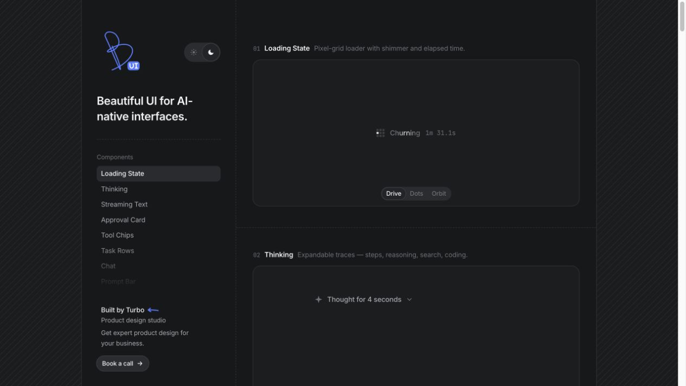

# AI 原生界面组件参考库：Beautiful UI

## 直观预览

> 官网深色首屏：以左侧组件目录组织 AI 产品的加载、推理、流式文本、批准卡片与工具调用等状态示例。

## 一句话价值

一套可复制粘贴的 AI-native 界面原语参考，把 Agent 的加载、思考、工具调用、人工批准、任务进度、检索上下文、数据修改和内容改写做成具体可交互的组件模式。

## AI 选用指南

| 项目 | 选用说明 |
| --- | --- |
| 优先选用条件 | Agent 产品需要任务、工具调用、来源、审批或数据改动的清晰界面语义。 |
| 不适合或暂缓条件 | 只缺转圈或图片占位时先看 Generative Loaders；组件示例不能替代 Agent 后端。 |
| 复用方式 | 视觉参考；复制代码 |
| 输入与产出 | 任务状态、来源与操作对象 → Task Rows、Tool Chips、Approval Card 等组件规格或示例改造。 |
| 首次读取入口 | [本卡](./AI原生界面组件参考库-Beautiful-UI-2026-08-17.md) →「组件选型速查」；随后读取[本地历史资料](../../_附件/网页快照/Beautiful-UI-2026-08-10/index.html) |
| 同类选择依据 | Beautiful UI 侧重人机协作模式且提供查看/复制代码入口；shadcn/ui 是基础控件基座，beUI 提供特定 registry 组件；Generative Loaders 聚焦等待态。 对照：[开放代码组件基座：shadcn/ui](./开放代码组件基座-shadcn-ui-2026-09-27.md)、[动画 React 组件库：beUI](./动画React组件库-beUI-2026-09-16.md)、[生成式 UI 加载动效 React 组件库：Generative Loaders](../动效/生成式UI加载动效React组件库-Generative-Loaders-2026-08-10.md)。 |
| 接入前提与待核实项 | 具体示例的框架、依赖与状态连接需查看源码；静态官网快照不保证包含所有交互代码。 |
| 检索词 | Beautiful UI Approval Card Tool Chips Task Rows Context Cards Diff Table Agent工作台 |

> 选用说明整理于 2026-09-20：适用与比较为基于收藏证据的建议；正文中的版本、数量、价格与功能范围按原收录时间理解。本次未安装或运行所收藏的工具，当前环境安装状态另查。未对外部来源作全量实时复核。

## 内容摘要

Beautiful UI 由 Turbo Product Design Studio 制作，官网当前展示 19 个组件示例。它不追求泛化的网页区块，而是针对“Agent 要和人一起完成工作”时最常见的界面状态：用户需要知道模型正在做什么、为什么建议某个动作、哪些数据会变、何时应由人确认。

当前组件覆盖：Loading State、Thinking、Streaming Text、Approval Card、Tool Chips、Task Rows、Chat、Prompt Bar、Recommendation Card、Context Cards、Diff Table、Records Table、Filter Table、Sidebar Nav、Search、Insight Cards、Code Block、Fine-tune Card 与 Selection Actions。每个示例均提供复制代码与查看代码入口。官网说明其组件按 MIT License 发布。

## 为什么值得收藏

1. 对 AI 产品最难的不是单个气泡或按钮，而是把模型过程、证据、风险、进度与人的决策放进同一个清晰界面；该库正好覆盖这一层。
2. 它将人机协作拆为可复用组件：模型发问用 Approval Card、外部动作可视化为 Tool Chips、长期工作显示为 Task Rows、带修改建议的数据操作使用 Diff Table。
3. 表格、筛选、搜索、侧边栏和洞察卡等传统业务界面，与 Agent 状态放在同一套视觉语言中，适合工具型产品而非营销落地页。
4. 组件示例强调实时状态和可操作反馈，适合作为 Codex 实现 Agent 前端时的准确参考，而非只模仿视觉。

## 未来可以怎么用

- 设计 Agent 工作台时，先用 Task Rows 表现执行队列，再用 Tool Chips 呈现每个具体操作，避免一整屏不可读的聊天文本。
- 需要用户决策或高风险动作时，使用 Approval Card 展示选项、影响与上下文，不以模糊的“确认吗”弹窗替代。
- 对 AI 建议的数据编辑，使用 Diff Table 将原值、提议值和修改范围并列展示，让用户能审阅后再接受。
- RAG/检索类产品用 Context Cards 暴露来源片段与文件类型；流式回答中用 Streaming Text、来源、后续问题与操作构成完整答案单元。
- 实现界面时优先复用其组件边界和交互语义，再按自己的产品视觉系统重做颜色、字体与间距。

## 组件选型速查

| 场景 | 优先参考组件 | 关键界面目标 |
| --- | --- | --- |
| Agent 正在执行多步任务 | Task Rows + Tool Chips | 让进度、失败与完成状态可扫描 |
| 用户需要授权或回答关键问题 | Approval Card | 清楚呈现问题、选项和上下文 |
| 流式回答与引用 | Streaming Text + Context Cards | 分开回答正文、来源与后续操作 |
| AI 提议修改表格数据 | Diff Table | 可比较、可审阅、可接受或拒绝 |
| 智能搜索与操作入口 | Search + Prompt Bar | 统一自然语言、命令、来源和模型选择 |
| 分析建议与数据趋势 | Insight Cards + Filter Table | 用可检视的数据支持建议，而不是只给结论 |

## 原始内容 / 链接

- 官网：[Beautiful UI](https://www.beautifului.dev/)
- 许可证：[MIT License](https://www.beautifului.dev/license)
- 本地官网快照：[index.html](../../_附件/网页快照/Beautiful-UI-2026-08-10/index.html)
- 本地许可证快照：[license.html](../../_附件/网页快照/Beautiful-UI-2026-08-10/license.html)

## 相关联想

- 与 [[生成式UI加载动效React组件库-Generative-Loaders-2026-08-10]] 互补：Generative Loaders 解决细粒度生成等待动效，Beautiful UI 解决整套 Agent 工作流与业务操作界面。
- 与 [[UI元素命名视觉词典-NameThatUI-2026-07-18]] 一起使用，可先从 Beautiful UI 选定模式，再用准确组件名称和交互边界约束实现。
- 与 [[Vibe-Coding视觉词典-布局结构导航组件-2026-08-05]] 一起使用，可将“Agent 工作台”拆成应用壳、侧边栏、任务列表、详情面板、批准卡片、工具日志和数据审阅表的实现 brief。

## 适合反向调用的场景

- 我在做 AI Agent 产品，哪些界面组件能让执行过程更透明？
- 如何设计人机协作中的批准、建议和数据修改流程？
- 我需要把聊天、任务进度、工具调用和表格放进一个工作台，有什么组件参考？
- 给 Codex 一个 Agent 前端的具体组件清单与交互边界。
