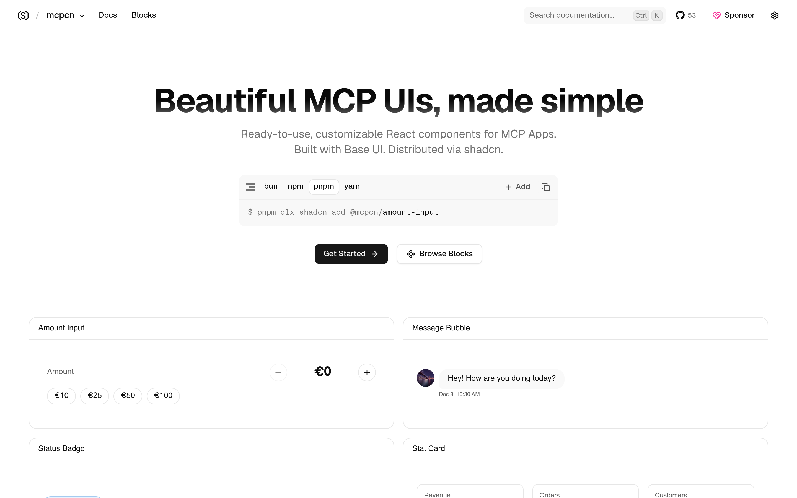

# MCP 应用 UI 组件：mcpcn

## 直观预览

> mcpcn 官网首页（1440×900）："shadcn/ui, but for building ChatGPT/Claude/MCP apps"——基于 Base UI 的 MCP App UI 组件。

## 一句话价值

"shadcn，但 for MCP 应用"：基于 Base UI 的 React 组件——做 ChatGPT/Claude 风格的聊天应用、MCP App 界面，直接 copy-paste。

## AI 选用指南

| 项目 | 选用说明 |
| --- | --- |
| 优先选用条件 | 要做 AI 聊天应用、MCP App 界面，想要 ChatGPT/Claude 风格的现成组件而非手写。 |
| 不适合或暂缓条件 | 不做聊天/AI 应用界面时用不上；项目早期（53 stars）——用之前先看仓库活跃度。 |
| 复用方式 | 安装依赖（shadcn registry：Base UI 底座的 MCP App 组件） |
| 输入与产出 | registry 安装 → 可直接用的聊天/AI 应用 UI 组件。 |
| 首次读取入口 | [本卡](./MCP应用UI组件-mcpcn-2026-10-09.md) →「内容摘要」；官网 https://www.mcpcn.dev。 |
| 同类选择依据 | 库内 AI 聊天界面类：[Beautiful UI](../01-界面设计/组件/AI原生界面组件参考库-Beautiful-UI-2026-08-17.md)（参考为主）vs mcpcn（可安装组件）；要"装上用"选 mcpcn，要"看设计"看 Beautiful UI。 |
| 接入前提与待核实项 | MIT；基于 Base UI；53 stars 早期项目，用前确认维护状态；未在本机安装验证。 |
| 检索词 | mcpcn MCP 应用 UI ChatGPT Claude 聊天界面 Base UI shadcn |

> 核查记录：整理于 2026-10-09，基于官网首页 + llms.txt（"Copy-paste React components for MCP Apps, built with Base UI"）+ GitHub（shadcn-labs/mcpcn，2026-06-22 创建，收录时 53 stars，MIT）。未安装验证。

## 内容摘要

mcpcn（https://www.mcpcn.dev）是 shadcn-labs "*cn" 家族中的 MCP 应用 UI 组件库，目前最早期的一员。

- **定位**：自述 "shadcn/ui, but for building ChatGPT/Claude/MCP apps"。
- **技术栈**：基于 Base UI 的 React 组件，shadcn CLI 安装。
- **仓库**：github.com/shadcn-labs/mcpcn，2026-06-22 建仓，收录时 53 stars，MIT——家族里最早期，star 最低。

## 为什么值得收藏

1. **AI 应用界面是趋势**：他做 xiegao2.0（写作 agent）、以后做 AI 产品，聊天界面组件迟早用得上。
2. **和 Beautiful UI 分工**：Beautiful UI 是"看设计"，mcpcn 是"装上用"。
3. *cn 家族 10 站收齐——这是最后一块拼图。

## 未来可以怎么用

- xiegao2.0 产品化时的聊天/工作台界面。
- 任何"ChatGPT 风格"内部工具的界面。
- 持续关注：53 stars 早期，先收藏，用前再看维护状态。

## 原始内容 / 链接

- 官网：https://www.mcpcn.dev
- 仓库：https://github.com/shadcn-labs/mcpcn（MIT，53 stars，2026-06-22 创建）
- 发现链：X @shadcnlabs 推文（2026-10-07，10 个 *cn 站之一）→ 本站
- 未安装验证。

## 相关联想

- [AI 原生界面组件参考库：Beautiful UI](./AI原生界面组件参考库-Beautiful-UI-2026-08-17.md)：看设计 vs 装上用
- [React 着色器组件库：shadercn](../动效/React着色器组件库-shadercn-2026-10-07.md)：同属 *cn 家族

## 适合反向调用的场景

- 想做个 ChatGPT 风格的聊天界面，有没有现成组件？
- MCP App 的 UI 有没有组件库？
- shadcn-labs 的 *cn 家族 10 个站收齐了吗？
