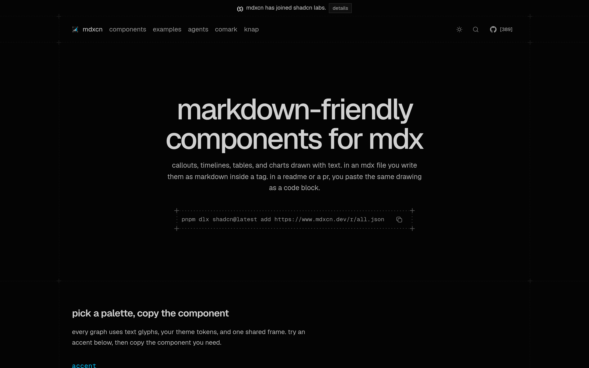

# MDX 图文组件：mdxcn

## 直观预览

> mdxcn 官网首页（1440×900）："markdown-friendly components"——callout、时间线、表格、文字图表：在 MDX 里写 markdown，README/PR 里粘代码块，同一份内容两种形态。

## 一句话价值

"给 Agent 用的图文组件"：callout、步骤、时间线、表格、文字图表——在 MDX 文件里写成标签内 markdown，在 README/PR 里粘成代码块；Agent 写文档时"别发明 ASCII、别画 SVG"，直接调它。

## AI 选用指南

| 项目 | 选用说明 |
| --- | --- |
| 优先选用条件 | 写 MDX 文档/README 需要 callout、时间线、表格、文字图表；或让 Agent 自动生成带图的文档（llms.txt 明确写了 agent 工作流）。 |
| 不适合或暂缓条件 | 纯代码文档不需要图文时不适合；非 MDX 技术栈用不上。 |
| 复用方式 | 安装依赖（shadcn registry：`pnpm dlx shadcn@latest add https://mdxcn.dev/r/all.json`）、Agent skill |
| 输入与产出 | markdown 内容 → 渲染好的图文组件（MDX 里）或代码块图形（README/PR 里）。 |
| 首次读取入口 | [本卡](./MDX图文组件-mdxcn-2026-10-09.md) →「内容摘要」；官网 https://www.mdxcn.dev（llms.txt 是给 agent 读的）。 |
| 同类选择依据 | 库内暂无 MDX 图文组件类收藏；与手绘 ASCII/SVG 的关系：mdxcn 明确要求"Do not invent ASCII. Do not draw SVG."——统一用它的组件。 |
| 接入前提与待核实项 | MIT；已加入 shadcn labs；未在本机安装验证。 |
| 检索词 | mdxcn MDX 组件 markdown-friendly callout 时间线 Agent 文档 |

> 核查记录：整理于 2026-10-09，基于官网首页 + llms.txt（"Framed figures for MDX…Do not invent ASCII. Do not draw SVG."）+ GitHub（shadcn-labs/mdxcn，2026-08-27 创建，收录时 389 stars，MIT）。未安装验证。

## 内容摘要

mdxcn（https://www.mdxcn.dev）是 shadcn-labs "*cn" 家族中的 MDX 图文组件，已宣布加入 shadcn labs。

- **形态**：callout、步骤、时间线、表格、文字图表——"framed figures for MDX"。
- **双形态**：MDX 文件里写成标签内 markdown；README/Linear/PR 里粘成代码块，同一份内容。
- **Agent 优先**：llms.txt 就是写给 agent 的工作流说明（"When to use: agent 写文件时，图比文字墙好扫"），还提供 agent skill（`pnpm dlx shadcn@latest add https://mdxcn.dev/r/all.json`）。
- **仓库**：github.com/shadcn-labs/mdxcn，2026-08-27 建仓，收录时 389 stars，MIT。

## 为什么值得收藏

1. **Agent 写文档的标配**：他天天让 Codex 写文档/方案页，mdxcn 解决"Agent 生成的文档全是文字墙"问题。
2. **"别发明 ASCII"**：llms.txt 直接把规范写死，统一图文语言。
3. 已加入 shadcn labs，是家族里"转正"的一个。

## 未来可以怎么用

- 让 Codex 写方案文档时装 mdxcn skill，自动配 callout/时间线/表格。
- GitHub 仓库 README 美化（xiegao2.0、bot pipeline 的 README）。
- 述职材料、复盘文档的图文排版。

## 原始内容 / 链接

- 官网：https://www.mdxcn.dev
- 仓库：https://github.com/shadcn-labs/mdxcn（MIT，389 stars，2026-08-27 创建）
- 发现链：X @shadcnlabs 推文（2026-10-07，10 个 *cn 站之一）→ 本站
- 未安装验证。

## 相关联想

- [React 着色器组件库：shadercn](../动效/React着色器组件库-shadercn-2026-10-07.md)：同属 *cn 家族
- 03-Codex能力 下的文档/Skill 卡：mdxcn 是"Agent 写文档"的组件层

## 适合反向调用的场景

- Agent 生成的文档全是文字墙，怎么让它配图文？
- README 里想放好看的时间线/表格，不想手画？
- shadcn-labs 的 *cn 家族里，哪个已经"转正"加入 shadcn labs 了？
