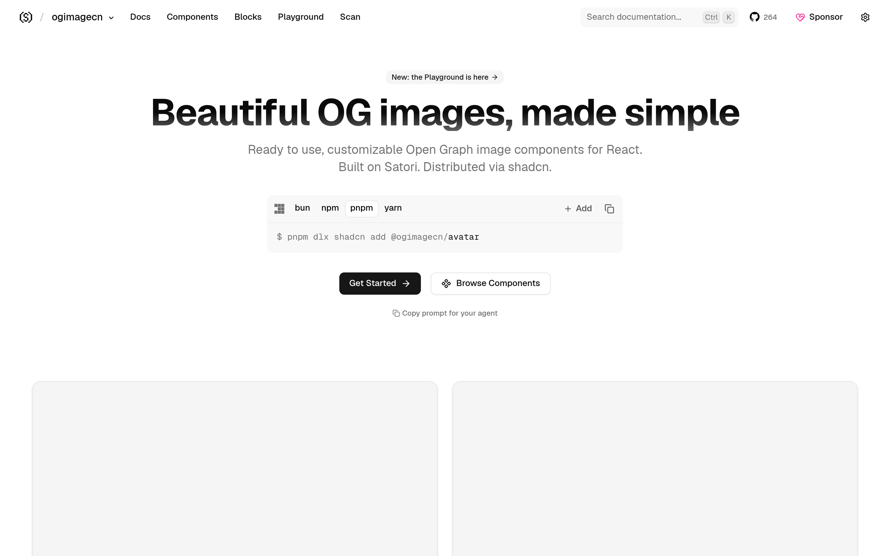

# OG 图组件库：ogimagecn

## 直观预览

> ogimagecn 官网首页（1440×900）："Beautiful OG images, made simple"——基于 Satori 的 OG 图组件，next/og 渲染。

## 一句话价值

"shadcn，但 for OG 图"：基于 Satori 的 Open Graph 分享图组件库——文章/页面的社交分享封面图，用组件拼出来，next/og 渲染。

## AI 选用指南

| 项目 | 选用说明 |
| --- | --- |
| 优先选用条件 | 需要给文章/页面批量生成社交分享图（OG image），想要设计好的组件而非手画；技术栈是 Next.js（next/og）。 |
| 不适合或暂缓条件 | 不做内容发布/分享图时用不上；非 Next.js 技术栈渲染链路不同。 |
| 复用方式 | 安装依赖（shadcn registry：ogimagecn block）、视觉参考 |
| 输入与产出 | registry 安装 block + next/og → 渲染出的 1200×630 分享图。 |
| 首次读取入口 | [本卡](./OG图组件库-ogimagecn-2026-10-09.md) →「内容摘要」；官网 https://www.ogimagecn.com。 |
| 同类选择依据 | 库内暂无 OG 图组件类收藏；与手写 Satori 模板的关系：ogimagecn 是包好的组件层。 |
| 接入前提与待核实项 | MIT；基于 Satori + next/og；未在本机安装验证。 |
| 检索词 | ogimagecn OG image 社交分享图 Satori next/og 封面图 |

> 核查记录：整理于 2026-10-09，基于官网首页 + llms.txt + GitHub（shadcn-labs/ogimagecn，2026-06-04 创建，收录时 267 stars，MIT）。未安装验证。

## 内容摘要

ogimagecn（https://www.ogimagecn.com）是 shadcn-labs "*cn" 家族中的 OG 分享图组件库。

- **技术栈**：基于 Satori，copy-paste OG image 组件，shadcn CLI 安装，用 next/og 渲染。
- **场景**：社交分享图（X/微信/小红书链接卡片）、文章封面图。
- **仓库**：github.com/shadcn-labs/ogimagecn，2026-06-04 建仓，收录时 267 stars，MIT。

## 为什么值得收藏

1. **内容人的刚需**：他做 bot、写文章、发 X——分享图是高频需求。
2. **组件化拼图**：不用每次手画封面，组件拼 + 数据驱动批量生成。
3. *cn 家族拼图之一，收齐才有全貌。

## 未来可以怎么用

- wuyu.uk 文章自动配 OG 分享图。
- bot 内容/X 帖子的链接卡片图批量生成。
- glint.red 落地页分享图。

## 原始内容 / 链接

- 官网：https://www.ogimagecn.com
- 仓库：https://github.com/shadcn-labs/ogimagecn（MIT，267 stars，2026-06-04 创建）
- 发现链：X @shadcnlabs 推文（2026-10-07，10 个 *cn 站之一）→ 本站
- 未安装验证。

## 相关联想

- [React 着色器组件库：shadercn](../动效/React着色器组件库-shadercn-2026-10-07.md)：同属 *cn 家族
- 内容视觉：hairline（等距线框封面）+ ogimagecn（分享图组件）可搭配

## 适合反向调用的场景

- 文章分享图每次手画太麻烦，有没有组件化的方案？
- next/og 渲染 OG 图，有没有现成的漂亮模板？
- shadcn-labs 的 *cn 家族里，和内容相关的有哪些？
