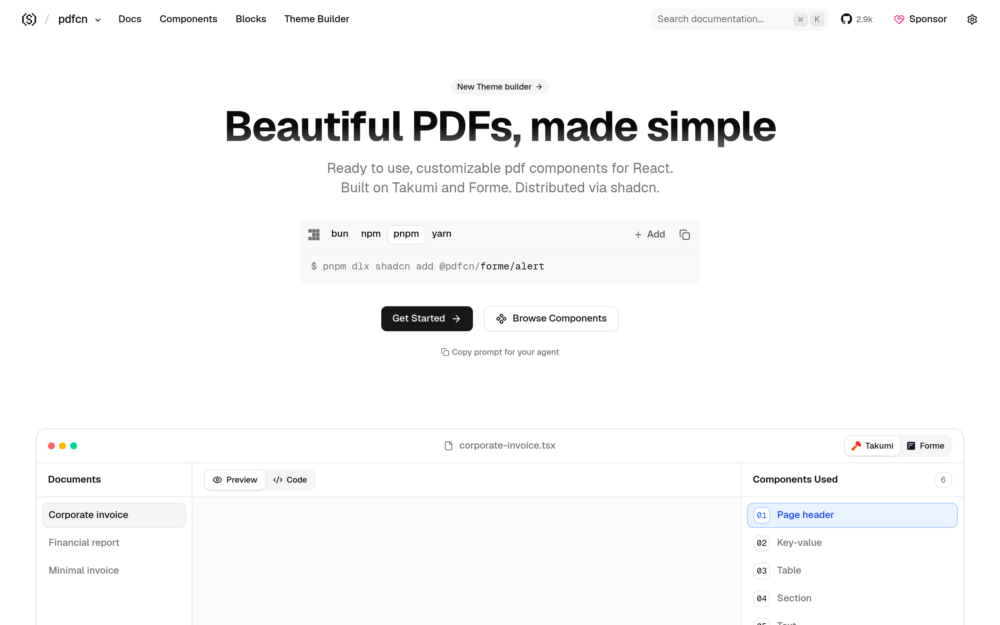

# PDF 组件库：pdfcn

## 直观预览

> pdfcn 官网首页（1440×900）："Beautiful PDFs, made simple"——基于 Takumi + Forme 的 React PDF 组件，走 shadcn registry 分发。

## 一句话价值

"shadcn，但 for PDF"：基于 Takumi + Forme 的 React PDF 组件库——*cn 家族里最火的一个（2896 stars），报表/发票/导出 PDF 不用再手写模板。

## AI 选用指南

| 项目 | 选用说明 |
| --- | --- |
| 优先选用条件 | React 项目需要生成 PDF（报表、发票、简历、导出文档），想要设计好的组件而非手写 PDF 模板。 |
| 不适合或暂缓条件 | 纯前端展示不需要导出 PDF 时不适合；非 React 技术栈用不上。 |
| 复用方式 | 安装依赖（shadcn registry）、视觉参考 |
| 输入与产出 | shadcn registry 命令 → 可直接用的 PDF 组件/区块/主题（基于 Takumi + Forme 渲染）。 |
| 首次读取入口 | [本卡](./PDF组件库-pdfcn-2026-10-09.md) →「内容摘要」；官网 https://www.pdfcn.dev（Docs / llms.txt）。 |
| 同类选择依据 | 库内暂无 PDF 组件类收藏；与 react-pdf 等底层库的关系：pdfcn 是"按 shadcn 哲学包好的组件层"，开箱即用。 |
| 接入前提与待核实项 | MIT；基于 Takumi + Forme；未在本机安装验证。 |
| 检索词 | pdfcn PDF 组件 React shadcn Takumi Forme 报表导出 |

> 核查记录：整理于 2026-10-09，基于官网首页 + llms.txt + GitHub（shadcn-labs/pdfcn，2026-08-11 创建，收录时 2896 stars，MIT）。未安装验证。

## 内容摘要

pdfcn（https://www.pdfcn.dev）是 shadcn-labs "*cn" 家族中的 PDF 组件库，也是全家最火的一个。

- **技术栈**：基于 Takumi + Forme，copy-paste PDF 组件，shadcn CLI 安装。
- **内容**：PDF 组件、区块（blocks）、主题，走 registry 分发。
- **文档**：llms.txt 完整，支持 shadcn MCP server。
- **仓库**：github.com/shadcn-labs/pdfcn，2026-08-11 建仓，收录时 2896 stars，MIT——*cn 家族 star 最高。

## 为什么值得收藏

1. **全家最火**：2896 stars，是 *cn 家族里社区认可度最高的。
2. **PDF 是刚需盲区**：库里此前没有 PDF 相关收藏，报表/发票/导出场景迟早碰到。
3. 同一套 shadcn registry 哲学，和他收的其他 *cn 站用法一致。

## 未来可以怎么用

- 述职/汇报材料一键导出 PDF（Q3 述职这类场景）。
- bot 数据报表、weibo 数据系统导出 PDF。
- 发票/账单类产品原型。

## 原始内容 / 链接

- 官网：https://www.pdfcn.dev
- 仓库：https://github.com/shadcn-labs/pdfcn（MIT，2896 stars，2026-08-11 创建）
- 发现链：X @shadcnlabs 推文（2026-10-07，10 个 *cn 站之一）→ 本站
- 未安装验证。

## 相关联想

- [React 着色器组件库：shadercn](../动效/React着色器组件库-shadercn-2026-10-07.md)：同属 *cn 家族
- *cn 家族已收齐 10 站中的 9 站（shadercn/termcn/agentcn/editorcn/pdfcn/ogimagecn/mdxcn/emailcn/framecn/mcpcn）

## 适合反向调用的场景

- React 项目要生成好看的 PDF，有没有组件库？
- shadcn-labs 的 *cn 家族里最火的是哪个？
- 报表/发票导出 PDF 不想手写模板怎么办？
