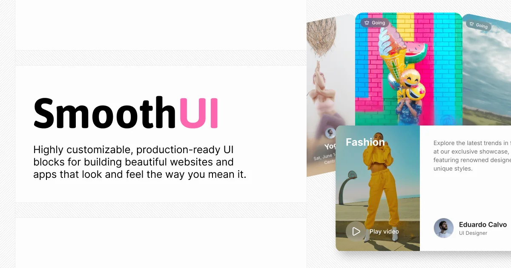

# shadcn 动画 React 组件库：SmoothUI

## 直观预览

> SmoothUI 官网预览。该站提供可通过 shadcn 命令加入项目的动画 React 组件与 Block。

## 一句话价值

一组兼容 shadcn/ui 的动画 React 组件：当前官网展示 130 个可直接加入项目的组件，结合 Motion、GSAP、React 19 与 Tailwind CSS v4，适合给产品界面补充有边界的动态细节。

## 内容摘要

SmoothUI 由 `educlopez/smoothui` 维护，定位为 “Animated React Components for shadcn/ui”。当前首页显示 130 个 drop-in 组件，可通过 `npx shadcn@latest add @smoothui/...` 按需加入。展示组件包括 Siri Orb、Dynamic Island、Number Flow、Apple Invites、Scramble Hover、Wave Text、Grid Loader、Social Selector、Image Metadata 与 Power Off Slide 等。

组件强调 Motion 与 GSAP 驱动的弹簧动画、reduced-motion 感知，技术栈为 React 19、TypeScript、Server Components、hooks 和 Tailwind CSS v4。网站同时提供可定制的 production-ready animated blocks，标注有 Free 与 Pro 层。

## 为什么值得收藏

1. 可按组件加入 shadcn 项目，结构和 Tailwind token 容易与现有项目融合。
2. 同时记录了 reduced-motion，而不只是展示夸张视觉效果。
3. 组件名覆盖加载、数值变化、媒体、悬浮反馈和 Hero 焦点等典型产品场景。

## 未来可以怎么用

- 每个页面只在 Hero、空状态、生成中、媒体控制或关键成功反馈中选 1 到 2 个组件。
- 数据密集型后台优先选 Number Flow、Grid Loader 等信息状态组件，避免强风格效果干扰扫描。
- 接入前检查 React 版本、Tailwind v4、Motion / GSAP 依赖与 Free / Pro / 许可边界。

## 原始内容 / 链接

- 官网：[https://smoothui.dev/](https://smoothui.dev/)
- GitHub：[https://github.com/educlopez/smoothui](https://github.com/educlopez/smoothui)
- 来源帖文：[https://x.com/csaba_kissi/status/2090328699992432716](https://x.com/csaba_kissi/status/2090328699992432716)
- 示例命令：`npx shadcn@latest add @smoothui/dynamic-island`
- 本地预览：`_附件/收藏预览/SmoothUI-2026-08-22.webp`
- 本地快照：`_附件/网页快照/SmoothUI-2026-08-22/index.html`

## 相关联想

- SmoothUI 是 Motion 的上层“组件配方库”：Motion 负责基础动画能力，SmoothUI 提供具象可改造的 UI 模式。

## 适合反向调用的场景

- 我想给 shadcn/ui 项目加入成熟的 React 动效组件。
- 我需要 AI、媒体或工具型产品的加载、数值、Hero、悬浮和状态反馈样本。
