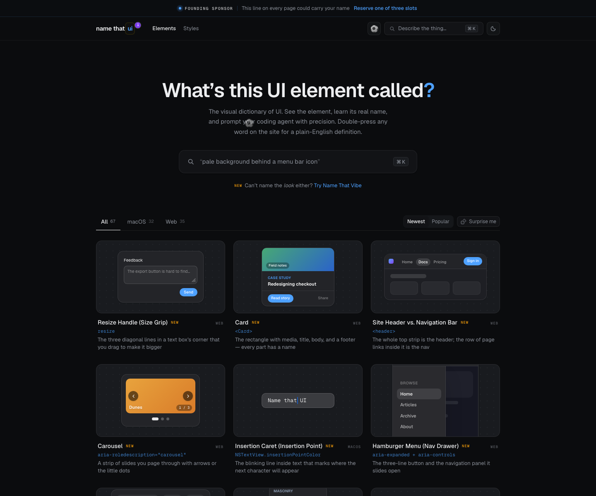

# UI 元素命名视觉词典：NameThatUI

## 直观预览



> 已保存 NameThatUI 官网首屏截图。这个收藏的核心价值不是“好看模板”，而是把模糊 UI 描述翻译成准确组件名、API 名称和可给 coding agent 使用的提示词。

## 一句话价值

NameThatUI 是一个 UI 视觉词典：当你不知道某个界面元素叫什么时，可以通过视觉和模糊描述找到它的真实名称、平台 API 符号、组件差异和可复制给 Codex 的精确提示词。

## AI 选用指南

| 项目 | 选用说明 |
| --- | --- |
| 优先选用条件 | 描述“这个控件叫什么”或向 AI 下 UI 需求时，先校准组件名、平台术语与交互语义。 |
| 不适合或暂缓条件 | 已经明确组件与 API，只缺生产代码时不当作实现库。 |
| 复用方式 | 套用方法；视觉参考 |
| 输入与产出 | 模糊界面描述或截图 → 准确术语、平台 API 线索和可执行需求。 |
| 首次读取入口 | [本卡](./UI元素命名视觉词典-NameThatUI-2026-07-18.md) →「适合反向调用的场景」 |
| 同类选择依据 | NameThatUI 解决名称；Component Gallery 提供同类案例；Vibe 视觉词典决定页面四层结构。 对照：[界面组件设计案例库：Component Gallery](./界面组件设计案例库-Component-Gallery-2026-07-16.md)、[Vibe Coding 视觉词典：布局、结构、导航与组件](../交互细节/Vibe-Coding视觉词典-布局结构导航组件-2026-08-05.md)。 |
| 接入前提与待核实项 | Web、AppKit、SwiftUI 术语不一定一一对应，目标平台 API 仍需复核。 |
| 检索词 | NameThatUI UI视觉词典 控件命名 modal dialog scrim AppKit SwiftUI |

> 选用说明整理于 2026-09-20：适用与比较为基于收藏证据的建议；正文中的版本、数量、价格与功能范围按原收录时间理解。本次未安装或运行所收藏的工具，当前环境安装状态另查。未对外部来源作全量实时复核。

## 内容摘要

NameThatUI 的官网标题是 `What Is This UI Element Called?`，定位为 UI visual dictionary。它的价值点很直接：你可以用很口语化的描述搜索，例如“菜单图标背后的浅色胶囊”“弹窗背后的深色透明层”“输入框里会消失的灰色文字”，然后找到对应的真实 UI 名称、API 名称、组件结构和 agent prompt。

网站当前覆盖 Web 与 macOS 两大类 UI 术语，页面结构里列出了约 67 个元素。它不是普通灵感站，而更像“组件学名 + 使用边界 + API 对照 + 调试提示”的词典。

可见的元素类型包括：

1. macOS：Menu Bar、Context Menu、Disclosure Triangle、Dock Badge、Focus Ring、Inspector、Insertion Caret、Menu Bar Extra、Panel、Popover、Segmented Control、Sheet、Sidebar、Stepper、Toolbar、Traffic Lights、Vibrancy、Window、Split View、Scroll View、Search Field、Save Panel、Token Field、Combo Button、Level Indicator、Column View、Outline View、Pointer、Alert、Slider、Color Well。
2. Web：Overflow Menu、Drag & Drop、Divider / Separator / Rule、Progress Ring / Spinner / Progress Bar、Toast / Snackbar、Modal Dialog / Drawer / Sheet、Popover / Dropdown Menu / Tooltip、Scrim / Backdrop / Overlay、Skeleton / Spinner、Combobox / Autocomplete / Typeahead、Command Palette、Accordion、Tabs、Badge / Chip / Pill / Tag、Breadcrumbs、Sticky / Fixed、Focus Ring、Empty State、Hover Card、Switch / Checkbox / Radio、Toggle Group、Form Field、Truncation、Hamburger Menu、Lightbox、Marquee、Bento Grid、Masonry Layout、Easing、Spring Animation、Text Scramble、Carousel、Site Header / Navigation Bar、Card、Resize Handle。

它还提供几类指南：AppKit vs SwiftUI、Swift vs Electron、Translation Table，适合在做 macOS 原生应用、Electron 应用或 Web 应用时先统一术语。

## 为什么值得收藏

1. 它能解决“我知道那个东西长什么样，但不知道叫什么”的问题，尤其适合向 Codex 描述 UI 需求。
2. 它能避免把所有收藏素材都塞进项目：先用 NameThatUI 判断该用什么组件，再从 BoardUI、Bag UI、FeralUI、Transitions.dev 等收藏里挑合适视觉和动效。
3. 它提供组件差异边界，例如 Popover / Dropdown / Tooltip、Modal / Drawer / Sheet、Badge / Chip / Pill / Tag、Switch / Checkbox / Radio，这些都是 AI 很容易混用的地方。
4. 它对 macOS 应用尤其有用：能把 AppKit、SwiftUI 和常见界面称呼对齐，减少“像系统那个按钮”的模糊沟通。
5. 它能作为设计系统术语库，后续写 `AGENTS.md`、UI 规范、组件验收清单时可以引用准确学名。

## 未来可以怎么用

1. 给 Codex 做网站或 App 前，先要求它从 NameThatUI 里识别当前页面需要的组件模式，再开始设计和实现。
2. 做 UI review 时，用它检查组件命名是否准确：是不是应该叫 combobox、command palette、hover card、scrim、empty state、toggle group。
3. 做 macOS / Electron 工具时，用它判断该参考 AppKit、SwiftUI 还是 Web 组件命名，避免平台语言混乱。
4. 做设计系统时，把常用组件按 NameThatUI 的词汇归档，形成自己的中文 + 英文 + API 对照表。
5. 做提示词时，把“我要一个弹窗”改成“使用 modal dialog，带 scrim/backdrop，焦点陷阱，Esc 关闭，触发按钮恢复焦点”，输出会稳定得多。

## 原始内容 / 链接

- 官网：[https://namethatui.com/](https://namethatui.com/)
- 页面标题：NameThatUI — What Is This UI Element Called?
- 官网定位：UI visual dictionary
- 当前截图：`_附件/收藏预览/Name-That-UI-2026-07-18.png`
- 适合搜索：组件名、模糊 UI 描述、AppKit / SwiftUI / Web API 名称、agent prompt

## 相关联想

- 和 [[界面组件设计案例库-Component-Gallery-2026-07-16]] 的关系：Component Gallery 更偏真实产品里的组件案例，NameThatUI 更偏“这个东西到底叫什么”和 API / prompt 对照。
- 和 [[Dashboard设计系统-BoardUI-2026-07-09]] 的关系：BoardUI 可作为 dashboard 视觉和 UX 参考，NameThatUI 可用于先命名 KPI card、data table、sidebar、badge、tabs、filters 等组件。
- 和 [[现代UI组件区块库-BagUI-2026-07-16]] 的关系：Bag UI 提供区块灵感，NameThatUI 负责把区块拆成准确组件术语，方便 Codex 按模块重组。
- 和 [[物理感互动React组件库-FeralUI-2026-07-18]] 的关系：FeralUI 适合局部互动记忆点，NameThatUI 适合判断这个互动应该落在什么组件上。
- 和 [[Web过渡动效参考库-Transitions-dev-2026-07-07]] 的关系：NameThatUI 告诉你组件是什么，Transitions.dev 告诉你状态变化如何动。

## 适合反向调用的场景

```text
请参考我的收藏：
Vault 根目录相对路径：01-界面设计/组件/UI元素命名视觉词典-NameThatUI-2026-07-18.md

在设计或重构当前项目 UI 前，先用 NameThatUI 的思路做组件命名和 UX 选型：
1. 列出页面里需要的核心 UI 元素，并给出准确英文组件名；
2. 区分容易混淆的组件，例如 popover / dropdown / tooltip、modal / drawer / sheet、switch / checkbox / radio、badge / chip / pill / tag；
3. 说明每个组件承担的用户任务；
4. 再从我的收藏里挑选合适视觉参考，不要把所有素材都塞进去；
5. 输出采用哪些组件、为什么采用、哪些没有采用。

实现时请优先使用正确语义、键盘可访问、焦点状态、空状态、加载状态和错误状态，而不是只做外观。
```
