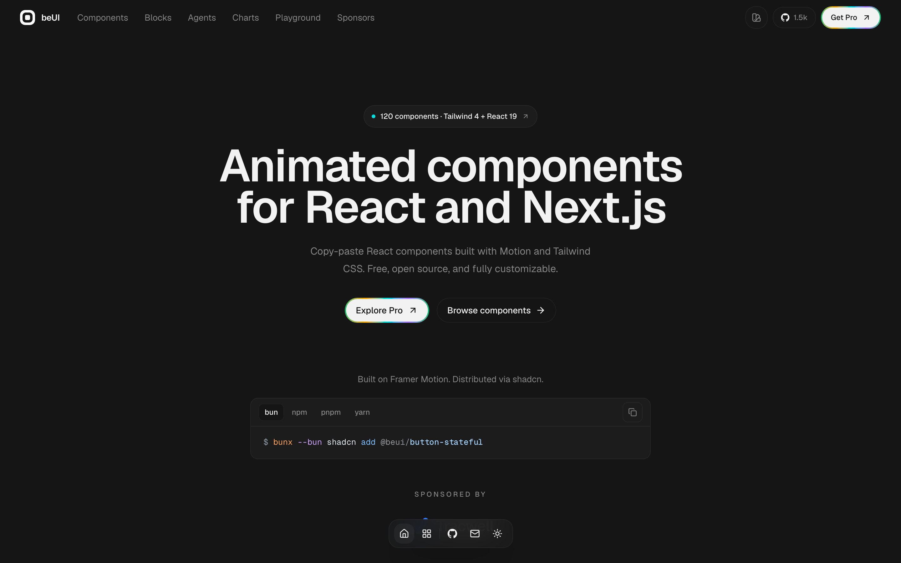

# 动画 React 组件库：beUI

## 直观预览

> beUI 官网首屏：定位是「Animated components for React and Next.js」，标注 120 components · Tailwind 4 + React 19，安装方式为 shadcn 命令。另存组件列表页与 Button 组件详情页截图。

## 一句话价值

一个收录 120 个动画 React 组件的 MIT 开源组件库，覆盖 Motion 组件、AI Agent 界面、图表和 Blocks，全部通过 shadcn registry 把源码复制进项目，可自由改造。

## 内容摘要

beUI（GitHub 仓库 `starc007/ui-components`，作者 Saurabh）定位为「Animated components for React and Next.js」，主张 copy the source, own the code：组件不锁在 npm 包里，而是通过 shadcn registry 以 `bunx --bun shadcn add @beui/<slug>` 或 `npx shadcn@latest add @beui/<slug>` 把 TypeScript 源码写入项目目录，再自行调整样式、弹簧参数和业务状态。

技术栈为 React 19、Tailwind CSS 4、Motion（Framer Motion）与 TypeScript；官网当前标注 120 个组件。从 registry 看，项目分为 Motion 组件、AI Agent 组件、Charts 与 Blocks 四类。Motion 方向包含 Button（Metallic / Magnetic / Stateful）、Tilt Card、Morphing Modal、Animated Toast Stack、Dynamic Island、Command Palette、Bottom Sheet、Expandable Tabs、Select / Combobox / Multi-Select、Otp Input、Bloom Menu、Theme Toggle、Swipeable List、File Tree、Preview Rail、Text / Number Animation 等；每个组件都提供 live preview、usage 示例、源码和安装命令。

AI Agent 方向是这套库比较少见的部分，覆盖 Message Bubble、Prompt Input、Todo List、Code Block、Approval Card、File Diff、Tool Result、Streaming Response、Image Generation、Tool Approval、Citations、Agent Activity、AI Sidebar、Chat App 等 17 个条目，适合直接组装 Agent 工作台界面。Charts 方向包含 Heat Calendar、Returns Calendar、Price Target Fan、Market Cards 等偏金融与数据密集场景的组件。另提供主题切换的 View Transition API 实现、reduced-motion 回退和键盘可访问的交互细节。

项目同时面向 AI 代理做了适配：官网提供 `llms.txt` 索引、`/r` registry JSON 端点、组件 Markdown 文档、Agent Guide 与 OpenUI 集成说明，代理可以拉取组件元数据、依赖和源码后直接落地到项目。仓库为 MIT 许可，GitHub 约 1.5k star，最近一次推送在 2026-09-15，维护活跃。官网另有 Pro 层（约 $179 lifetime，200+ blocks 与高级区块），但免费层已包含全部 Motion / Agent 组件源码。

## 为什么值得收藏

1. 组件量在同类型库中偏大（120 个），且 MIT 开源、源码可复制进项目，不存在包升级或供应商锁定问题。
2. AI Agent 界面组件集是稀缺资源：Approval Card、Tool Result、Streaming Response、Citations、Agent Activity 等可以直接组合出 Agent 工作台。
3. 动效质量偏克制，提供 reduced-motion 回退和键盘操作支持，适合产品界面而不只是演示页面。
4. 对 AI 代理友好：llms.txt + registry JSON + 组件 Markdown，让 Codex 可以自己读组件规格并落地实现。
5. 维护活跃（最近推送到昨天），GitHub star 数可作为社区验证的参考信号。

## 未来可以怎么用

- 给 React 19 + Tailwind 4 + shadcn 项目按需挑 1-2 个组件补充关键交互（如 Command Palette、Tilt Card、Number Animation），避免全站堆动效。
- 搭 AI 产品原型时，直接用 Agent 组件组合出聊天、任务列表、工具审批和结果展示的界面骨架，再按自己的设计语言调整。
- 参考其 spring 参数、触发方式与 reduced-motion 实现，沉淀一份自己项目的动效规范。
- 借 `llms.txt` 与 registry 端点让 Codex 自动拉取组件源码，减少手写重复组件的时间。
- 做金融或数据看板时，参考 Heat Calendar、Returns Calendar、Market Cards 的信息密度与动画处理方式。

## 原始内容 / 链接

- 官网：[https://beui.dev/](https://beui.dev/)
- 组件总览：[https://beui.dev/components/motion](https://beui.dev/components/motion)
- GitHub：[https://github.com/starc007/ui-components](https://github.com/starc007/ui-components)（MIT，1.5k star）
- llms.txt：[https://beui.dev/llms.txt](https://beui.dev/llms.txt)
- registry：[https://beui.dev/registry.json](https://beui.dev/registry.json)
- 典型安装：`bunx --bun shadcn add @beui/button-stateful`
- 本地预览：`_附件/收藏预览/beUI动画React组件库-首屏-2026-09-16.png`、`_附件/收藏预览/beUI动画React组件库-组件列表-2026-09-16.png`、`_附件/收藏预览/beUI动画React组件库-按钮组件详情-2026-09-16.png`
- 本地快照：`_附件/网页快照/beUI-2026-09-16/`（index.html、registry.json、llms.txt、README.md、LICENSE、源码 zip）

## 相关联想

- 与 [shadcn 动画 React 组件库：SmoothUI](../组件/Shadcn动画React组件库-SmoothUI-2026-08-22.md) 属于同类：都是 shadcn registry 分发的动画组件；beUI 的差异在 AI Agent 组件集与金融图表。
- 与 [React 微交互与过渡组件库：Amicro](../动效/React微交互与过渡组件库-Amicro-2026-08-23.md) 组合时，Amicro 偏动效原语与卡片编排，beUI 偏完整产品组件。
- 与 [网页动画库：Motion](../动效/网页动画库-Motion-2026-08-22.md) 是上下游关系：Motion 提供动画引擎，beUI 提供已调好的组件配方。
- 与 [AI 原生界面组件参考库：Beautiful UI](../组件/AI原生界面组件参考库-Beautiful-UI-2026-08-17.md) 互补：Beautiful UI 偏组件模式与视觉参考，beUI 直接给可安装源码。

## 适合反向调用的场景

- 我要给 React / Next.js 项目加一套动画交互组件，想直接改源码而不是引包。
- 我在搭 AI Agent 对话界面，需要消息、工具调用、审批、流式回答等现成组件。
- 我想参考金融数据看板的热力图日历、收益日历或市场卡片实现。
- 我想让 Codex 通过 llms.txt / registry 自己拉取并落地指定组件。
- 我需要找 shadcn 生态里除 SmoothUI、Amicro 之外的又一个高质量动效组件来源。
