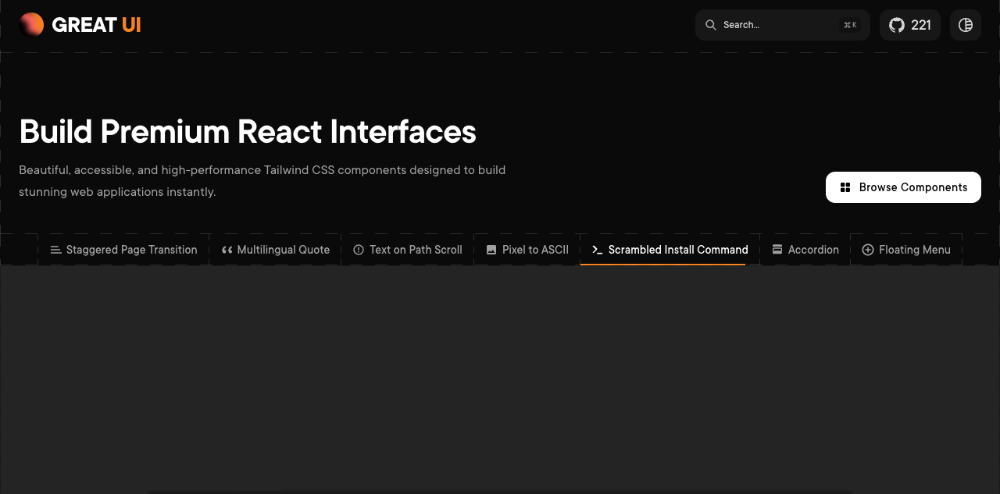
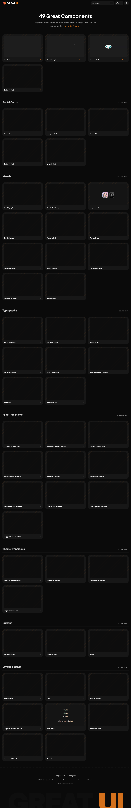

# 动画 React 组件源码库：Great UI

## 直观预览

> 官网首页与 49 个组件的完整目录截图，保存于 2026-09-22。静态截图用于辨认范围；动画、交互和源码以具体组件页为准。

## 一句话价值

一套可直接复制源码的 React、TypeScript、Tailwind CSS 与 Motion 动画组件，尤其适合页面过渡、主题切换、文字图片实验效果、社交卡片和设备展示模型。

## AI 选用指南

| 项目 | 选用说明 |
| --- | --- |
| 优先选用条件 | React 项目处于视觉原型或界面实现阶段，需要页面／主题过渡、滚动文字、图片显现、社交资料卡、浮动菜单、MacBook／手机模型等已有编排的展示组件，并愿意把源码复制进项目后自行维护。目标产物应是一个具体组件或少量展示区块，而不是完整基础设计系统。 |
| 不适合或暂缓条件 | 原生 JavaScript、Vue 或其他非 React 页面不能直接复用 TSX；后台表单、表格、日期选择等基础控件应先选 HeroUI；只缺底层动画能力时优先直接使用 Motion；准备把源码重新包装成 UI kit、模板、主题、组件库或框架再分发时不应选用。 |
| 复用方式 | 视觉参考；复制源码；安装目标组件所需依赖。 |
| 输入与产出 | 输入现有 React 技术栈、目标组件、触发状态、内容与品牌样式、键盘／减少动态效果／性能要求 -> 输出选定组件的 TSX、Tailwind 和 Motion 改造方案，以及接入业务状态后的可验收界面。 |
| 首次读取入口 | 先看[本卡](./动画React组件源码库-Great-UI-2026-09-22.md)的「内容摘要」与「许可与使用边界」，再看[官方组件目录](https://www.great-ui.com/components)和具体组件的 Usage／Code；离线核对用[来源说明](../../_附件/项目备份/Great-UI-2026-09-22/来源说明.md)、[README](../../_附件/项目备份/Great-UI-2026-09-22/README.md)、[LICENSE](../../_附件/项目备份/Great-UI-2026-09-22/LICENSE)与[package.json](../../_附件/项目备份/Great-UI-2026-09-22/package.json)。 |
| 同类选择依据 | Great UI 优先用于页面过渡、主题切换、文字／图片实验效果、社交卡片和设备模型；[beUI](./动画React组件库-beUI-2026-09-16.md) 更适合 Agent 工具审批、结果展示和金融图表，并提供 registry／llms.txt；[RareUI](./独特交互动效组件库-RareUI-2026-09-20.md) 更适合球体、特色侧边栏和少量输入反馈；[SmoothUI](./Shadcn动画React组件库-SmoothUI-2026-08-22.md) 按目标组件与 Free／Pro 权益比较；[HeroUI](./现代React组件库-HeroUI-2026-07-23.md) 用作基础控件基座；[Motion](../动效/网页动画库-Motion-2026-08-22.md) 是需要自行编排时的底层动画引擎。 |
| 接入前提与待核实项 | 收录时仓库栈为 Next 16.3、React 19.2、Tailwind CSS 4.3、Motion 12.42 和 TypeScript 5；这些是官网仓库版本，不表示每个复制组件都强制依赖 Next。逐组件核对 `motion`、`motion/react`、`@/lib/utils`、路由器、WebGL 或 View Transition API 等依赖。README 宣称 WAI-ARIA 与高性能，本次未逐组件审计。许可文件与 README 的 MIT 声明冲突，实际用途必须读取根 LICENSE。 |
| 检索词 | Great UI GreatUI 动画React组件 页面过渡 page transition theme transition Pixel to ASCII Pixel Swipe Text Text On Path Scroll Image Hover Reveal Floating Menu Gooey Menu social card MacBook Mockup Mobile Mockup Tailwind Motion copy paste components |

> 核查记录：2026-09-22 读取官网首页、49 个组件目录、示例组件页面、GitHub API，以及固定提交 `fe61e8e` 的 README、LICENSE 与 package.json。组件范围和技术栈来自官方资料；选用条件与同类比较为编辑建议。没有安装、构建或逐组件运行；GitHub 星数等易变指标不作为选择依据。

## 内容摘要

Great UI 是 Saurabh Sharma 维护的 React 动画组件项目。官网在收录时列出 49 个组件，按 Social Cards、Visuals、Typography、Page Transitions、Theme Transitions、Buttons、Layout & Cards 等类别组织。典型组件包括 Pixel Swipe Text、Scroll Flying Cards、Animated Path、Pixel to ASCII、Image Hover Reveal、Floating Menu、Floating Dock Menu、Radial Gooey Menu、MacBook／Mobile Mockup、十种左右页面过渡、四种主题过渡、Team Section、Revision Timeline 与 Deployment Checklist。

它采用复制源码模式。具体组件页同时提供 Usage 与完整 TSX 示例；以 Staggered Page Transition 为例，源码使用 `motion/react`，支持在 Next.js App Router 或 React Router 中触发路由过渡，并开放 columns、duration、staggerDelay、direction 等参数。不同组件依赖不同，不能把官网仓库的完整 `package.json` 当成每个组件的最小安装清单。

仓库的开发项目使用 Next.js、React 19、Tailwind CSS 4、Motion 和 TypeScript，根 `package.json` 标记为 private。这里收藏的是组件源码与设计参考，不代表存在一个已安装的 npm 组件包，也不代表当前项目已经兼容这些版本。

## 许可与使用边界

许可证信息存在直接冲突：README 的徽章和 License 段写 MIT，部分示例源码注释也写 MIT；仓库根 `LICENSE` 却是 Great UI Custom License Agreement，GitHub API 识别为 `NOASSERTION`。

根许可证允许个人和商业终端项目使用、复制、修改和合并源码，也明确允许用于应用、SaaS 与网站；但禁止把原始或修改后的组件作为独立 UI kit、模板或组件库转售、再分发、再许可或发布，也禁止包装为用于分发或销售的衍生 UI 库、主题或框架。实际接入以根许可证作为主要风险依据；若产品形态接近模板销售、组件市场或再分发，应先向作者确认。

## 为什么值得收藏

1. 页面过渡和主题切换的覆盖集中，适合为作品集、品牌站和产品演示补充明确的转场语言。
2. 文字、图片、社交卡片和设备模型组合较少见，能直接支撑案例展示与视觉原型。
3. 组件页公开 Usage 与完整 TSX，AI 可以从具体目标组件开始读取并改造，而不必只凭截图猜实现。
4. 同类选择边界清楚：它补充 HeroUI 这类基础组件库，也位于 Motion 这类底层引擎之上。
5. 本地保存固定 commit 的 README、LICENSE 和依赖清单，便于以后核对历史事实与许可变化。

## 未来可以怎么用

- 作品集需要项目切换或章节转场时，先比较 Curtain、Staggered、Pixel、Sine Wave 等页面过渡，只选一种与内容结构匹配的方案。
- 品牌站需要文字或图片记忆点时，选择 Text On Path Scroll、Pixel Swipe Text、Image Hover Reveal 或 Pixel to ASCII，再补 reduced-motion 与移动端回退。
- 展示 App 或网页案例时，用 MacBook／Mobile Mockup 承载真实截图或录屏，替换示例中的 WhatsApp 内容与远程资产。
- 需要导航记忆点时，比较 Floating Menu、Floating Dock Menu 与 Radial Gooey Menu，并验证键盘操作、触摸设备和小屏布局。
- 已有 HeroUI／shadcn 基础组件时，仅把 Great UI 用作少量展示动效补充，避免混入高频表单和后台工作流。

## 原始内容 / 链接

- 官网：[https://www.great-ui.com/](https://www.great-ui.com/)
- 组件目录：[https://www.great-ui.com/components](https://www.great-ui.com/components)
- GitHub：[https://github.com/Saurabh-2607/GreatUI](https://github.com/Saurabh-2607/GreatUI)
- 示例组件：[Staggered Page Transition](https://www.great-ui.com/components/staggered-page-transition)
- 固定提交：[fe61e8ee2737600ec5ae76c86a3087da69883049](https://github.com/Saurabh-2607/GreatUI/commit/fe61e8ee2737600ec5ae76c86a3087da69883049)
- 本地预览：[首页截图](../../_附件/收藏预览/Great-UI-首页-2026-09-22.png)、[组件目录截图](../../_附件/收藏预览/Great-UI-组件列表-2026-09-22.png)
- 本地资料：[来源说明](../../_附件/项目备份/Great-UI-2026-09-22/来源说明.md)、[README](../../_附件/项目备份/Great-UI-2026-09-22/README.md)、[LICENSE](../../_附件/项目备份/Great-UI-2026-09-22/LICENSE)、[package.json](../../_附件/项目备份/Great-UI-2026-09-22/package.json)

## 相关联想

- 可把 Great UI 的组件目录当成作品集动效词典，让 AI 先按内容目标选择“转场、文字、图片、导航、设备展示”角色，再读取单个组件源码。
- 与 HeroUI 组合时，HeroUI 负责表单、弹窗、表格等高频控件，Great UI 只负责少量关键展示节点。
- 与 Motion 组合时，先判断是否已有合适组件；没有时再使用 Motion 自行实现，减少为了一个简单动画复制整套复杂组件。
- 它和 beUI 都是 React、Tailwind、Motion 的源码型资源，但面向的组件角色明显不同，可作为 AI 选材测试的对照组。

## 适合反向调用的场景

- 我的 React 作品集需要页面切换、滚动文字或图片显现效果，想从现成源码开始改。
- 我要展示 App／网站案例，需要 MacBook 或手机设备模型组件。
- 品牌站需要一个有辨识度的浮动菜单、社交资料卡或主题切换过渡。
- 已有基础组件库，只想补充一两个展示型动画组件。
- 请比较 Great UI、beUI、RareUI、SmoothUI 和 Motion，按组件角色、接入成本与许可选择。
