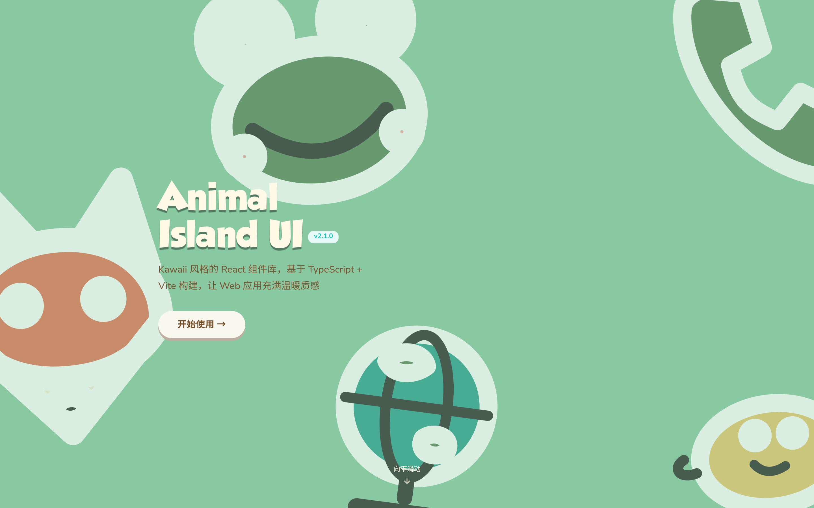

# 可爱风 React 组件库：Animal Island UI

## 直观预览

> Animal Island UI 官网首页（1440×900，v2.1.0）："Kawaii 风格的 React 组件库，基于 TypeScript + Vite 构建，让 Web 应用充满温暖质感"——全中文文档站。

## 一句话价值

中文的 Kawaii 风 React 组件库（4945 stars，MIT）：TypeScript + Vite，动物岛主题的可爱组件——库里第一套"可爱风"组件库，配他的温暖治愈调性。

## AI 选用指南

| 项目 | 选用说明 |
| --- | --- |
| 优先选用条件 | 想要可爱/温暖治愈风的 React 界面（女性向、亲子、宠物、治愈系产品）；中文文档阅读无障碍。 |
| 不适合或暂缓条件 | 严肃 B 端/SaaS 界面不适合（风格太甜）；非 React 项目用不上。 |
| 复用方式 | 安装依赖（npm 包）、视觉参考 |
| 输入与产出 | npm 安装 → 可直接用的 Kawaii 风 React 组件（含动物岛主题视觉）。 |
| 首次读取入口 | [本卡](./可爱风React组件库-Animal-Island-UI-2026-10-09.md) →「内容摘要」；官网 https://guokaigdg.github.io/animal-island-ui/（中文文档）。 |
| 同类选择依据 | 库内组件库多为中性/极客风（shadcn、*cn 家族）；要"可爱温暖"只有这一套——按项目气质二选一。 |
| 接入前提与待核实项 | MIT；TypeScript + Vite；v2.1.0；未在本机安装验证。 |
| 检索词 | Animal Island UI 可爱风 Kawaii React 组件库 动物岛 温暖治愈 |

> 核查记录：整理于 2026-10-09，基于官网首页截图（v2.1.0，中文）+ GitHub（guokaigdg/animal-island-ui，2026-04-12 创建，收录时 4945 stars，MIT）。未安装验证，组件清单以官网为准。

## 内容摘要

Animal Island UI（https://guokaigdg.github.io/animal-island-ui/）是国人出品的 Kawaii 风 React 组件库。

- **风格**：动物岛主题，圆润可爱插画 + 暖色，中文文档站。
- **技术栈**：TypeScript + Vite 构建的 React 组件库，v2.1.0。
- **仓库**：github.com/guokaigdg/animal-island-ui，2026-04-12 建仓，收录时 4945 stars，MIT。

## 为什么值得收藏

1. **库里第一套可爱风**：之前收的组件库全是中性/极客/性冷淡风，这是第一套 Kawaii——风格维度补齐。
2. **4945 stars**：国人组件库里这个 star 数算很能打了。
3. **中文文档**：阅读无障碍。
4. **调性对版**：他的 bot 是温暖治愈定位、伴侣喜欢 Kuromi 这类可爱风——这套的受众审美他身边就有。

## 未来可以怎么用

- 治愈系/女性向小产品的界面（bot 周边、猫相关页面"无语"的主题页）。
- 可爱风落地页、活动页。
- 和 Nyatabi Icons（日式圆润图标）搭配：可爱风界面 + 圆润图标。

## 原始内容 / 链接

- 官网：https://guokaigdg.github.io/animal-island-ui/
- 仓库：https://github.com/guokaigdg/animal-island-ui（MIT，4945 stars，2026-04-12 创建）
- 未安装验证。

## 相关联想

- [旅行主题图标库：Nyatabi Icons](./旅行主题图标库-Nyatabi-Icons-2026-10-09.md)：日式圆润图标 + 可爱风组件，搭配用
- [开放代码组件基座：shadcn/ui](./开放代码组件基座-shadcn-ui-2026-09-27.md)：中性基座 vs 可爱风，按项目气质选

## 适合反向调用的场景

- 想要一套可爱/治愈风的 React 组件库，有没有？
- 国人出品的中文组件库有哪些？
- 温暖治愈调性的产品，组件和图标怎么配？
