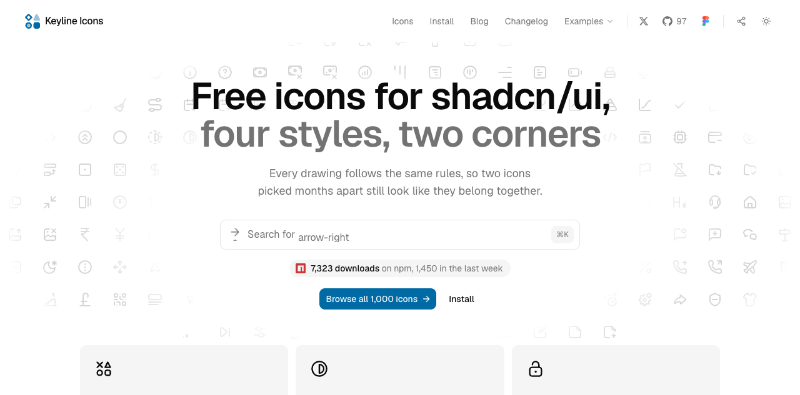
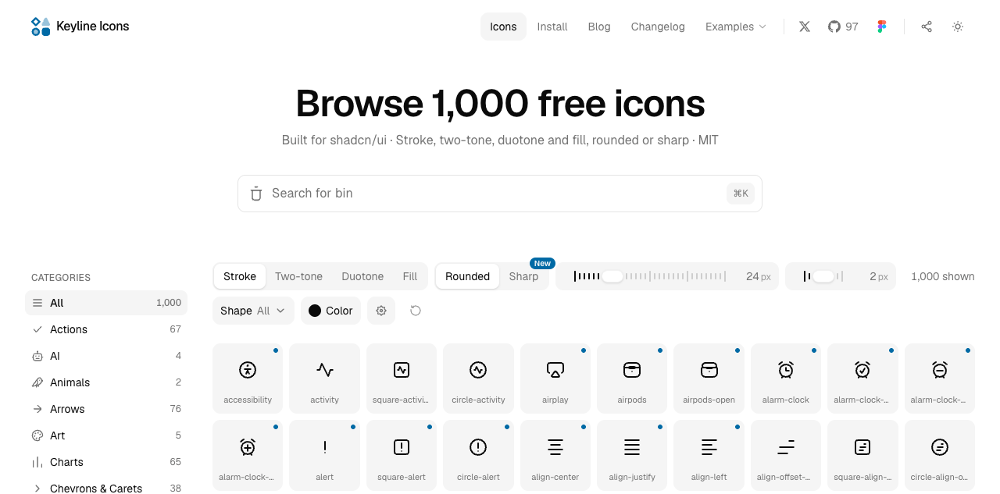

# 多风格开源 SVG 图标库：Keyline Icons

## 直观预览





> 官网首页与图标浏览器截图，保存于 2026-09-21；实际图形与样式请进入[图标浏览器](https://keylineicons.com/icons)逐个比较。

## 一句话价值

面向产品界面的多风格 SVG 图标库，提供圆角／锐角版本、React 包、源码复制与 MCP 查询入口，适合让 AI 先检索真实图标名，再按项目风格接入。

## AI 选用指南

| 项目 | 选用说明 |
| --- | --- |
| 优先选用条件 | 正在实现导航、工具栏、按钮或状态反馈，需要统一图标几何；希望比较描边、双色、填充及圆角／锐角外观。需要代理搜索图标名、读取 SVG 或生成准确 React import 时，可评估官方 MCP。 |
| 不适合或暂缓条件 | 需要完整表单、表格、动画或品牌插画时不能用图标库替代；项目已有统一且够用的图标体系时暂缓再加一套。必须保证某个图标的所有填充样式等价时，先核对实际文件和导出，官方文档存在覆盖描述矛盾。 |
| 复用方式 | 复制 SVG／JSX 源码；安装 React 依赖；shadcn registry 按需复制组件；视觉参考；可选 CLI／MCP 查询入口。收藏不表示已安装 MCP。 |
| 输入与产出 | 输入业务动作、已有图标库、尺寸、样式、角处理、框架与联网限制 → 输出真实图标名清单、SVG 文件或 React 引入方式；图标的业务含义和无障碍名称仍由项目定义。 |
| 首次读取入口 | 先读本卡[接入路线与选择顺序](#接入路线与选择顺序)；代理接入读[本地 MCP README](../../_附件/项目备份/Keyline-Icons-2026-09-21/packages/mcp/README.md)；具体绘图从[官方浏览器](https://keylineicons.com/icons)查看；包接入读[官方安装文档](https://keylineicons.com/install)。 |
| 同类选择依据 | 与[Tabler Icons](./开源SVG图标库-Tablericons-2026-07-16.md)比较：已有 Tabler 图标映射且语义齐全，优先沿用；新项目明确需要同一图形的样式／角处理选择，或希望通过已文档化 MCP 取 SVG，优先评估 Keyline。按所需语义逐个比对，不能只按图标总数排名。[HeroUI](./现代React组件库-HeroUI-2026-07-23.md)提供控件，与图标是互补关系。 |
| 接入前提与待核实项 | 本地上游包元数据为 1.0.0：React 包要求 React ≥18，React／CLI／MCP 包均声明 Node ≥20.9；这是源码快照，npm 实际发布版本及目标构建兼容性需实施前核对。纯 SVG 不需要 React。MIT 文件已备份，分发时保留其要求的版权及许可声明。样式覆盖、Iconify 离线方案和目标图标导出需要按使用路线验证。 |
| 检索词 | 图标库、导航图标、按钮图标、双色图标、填充图标、圆角、锐角、AI 选图标、Keyline Icons、keyline-icons、SVG、shadcn/ui、stroke、two-tone、duotone、fill、search_icons、get_icon、get_react_usage。 |

> 核查记录：2026-09-21 阅读官网、安装文档和官方仓库；保存固定提交的 README、LICENSE、包元数据与 MCP 文档。能力描述来自官方；优先条件与同类取舍是编辑建议。未安装、运行或接入任何 Keyline 包；文档矛盾见下文，不把收藏视为运行验证。

## 内容摘要

### 素材是什么

官网将其定位为适配 shadcn/ui 的图标集；也可单独使用 SVG。官方当前宣称 1,000 个图标名、四种样式、两种角处理，共 8,000 个 SVG；这是收录日的官方口径，并非本次逐文件计数。

- `stroke`：线条；`two-tone`：保留轮廓与底色；`duotone`：灰色主体与强调细节；`fill`：填充。
- 圆角与锐角处理可按界面风格选择。不能用样式变化代替状态文字或可访问名称。
- 官网支持图标检索、预览与复制；官方还提供 Figma 插件、Iconify 与按需复制入口。

### 接入路线与选择顺序

| 项目条件 | 起步入口 | 预期得到什么 |
| --- | --- | --- |
| 原生 HTML／JavaScript，或只用少量图标 | [浏览器](https://keylineicons.com/icons)选择后复制 SVG | 自有 SVG；不需要为此引入 React |
| React 项目，需要持续更新图标依赖 | [安装文档](https://keylineicons.com/install)与[包元数据快照](../../_附件/项目备份/Keyline-Icons-2026-09-21/packages/react/package.json) | `@keyline-icons/react` 导入；先核对目标名称及样式导出 |
| shadcn 项目，希望拥有少量源码 | 同一安装文档的 Install with the shadcn CLI | registry `@keyline`，将单图标组件加入项目；先检查 `components.json` 与 aliases |
| 让 AI 自助检索真实图标 | [MCP README 快照](../../_附件/项目备份/Keyline-Icons-2026-09-21/packages/mcp/README.md) | `describe_set` → `search_icons` → `get_icon` 或 `get_react_usage`；须另行安装并配置客户端 |
| Vue／Svelte 等已有 Iconify 的项目 | 安装文档的 Vue, Svelte and everything else | `keyline-icons` 图标集；是否按需联网取图取决于具体用法，离线场景先核对打包方案 |

官方示例命令仅作调用入口记录，未执行：

```sh
npm i @keyline-icons/react
npx @keyline-icons/cli search arrow
npx @keyline-icons/cli add bell --style fill --corners sharp
```

MCP 文档称图标数据随包提供、无需 API key，运行时不靠联网获取图标；首次下载包仍需要网络。不同 AI 客户端的 MCP 配置格式应按客户端文档处理，不直接照搬 Claude 命令到 Codex。

### 文档矛盾与使用前复核

1. 官网 FAQ 与安装文档宣称自 1.0.0 起全部名称都有四种样式；首页演示说明却仍提到部分样式回退到 stroke。
2. 仓库 README 顶部同样宣称全覆盖，后文却说 `Check` 不在部分样式导出中；MCP README 也用 `bar-chart` 缺少 fill 作示例。此次保留原快照，不替官方消解矛盾。真正使用时以选定发布版本、单个 SVG 与实际导出为准，必要时运行最小导入验证。
3. `duotone` 的旧含义与 1.0.0 不同；迁移旧代码需要辨认 `two-tone`，不能只按名称认为视觉不变。
4. 安装文档明确 `absoluteStrokeWidth` 不受支持。从其他图标库迁移时应检查 prop、名称和 CSS 尺寸规则，不能整库盲目替换 import。

## 为什么值得收藏

既能用于人看图选型，也给代理提供名称查询、SVG 和 import 的实际入口；适合把“找一个大概像的图标”变成可追溯的图标清单。其价值在于接入路线和风格选择，不在于取代项目里已经成熟的图标体系。

## 未来可以怎么用

- **后台导航与操作栏**：输入菜单及动作清单，先检查现有库，再统一选择图标名、尺寸和角处理。
- **设计定调**：用同一组业务图标比较两种角处理和少量样式，确认实际小尺寸可辨认后再扩展。
- **AI 选材**：先查询存在的名称和样式，再生成 SVG／import，记录未匹配项；不凭空发明组件名。

## 原始内容 / 链接

- [官网](https://keylineicons.com/)、[图标浏览器](https://keylineicons.com/icons)、[安装文档](https://keylineicons.com/install)。
- [官方 GitHub](https://github.com/keyline-icons/keyline-icons)：公开仓库，可读；本次未下载完整源码或全部图标。
- [本地来源与固定提交](../../_附件/项目备份/Keyline-Icons-2026-09-21/来源说明.md)、[README 快照](../../_附件/项目备份/Keyline-Icons-2026-09-21/README.md)、[LICENSE](../../_附件/项目备份/Keyline-Icons-2026-09-21/LICENSE)。
- [MCP 包元数据](../../_附件/项目备份/Keyline-Icons-2026-09-21/packages/mcp/package.json)、[CLI 包元数据](../../_附件/项目备份/Keyline-Icons-2026-09-21/packages/cli/package.json)。
- 备份只代表 2026-09-21 所读提交；备份内未保存的相对链接需回上游查看。Figma 等外部编辑服务的实际操作可能需要账号与客户端，本次未验证。

## 相关联想

- [Tabler Icons](./开源SVG图标库-Tablericons-2026-07-16.md)：比较业务语义覆盖及已有项目一致性。
- [HeroUI](./现代React组件库-HeroUI-2026-07-23.md)：控件基座确定后，再补图标层。
- [AI 选材索引](../../_索引/AI选材索引.md)：从基础组件与图标分组进入，跨库比较。

## 适合反向调用的场景

- “shadcn 后台需要同一套圆角或锐角图标，并比较描边与填充。”
- “原生 JavaScript 项目只要几个 SVG，不需要 React。”
- “让 AI 先检索真实图标名，再给源码或 React 引用。”
- “已有 Tabler，还值得引入第二套图标吗？”先看未覆盖的具体需求与改造成本；没有缺口就沿用。
