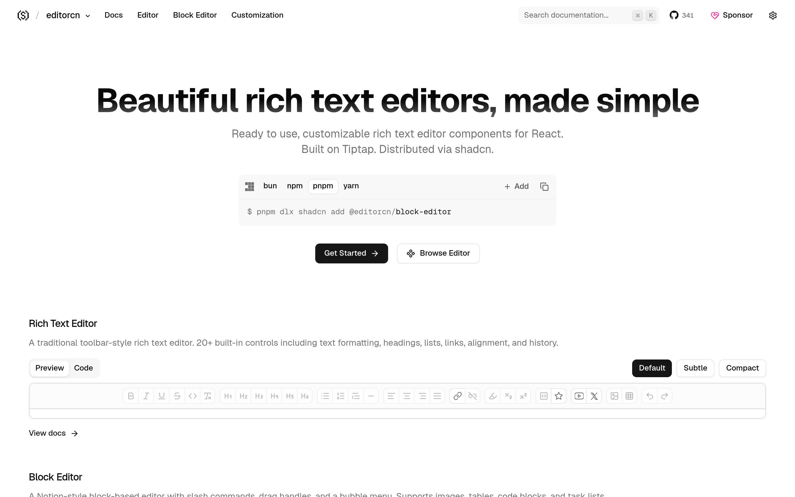

# 富文本编辑器组件：editorcn

## 直观预览

> editorcn 官网首页（1440×900，站名 rtecn.space）："Beautiful rich text editors, made simple"——基于 Tiptap 的 React 富文本编辑器组件，走 shadcn registry 分发。

## 一句话价值

"shadcn，但 for 富文本编辑器"：基于 Tiptap 的 React 编辑器组件——工具栏版 + Notion 风块编辑器（含 slash 命令与 bubble menu），走 shadcn registry 安装。

## AI 选用指南

| 项目 | 选用说明 |
| --- | --- |
| 优先选用条件 | React 项目需要富文本编辑器（写作工具、文档、CMS），想要 Notion 风块编辑或传统工具栏两种形态；已在用 shadcn 生态。 |
| 不适合或暂缓条件 | 纯展示无需编辑时不适合；非 React 项目用不上；已有编辑器在用且够用时没必要换。 |
| 复用方式 | 安装依赖（shadcn registry：@editorcn/editor、@editorcn/block-editor 等） |
| 输入与产出 | shadcn registry 命令 → 可直接用的编辑器组件（含工具栏控件、slash 命令、表格/图片扩展、静态渲染器）。 |
| 首次读取入口 | [本卡](./富文本编辑器组件-editorcn-2026-10-09.md) →「内容摘要」；官网 https://www.rtecn.space（Docs / Templates，llms.txt 可查）。 |
| 同类选择依据 | 库内暂无富文本编辑器组件类收藏；与 Tiptap 官方的关系：editorcn 是"按 shadcn 哲学包装好的 Tiptap"，开箱即用。 |
| 接入前提与待核实项 | MIT；基于 Tiptap；未在本机安装验证，编辑器实际体验以官网为准。 |
| 检索词 | editorcn rtecn 富文本编辑器 Tiptap React shadcn 块编辑器 Notion风 |

> 核查记录：整理于 2026-10-09，基于官网 llms.txt（@editorcn/editor、@editorcn/block-editor、@editorcn/extensions、@editorcn/static-renderer 四个包）+ GitHub（shadcn-labs/editorcn，2026-06-22 创建，收录时 342 stars，MIT）。未安装验证。

## 内容摘要

editorcn（https://www.rtecn.space，站名 rtecn）是 shadcn-labs "*cn" 家族中的富文本编辑器组件库。

- **技术栈**：基于 Tiptap，按 shadcn 哲学包装，走 shadcn registry 分发。
- **四个包**：
  - `@editorcn/editor`：传统工具栏编辑器（含工具栏控件、链接扩展、序列化格式说明）
  - `@editorcn/block-editor`：Notion 风块编辑器，slash 命令 + bubble menu
  - `@editorcn/extensions`：现成 Tiptap 扩展（图片占位、表格等），带 live 预览逐个安装
  - `@editorcn/static-renderer`：把编辑器内容渲染成只读 HTML / React
- **文档**：llms.txt 完整，支持 shadcn MCP server，AI 可读。
- **仓库**：github.com/shadcn-labs/editorcn，2026-06-22 建仓，收录时 342 stars，MIT。

## 为什么值得收藏

1. **xiegao2.0 直接相关**：写作工具的核心就是编辑器——块编辑器（Notion 风）正是他稿件工作台需要的形态。
2. **开箱即用**：Tiptap 原生配置繁琐，editorcn 按 shadcn 哲学包好，registry 一条命令。
3. **形态齐全**：工具栏版 + 块编辑器 + 扩展 + 静态渲染，写稿、预览、发布全链路。

## 未来可以怎么用

- xiegao2.0 的稿件编辑器：直接装 @editorcn/block-editor（Notion 风，slash 命令）。
- 稿件预览/发布：static-renderer 把内容转只读 HTML。
- bot 素材库、终审表这类"要编辑大段文字"的内部工具，也能用。

## 原始内容 / 链接

- 官网：https://www.rtecn.space（站名 rtecn，品牌名 editorcn）
- 仓库：https://github.com/shadcn-labs/editorcn（MIT，342 stars，2026-06-22 创建）
- 发现链：X @shadcnlabs 推文（2026-10-07，10 个 *cn 站之一）→ 本站
- 未安装验证。

## 相关联想

- xiegao2.0 项目：稿件工作台的编辑器选型候选
- [React 着色器组件库：shadercn](../动效/React着色器组件库-shadercn-2026-10-07.md)：同属 *cn 家族
- [终端 UI 组件库：termcn](./终端UI组件库-termcn-2026-10-09.md)：同属 *cn 家族，一次收了三个

## 适合反向调用的场景

- React 项目要一个 Notion 风的块编辑器，有没有开箱即用的？
- Tiptap 配置太繁琐，有没有包好的版本？
- shadcn-labs 的 *cn 家族里，和编辑器相关的有哪些？
