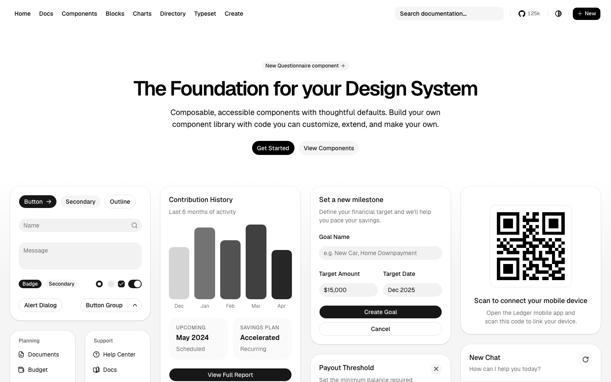

# 开放代码组件基座：shadcn/ui

## 直观预览

> 官网首屏展示按钮、输入、图表、表单与卡片组合；这是官网画面快照，不等于这些示例已安装到本地。

## 一句话价值

把可编辑的组件代码引入自己的项目，作为按钮、表单、弹窗、表格等基础界面的可定制起点，而不是依赖一个不可改的黑盒 UI 包。

## AI 选用指南

| 项目 | 选用说明 |
| --- | --- |
| 优先选用条件 | 新建或扩展支持其安装流程的 Web 项目，需要可自主修改的基础控件、主题和组件组合；尤其适合已经采用 shadcn 配置的项目按需补组件。 |
| 不适合或暂缓条件 | 既有产品已有稳定组件基座且只需要一个 AI 审批卡或展示动效时，不应为了局部效果整体替换组件体系；目标框架尚无可用安装路径时先核对文档。 |
| 复用方式 | 安装／复制组件源码；读取官方文档；套用组件组合方法。 |
| 输入与产出 | 目标框架、已有项目配置、设计令牌与具体控件需求 → 项目内可维护的组件源码与组合页面；业务数据和状态连接仍需自行实现。 |
| 首次读取入口 | [本卡「原始内容 / 链接」](#原始内容--链接) → [官方安装文档](https://ui.shadcn.com/docs/installation)；已有项目先核对配置，再查看[组件目录](https://ui.shadcn.com/docs/components)。 |
| 同类选择依据 | 需要基础控件且希望拥有源码时选 shadcn/ui；需要 Agent 审批、工具执行与 Diff 的交互语义时参考 [Beautiful UI](./AI原生界面组件参考库-Beautiful-UI-2026-08-17.md)；在兼容项目内补 AI Agent、图表与动画配方时比较 [beUI](./动画React组件库-beUI-2026-09-16.md)；[HeroUI](./现代React组件库-HeroUI-2026-07-23.md) 是另一套基础组件体系，已有体系优先沿用。 |
| 接入前提与待核实项 | 官方文档列出 Next.js、Vite、Laravel、React Router、Astro、TanStack Start 等安装入口；具体项目需确认框架、包管理器、CSS / token 配置、所选组件的依赖及底层实现。仓库根 LICENSE.md 为 MIT；第三方 registry 项目的许可单独核查。 |
| 检索词 | shadcn/ui shadcn 组件基座 基础表单 数据表格 Dialog Sidebar Registry components.json 开放代码 可复制源码 |

> 核查记录：2026-09-27 查阅官网 Introduction、Installation、Components、Registry 与 GitHub `LICENSE.md`，并保存首屏截图。以上安装入口与 MIT 为官方资料；选用取舍属于编辑判断。未安装或运行组件；不同 registry 的兼容性与授权未逐项核查。

## 内容摘要

官方定位是「开放代码」的组件与代码分发平台，不将它等同于传统 npm 黑盒组件包。官网提供基础控件和组合示例，包括 Button、Field、Dialog、Data Table、Sidebar、Chart、Skeleton 等；CLI 与 `components.json` 负责按项目配置引入组件。Registry 机制允许发布和引入第三方组件，但不能把第三方条目自动视作官方维护或同一许可。

## 为什么值得收藏

- 把“选组件、复制进项目、按设计令牌改造”作为可审阅的工作流，适合长期维护自己的产品组件体系。
- 与 Beautiful UI、beUI 等库形成明确层次：基础控件基座、Agent 协作模式、特定动画及场景配方并非同一选型。

## 未来可以怎么用

1. 项目已有 shadcn 配置：先识别缺少的基础控件，阅读对应组件页，再按需加入并连接真实业务状态。
2. 新项目：从安装页选择实际框架入口，确定 token、样式和可访问性验收标准，再组合页面。
3. 使用 beUI 等第三方 registry 时，先检查组件源码、依赖与许可证，避免把展示组件误当成核心业务能力。

## 原始内容 / 链接

- 官网：[shadcn/ui](https://ui.shadcn.com/)
- 官方介绍：[Introduction](https://ui.shadcn.com/docs)
- 安装说明：[Installation](https://ui.shadcn.com/docs/installation)
- 组件目录：[Components](https://ui.shadcn.com/docs/components)
- Registry 说明：[Registry](https://ui.shadcn.com/docs/registry)
- GitHub 与许可：[shadcn-ui/ui](https://github.com/shadcn-ui/ui)、[LICENSE.md](https://github.com/shadcn-ui/ui/blob/main/LICENSE.md)
- 本地预览：[官网首屏](../../_附件/收藏预览/shadcn-ui官网首屏-2026-09-27.png)

## 相关联想

先确定基础体系，再针对需要人工决策、工具运行或高辨识度动效的局部模块选择互补素材；不要把所有组件库叠成一套未定义的设计系统。

## 适合反向调用的场景

- 我想为新 Web 产品选一套可改源码的基础 UI 体系。
- 已有 shadcn 项目还缺表单、弹窗、数据表格或侧边栏，该从哪里找官方组件？
- Beautiful UI、beUI 和 shadcn/ui 分别该用于什么层次？
