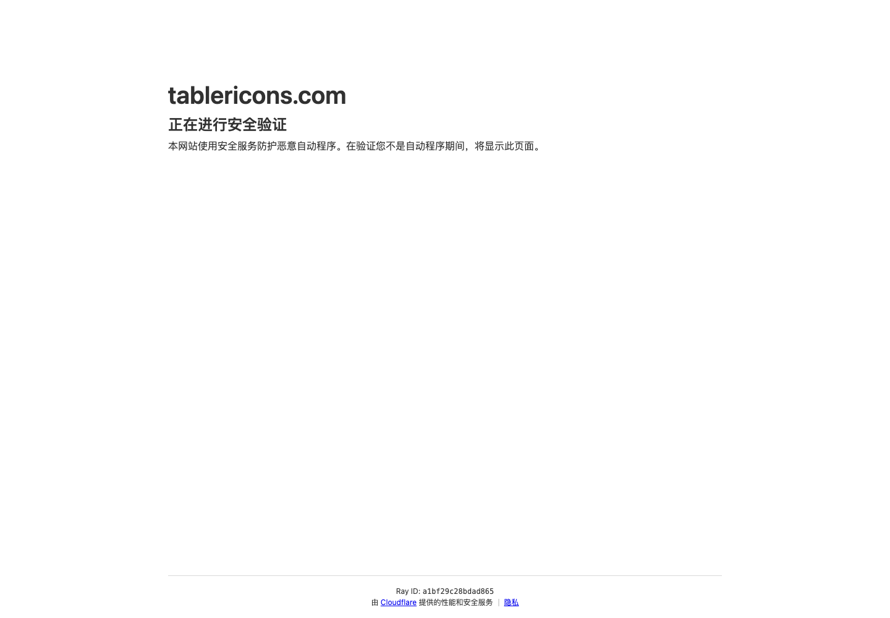

# 开源 SVG 图标库：Tabler Icons

## 直观预览

> Tabler Icons 首屏截图，直观看 5000+ SVG 图标库的检索和展示方式。

## 一句话价值

一个覆盖 5000+ 图标的开源 SVG 图标库，适合作为网站、SaaS 后台、工具型产品和设计系统里的默认线性图标来源。

## AI 选用指南

| 项目 | 选用说明 |
| --- | --- |
| 优先选用条件 | 项目需要语义覆盖较广、风格一致的 SVG 图标，或为导航、按钮和状态统一图标来源。 |
| 不适合或暂缓条件 | 已有统一图标库且无缺口时不另引入；不提供布局或完整控件行为。 |
| 复用方式 | 使用图标资产；安装依赖（按目标框架选包） |
| 输入与产出 | 动作清单、尺寸与线宽 → 图标映射和统一样式。 |
| 首次读取入口 | [本卡](./开源SVG图标库-Tablericons-2026-07-16.md) →「原始内容 / 链接」 |
| 同类选择依据 | 已有 Tabler 图标映射且业务语义齐全时优先沿用；新项目需要同图形的多种样式／角处理或已文档化的 MCP 查询入口时，比较 [Keyline Icons](./多风格开源SVG图标库-Keyline-Icons-2026-09-21.md)，逐项核对目标图标，不按总数排名。Tabler 负责图标；[HeroUI](./现代React组件库-HeroUI-2026-07-23.md)负责控件；[BoardUI](./Dashboard设计系统-BoardUI-2026-07-09.md)负责布局参考，三者互补。 |
| 接入前提与待核实项 | 原卡未给当前包版本和许可文件，实际安装前查官方框架入口；不猜测导出名。 |
| 检索词 | Tabler Icons SVG 线性图标 icon 导航图标 状态图标 |

> 选用说明整理于 2026-09-20：适用与比较为基于收藏证据的建议；正文中的版本、数量、价格与功能范围按原收录时间理解。本次未安装或运行所收藏的工具，当前环境安装状态另查。未对外部来源作全量实时复核。

> 比较补充：2026-09-21 根据新收录的 Keyline 官方资料补充选用建议；未重新核实 Tabler 当前版本、数量或完整能力。

## 内容摘要

Tabler Icons 是一个开源 SVG 图标库，官网提供大量线性风格图标，可用于 Web 界面、后台系统、导航、按钮、表单、状态提示和数据面板。它的价值不只是“图标多”，更在于风格统一、语义覆盖广，适合做成项目里的基础图标系统。

对 Codex 或其他 AI 前端代理来说，Tabler Icons 可以作为明确的图标来源约束：不要临时画粗糙 SVG，也不要混用多套图标风格；优先选择 Tabler 里语义接近的图标，再按项目的字号、线宽和颜色体系落地。

## 为什么值得收藏

1. 图标数量大，覆盖常见产品、工具、导航、媒体、开发、数据、状态等场景。
2. SVG 开源资源适合长期沉淀到设计系统和前端组件库里。
3. 线性图标风格克制，适合 SaaS、仪表盘、工具站、内容管理系统等高频界面。
4. 给 Codex 做 UI 时，可以直接指定“使用 Tabler Icons 风格”，避免图标来源混乱。

## 未来可以怎么用

- 做网站或 SaaS 后台时，把它作为默认图标库，统一导航、按钮、空状态和设置页图标。
- 做设计系统时，定义图标尺寸、线宽、颜色、hover/active 状态和禁用状态。
- 做 AI 生成页面时，在提示词里要求 Codex 使用 Tabler Icons 的语义图标，不临时拼接 SVG。
- 做产品文档或 README 时，用统一图标提升模块说明的可扫读性。

## 原始内容 / 链接

- 官网：[https://tablericons.com/](https://tablericons.com/)
- 用户提供短链：[https://t.co/3nyzXkNK5A](https://t.co/3nyzXkNK5A)
- 类型：开源 SVG 图标库
- 用户备注：5000+ 开源 SVG 图标

## 相关联想

- 可以和 BoardUI 一起用：BoardUI 提供 dashboard 结构，Tabler Icons 补充侧边栏、按钮和状态图标。
- 可以和 Component Gallery 一起用：先找组件模式，再用 Tabler Icons 补齐语义图标。
- 后续可以沉淀一套“Codex UI 图标使用规则”，要求所有图标来自同一套库。

## 适合反向调用的场景

- 我要给一个 SaaS 后台统一图标风格。
- 我需要给导航、按钮、空状态、表格操作增加图标。
- 我想让 Codex 做页面时别乱画图标。
- 我想建立自己的设计系统图标规范。
