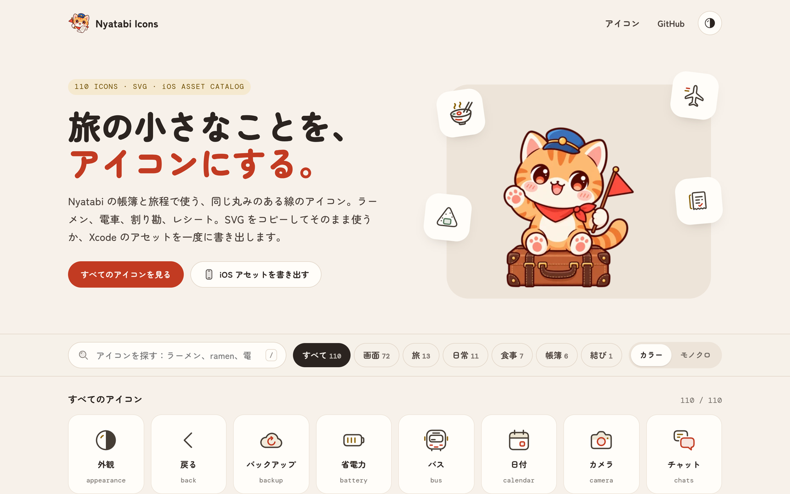

# 旅行主题图标库：Nyatabi Icons

## 直观预览

> Nyatabi Icons 官网首页（1440×900）：110 个图标，SVG + iOS Asset Catalog，日文站，圆润线条风，旅行主题（拉面、电车、饭团、收据……）。

## 一句话价值

110 个日式圆润线条图标，旅行主题（拉面、电车、饭团、收据、住宿、护照……），SVG 一键复制，还能一次导出 Xcode asset——小众但味道独特。

## AI 选用指南

| 项目 | 选用说明 |
| --- | --- |
| 优先选用条件 | 旅行/生活类产品需要图标，且想要圆润可爱的日式线条风；做 iOS 需要直接导出 asset catalog。 |
| 不适合或暂缓条件 | 通用后台/工具类产品用 Lucide/Tabler 更全（110 个覆盖面小）；正式商务风不搭这种可爱线条。 |
| 复用方式 | 复制 SVG、使用；iOS 一键导出 asset |
| 输入与产出 | 官网浏览 → 点图标复制 SVG，或"一键导出 Xcode asset"。 |
| 首次读取入口 | [本卡](./旅行主题图标库-Nyatabi-Icons-2026-10-09.md) →「内容摘要」；官网 https://icons.nyatabi.app/（搜索 + 分类筛选 + 颜色/单色切换）。 |
| 同类选择依据 | 库内已有 [Tabler Icons](./开源SVG图标库-Tablericons-2026-07-16.md)（通用全）、[Keyline Icons](./多风格开源SVG图标库-Keyline-Icons-2026-09-21.md)（多风格）：Nyatabi 是"主题型"——要通用选前两者，要旅行生活味选 Nyatabi。 |
| 接入前提与待核实项 | 许可未在官网明确标注，商用前需核实；GitHub 仓库 musubicho/icon-workshop 仅 5 stars（2026-09-30 创建），项目很新。 |
| 检索词 | Nyatabi Icons 旅行图标 日式图标 SVG iOS asset 圆润线条 |

> 核查记录：整理于 2026-10-09，基于官网首页（110 icons，分类：画面 72 / 旅 13 / 日常 11 / 食事 7 / 帳簿 6 / 結び 1，颜色/单色切换，SVG 复制 + Xcode 导出）+ GitHub（musubicho/icon-workshop，2026-09-30 创建，5 stars，license 未声明）。许可未明确，商用前核实。

## 内容摘要

Nyatabi Icons（https://icons.nyatabi.app/）是一套日式旅行主题图标库。

- **规模**：110 个图标，SVG 格式，另支持 iOS Asset Catalog。
- **主题**："旅の小さなことを、アイコンにする"（把旅行中的小事做成图标）——拉面、电车、饭团、收据、住宿、护照、抹茶、清酒、布丁……生活气息浓。
- **风格**：统一的圆润线条，可爱但不幼稚；支持颜色/单色两种外观切换。
- **用法**：官网搜索（支持日文/英文/拼音如 ramen），点图标复制 SVG；或一键导出全部 Xcode asset。
- **出处**：Nyatabi 自家记账+旅行 app 用的同一套图标，属"吃自己狗粮"。
- **仓库**：github.com/musubicho/icon-workshop，自述 "Rounded SVG icons and a local atelier for Web and iOS"，2026-09-30 创建，5 stars——项目很新。

## 为什么值得收藏

1. **差异化**：库里的图标都是通用型（Lucide/Tabler/Keyline），这是第一套"主题型"——旅行生活味，通用库给不了。
2. **iOS 友好**：一键导出 Xcode asset，对做 iOS（他有 iOS 产品想法）很顺手。
3. **味道**：圆润线条 + 日式生活感，适合温暖治愈类调性（参考他的 bot 审美）。

## 未来可以怎么用

- 旅行/生活类小产品、bot 周边页面的图标。
- iOS 原型快速出图标资产。
- 圆润线条风的视觉参考（和 Lucide 的硬朗线条对比着用）。

## 原始内容 / 链接

- 官网：https://icons.nyatabi.app/
- 仓库：https://github.com/musubicho/icon-workshop（license 未声明，5 stars，2026-09-30 创建）
- 许可未明确标注，商用前务必核实。

## 相关联想

- [开源 SVG 图标库：Tabler Icons](./开源SVG图标库-Tablericons-2026-07-16.md)：通用型 vs 主题型
- [多风格开源 SVG 图标库：Keyline Icons](./多风格开源SVG图标库-Keyline-Icons-2026-09-21.md)：多风格 vs 单一主题深耕

## 适合反向调用的场景

- 旅行/生活类产品需要一套有味道的图标，有什么小众选择？
- iOS 项目图标想一键导出 asset，有什么工具？
- 我收藏过哪些图标库？通用和主题型的分别有哪些？
