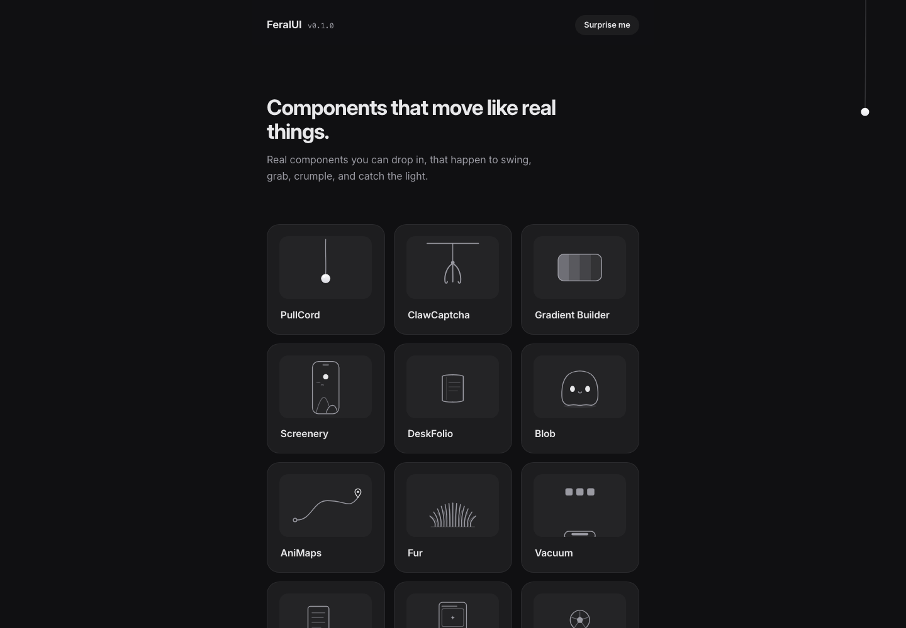

# 物理感互动 React 组件库：FeralUI

## 直观预览



> 已保存 FeralUI 官网首屏截图。这个收藏不是普通 UI kit，而是一组带真实物理感、可交互、偏实验性的 React / TypeScript 界面元素。

## 一句话价值

FeralUI 是一个由 mortspace 制作的趣味物理感 React 组件与互动实验库，适合给网站、产品页、作品集和工具界面补充“可玩、可记住、可拆成局部组件”的 UX 细节。

## AI 选用指南

| 项目 | 选用说明 |
| --- | --- |
| 优先选用条件 | 作品集、品牌页或局部操作希望借用拉绳、翻册、揉纸、镭射等物理隐喻形成记忆点。 |
| 不适合或暂缓条件 | 高频后台任务、完整基础控件或真实安全验证码不能仅靠趣味演示替代。 |
| 复用方式 | 视觉参考；复制代码（确认源码后） |
| 输入与产出 | 关键动作、期望反馈、设备约束 → 一个局部物理互动原型。 |
| 首次读取入口 | [本卡](./物理感互动React组件库-FeralUI-2026-07-18.md) →「内容摘要」 |
| 同类选择依据 | FeralUI 强调物体隐喻；Amicro 擅长卡片空间编排；RareUI 覆盖球体、导航与输入微交互。 对照：[React 微交互与过渡组件库：Amicro](../动效/React微交互与过渡组件库-Amicro-2026-08-23.md)、[独特交互动效组件库：RareUI](./独特交互动效组件库-RareUI-2026-09-20.md)。 |
| 接入前提与待核实项 | 原卡以演示与截图为证；目标组件源码、依赖和许可需查，ClawCaptcha 的演示不证明具备反机器人安全能力。 |
| 检索词 | FeralUI PullCord ClawCaptcha DeskFolio Crumple Hologram 物理交互 |

> 选用说明整理于 2026-09-20：适用与比较为基于收藏证据的建议；正文中的版本、数量、价格与功能范围按原收录时间理解。本次未安装或运行所收藏的工具，当前环境安装状态另查。未对外部来源作全量实时复核。

## 内容摘要

FeralUI 官网标题是 `playful, physics-driven React elements`，定位为一组小型、好玩的、由物理驱动的 React 元素。页面描述里明确提到它包含真实 Verlet 绳索的吊绳开关、抓娃娃机验证码等组件。

当前官网列出的组件包括：

1. `PullCord`：像真实布绳一样下垂的拉绳，用户可以拖拽切换灯光。
2. `ClawCaptcha`：把“证明你是人类”做成抓娃娃机游戏。
3. `Gradient Builder`：使用传统日本色彩混合柔和渐变。
4. `Screenery`：一组带标志性动作的完成态应用界面。
5. `DeskFolio`：像小册子一样打开并带弹簧翻页的作品集组件。
6. `Blob`：在退出确认弹窗里反应的软弹果冻吉祥物。
7. `AniMaps`：可导出和分享的动画路线地图。
8. `Fur`：可以被“抚摸”的毛发质感组件。
9. `Vacuum`：选择若干 tile 后，用吸尘器软管吸走。
10. `Crumple`：把便签揉成纸团并丢进篮子。
11. `Hologram`：倾斜时捕捉光线的镭射卡片效果。
12. `Matchday`：类似 Letterboxd 的足球比赛评分界面。

这些组件的共同点不是“标准化后台组件”，而是把现实物体、物理反馈和轻游戏化交互转译成网页 UI。它更适合做页面记忆点、品牌细节、空状态、确认流程、趣味验证码、作品集互动和局部动效，而不是整站套用。

## 为什么值得收藏

1. 它能补上很多 UI 库缺少的“互动想象力”：拉绳、抓娃娃、揉纸、吸尘器、翻页册、毛发、镭射卡片，都是具体可感的交互隐喻。
2. 它对 Codex 做前端很有启发：不是只让页面更漂亮，而是要求组件有物理反馈、用户动作和状态变化。
3. 它适合和现有收藏组合使用：用 Component Gallery 决定组件类型，用 BoardUI / Bag UI 保证结构，再用 FeralUI 给关键位置增加一个令人记住的互动点。
4. 它能作为 UX 设计词库：physics-driven UI、Verlet rope、game-like captcha、spring page turn、squishy mascot、interactive texture、holographic tilt effect 都是以后描述交互时可直接调用的学名或方向。

## 未来可以怎么用

1. 做产品官网时，把 `PullCord`、`Blob`、`Hologram` 这类互动转成 Hero 区、CTA、退出确认或会员卡片的局部记忆点。
2. 做工具型产品时，把 `Vacuum`、`Crumple` 用作删除、归档、清理、完成任务等操作反馈，让用户明确感到“动作发生了”。
3. 做创作者工具或作品集时，参考 `DeskFolio` 和 `Screenery`，把作品展示从静态卡片变成可翻阅、可展开、带手感的界面。
4. 做验证码、登录、权限确认时，参考 `ClawCaptcha` 的思路，把原本无聊或压迫感强的流程转成轻量互动。
5. 给 Codex 做界面时，可以要求它“从 FeralUI 里只挑一个适合当前任务的物理感互动，不要全站堆特效”。

## 原始内容 / 链接

- 官网：[https://feralui.dev/](https://feralui.dev/)
- 作者：mortspace
- 作者 GitHub：[https://github.com/mortspace](https://github.com/mortspace)
- 官网描述：A small library of playful, physics-driven React elements.
- 当前直观快照：`_附件/收藏预览/Feral-UI-2026-07-18.png`

## 相关联想

- 和 [[界面组件设计案例库-Component-Gallery-2026-07-16]] 的关系：Component Gallery 更适合找组件学名和常规 UX 结构，FeralUI 更适合找“非常规互动隐喻”。
- 和 [[现代UI组件区块库-BagUI-2026-07-16]] 的关系：Bag UI 可以提供页面区块骨架，FeralUI 可以只取一个局部互动做记忆点。
- 和 [[Web过渡动效参考库-Transitions-dev-2026-07-07]] 的关系：Transitions.dev 更偏通用过渡节奏，FeralUI 更偏物理感、物体隐喻和互动实验。
- 和 [[Web交互音效库-Cuelume-2026-07-17]] 的关系：FeralUI 的物理动作可以搭配 Cuelume 的轻量声音反馈，形成“视觉 + 动作 + 声音”的多感官微交互。

## 适合反向调用的场景

```text
请参考我的收藏：
Vault 根目录相对路径：01-界面设计/组件/物理感互动React组件库-FeralUI-2026-07-18.md

在当前项目里只选择 1 个最适合的 FeralUI 式互动隐喻，不要整站堆特效。

请先判断：
1. 当前页面最需要被记住的动作是什么；
2. 这个动作适合用哪类物理隐喻表达，例如拉绳、抓取、揉纸、吸走、翻页、软弹、倾斜镭射；
3. 它应该落在哪个组件上，例如 Hero、CTA、删除确认、空状态、作品展示、验证码、成功反馈；
4. 是否会干扰主任务，如果会，就降级成更轻的 hover / press / transition。

实现时优先保持可访问性、移动端可用和性能稳定。
```
