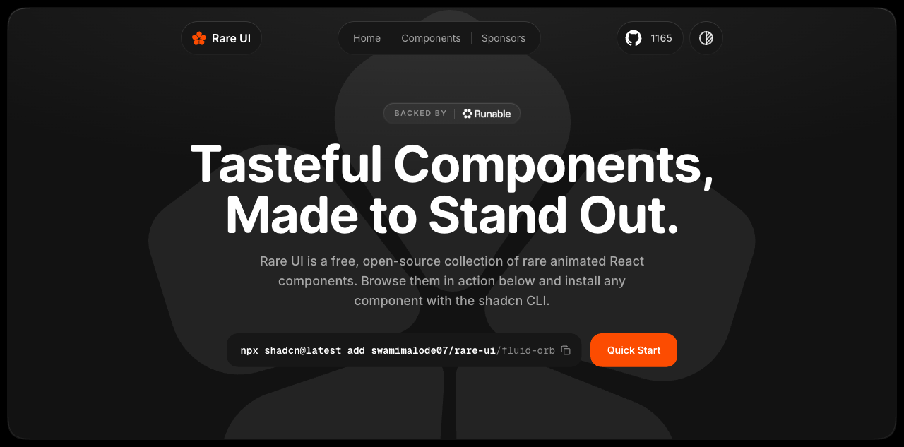
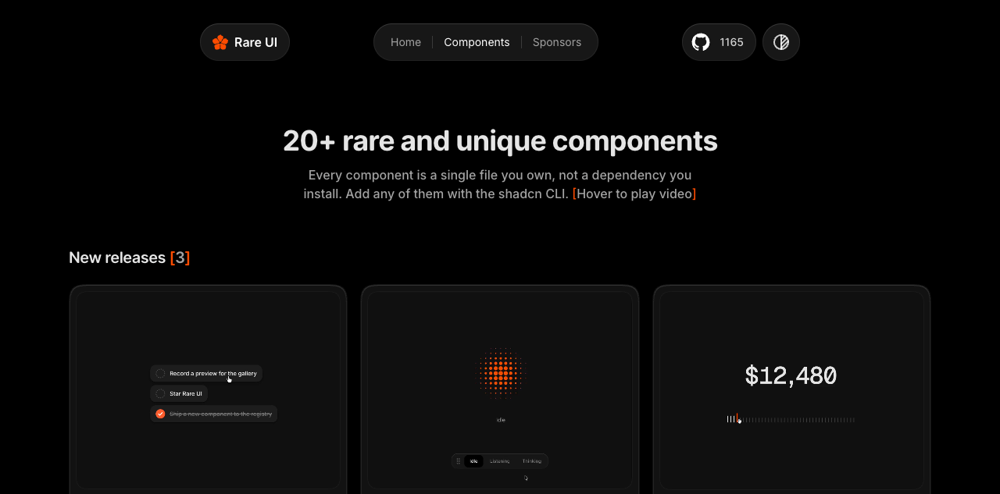

# 独特交互动效组件库：RareUI

## 直观预览





> 官网首页与组件列表截图，保存于 2026-09-20。静态截图用于快速辨认素材，实际动效请打开官网查看。

## 一句话价值

提供可通过 shadcn CLI 引入的 React 动画组件，适合为导航、输入与反馈操作增加有辨识度的交互细节。

## AI 选用指南

| 项目 | 选用说明 |
| --- | --- |
| 优先选用条件 | React 项目只需要一个可辨认的局部组件：文件夹、代码块、重力字母、步骤播放器、流体球体、网格揭示、侧边栏、时长选择器、OTP、任务列表或通知铃铛；目标产物是页面原型、作品集、AI 状态反馈或产品里的单个交互。 |
| 不适合或暂缓条件 | 需要完整表单、表格、数据图表、Agent 工作台或底层动画状态机时，先比较 HeroUI、Beautiful UI、beUI 或 Motion；不能把球体、Grid Reveal 或任务列表当成语音识别、图片生成后端或任务调度能力。 |
| 复用方式 | 复制源码；视觉参考 |
| 输入与产出 | 组件用途、业务状态、主题 → shadcn 单文件组件及状态接入。 |
| 首次读取入口 | 先读[官方组件目录](https://www.rareui.com/components)按分类挑单组件，再读对应组件页的「Dependencies」「Props」「Installation」「Source Code」；本地证据见本卡「直观预览」与「内容摘要」。 |
| 同类选择依据 | 需要具体导航、输入、反馈或 AI 球体时优先 RareUI；需要完整 Agent 状态、审批和工具结果选 beUI/Beautiful UI；需要物理隐喻选 FeralUI；需要弧形卡片编排或通用过渡选 Amicro；需要底层 JavaScript/React/Vue 动画逻辑选 Motion。对照：[动画 React 组件库：beUI](./动画React组件库-beUI-2026-09-16.md)、[AI 原生界面组件参考库：Beautiful UI](./AI原生界面组件参考库-Beautiful-UI-2026-08-17.md)、[物理感互动 React 组件库：FeralUI](./物理感互动React组件库-FeralUI-2026-07-18.md)、[React 微交互与过渡组件库：Amicro](../动效/React微交互与过渡组件库-Amicro-2026-08-23.md)、[网页动画库：Motion](../动效/网页动画库-Motion-2026-08-22.md)。 |
| 接入前提与待核实项 | 2026-09-23 复核官方组件目录与[使用条款](https://www.rareui.com/terms)：组件通常按 MIT + Commons Clause 发布，项目需保留 Rare UI 可见署名和源代码版权说明，不能单独销售、再包装成组件库或模板；个别组件页的许可说明存在“商业可用”与“仅个人/非商业”差异，实际接入前必须以目标组件页和仓库 LICENSE 为准。目标项目需能使用 React、shadcn CLI 与该组件列出的依赖（例如 motion），本次未安装或运行。 |
| 检索词 | RareUI Rare UI components Display AI kit Navigation Inputs Feedback Folder component Code Block Gravity Letters Step player Animated counter Fluid Orb Grid Reveal Matrix orb Bounce sidebar Hook Sidebar Proximity Sidebar Gooey nav Duration Picker OTP Input Delete button Task list Emoji reaction Notification bell |

> 选用说明整理于 2026-09-23；原始收录于 2026-09-20。适用与比较为基于收藏证据的建议；正文中的版本、数量、价格与功能范围按原收录时间理解。本次未安装或运行所收藏的工具，当前环境安装状态另查。本次另作官方页面复核：官方目录：球体、导航、输入与反馈组件；未确认具体源码许可。

## 内容摘要

- 官网将其定位为免费、开源的 React 动画组件集合，组件目录按 Display、AI kit、Navigation、Inputs、Feedback 分组，首页标注 20+ 个组件。
- 组件以单文件源码形式加入项目，可自行修改；使用 shadcn CLI 添加。
- 展示类：文件夹、代码块、重力字母、GitHub 活跃度、步骤播放器和动画计数器；AI kit：Fluid Orb、Grid Reveal、Matrix orb；Navigation：Bounce sidebar、Hook Sidebar、Proximity Sidebar、Scroll Progress、Gooey nav；Inputs：Duration Picker、OTP Input、Delete button、Task list；Feedback：Emoji reaction、Notification bell。
- 单组件页会列出依赖、Props、安装方式和源码入口；例如 Task list 依赖 `motion`，Step player 提供 `npx shadcn@latest add swamimalode07/rare-ui/step-player`。

## 为什么值得收藏

组件围绕具体操作提供动效示例，既能用于视觉选型，也能作为实现起点。比只保存效果截图更容易复用到实际 React 项目。

## 未来可以怎么用

- 做工具网站时，从侧边栏与输入组件中选择符合操作习惯的交互。
- 做 AI 产品原型时，用球体效果探索等待、思考或语音状态的表达；状态映射属于后续设计方案。
- 做作品集或落地页时，使用文件夹、重力字母或动画计数器强调局部内容。
- 接入时先浏览演示，再添加所需组件、调整品牌样式，并验证键盘操作、移动端与减少动态效果偏好。

## 原始内容 / 链接

- [Rare UI 官网](https://www.rareui.com/)
- [组件目录与演示](https://www.rareui.com/components)
- [官方使用条款与许可说明](https://www.rareui.com/terms)
- 官网安装示例（本次仅收藏，未执行）：

```bash
npx shadcn@latest add swamimalode07/rare-ui/fluid-orb
```

> 2026-09-23 复核：组件目录提供分类、单组件详情、依赖、Props、安装和源码入口。官网条款写明 MIT + Commons Clause、署名要求和禁止单独再分发；单组件页面的使用边界可能不同，接入前以目标组件页和仓库 LICENSE 为准。

## 相关联想

- [[动画React组件库-beUI-2026-09-16]]：同属可直接引入的动画组件资源，可按项目所需功能对比选型。
- [[Shadcn动画React组件库-SmoothUI-2026-08-22]]：可一起作为 React 动效实现参考。
- [[物理感互动React组件库-FeralUI-2026-07-18]]：适合对照探索拟物与物理反馈。

## 适合反向调用的场景

- 想给 React 产品找有特色的侧边栏、输入框或通知反馈。
- 想找 AI 球体动画、作品集文件夹或文字交互参考。
- 想让 Codex 基于已有组件实现局部微交互。
