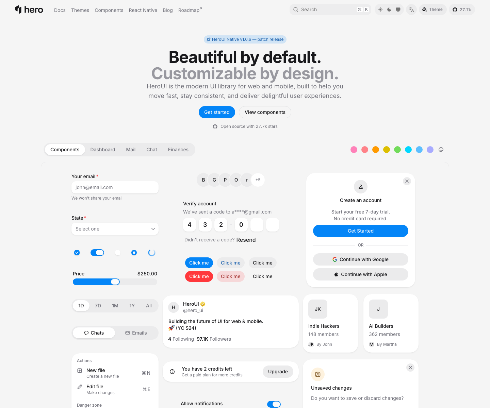
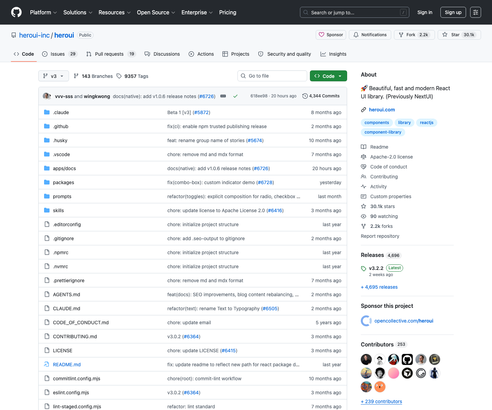

# 现代 React 组件库：HeroUI

## 直观预览

> HeroUI 官网首屏和 GitHub 仓库截图。官网截图更适合直观看组件风格，GitHub 截图用于确认项目状态。

## 一句话价值

一个原 NextUI 演进来的现代 React UI 组件库，基于 React 19、Tailwind CSS v4、React Aria Components 和 compound component API，适合快速搭建可访问、可主题化、AI 友好的产品界面。

## 内容摘要

`heroui-inc/heroui` 是 HeroUI v3 的 monorepo。项目定位是 production-ready React UI library，曾用名 NextUI。它的核心包是 `@heroui/react` 和 `@heroui/styles`，文档站在 `apps/docs`，组件源码在 `packages/react/src/components/`，样式和 Tailwind 变体在 `packages/styles/`。

技术逻辑上，HeroUI v3 用 React Aria Components 提供键盘、焦点、屏幕阅读器和交互状态等可访问性基础；用 Tailwind CSS v4 和 `tailwind-variants` 管理视觉变体与主题；用 compound component pattern 提供 `Card.Header`、`Card.Content`、`Select.Item` 这类可组合 API；v3 明确不再需要全局 Provider，样式通过 CSS 变量和 oklch 颜色体系驱动。

它的 monorepo 使用 pnpm + Turborepo，核心包包括 `react`、`styles`、`standard`、`storybook`、`vitest`。组件目录覆盖 accordion、button、card、modal、drawer、select、table、tabs、toast、calendar、date-picker、color-picker、toolbar、typography 等大量基础与复杂控件，比较适合 SaaS 后台、表单密集产品、dashboard、电商和现代工具站。

一个特别值得收藏的点是它对 AI 编程代理的适配：仓库里有 `AGENTS.md`、`CLAUDE.md`、`skills/heroui-react`、`skills/heroui-migration`、`skills/heroui-native`、`prompts/`、官网 `llms.txt` 和 MCP Server 相关说明。也就是说它不只是组件库，还在主动给 Codex、Claude Code、Cursor、v0、Bolt 等 AI 工具准备上下文。

## 为什么值得收藏

1. 它是成熟 React UI 库，不是单个组件参考；适合做整站界面基础设施。
2. v3 技术栈很现代：React 19、Tailwind CSS v4、React Aria Components、TypeScript、Turborepo。
3. 组件 API 偏组合式，适合让 Codex 生成更清晰的结构，而不是一堆扁平 props。
4. 可访问性基础比普通 Tailwind 组件库更扎实，适合表单、弹窗、菜单、选择器、日期控件这类容易写错交互细节的地方。
5. AI-ready 资料很完整，尤其是 `llms.txt`、MCP、Agent Skills 和 prompt packs，后续可以直接拿来约束 AI 生成 HeroUI v3 代码。
6. 许可证需要特别留意：GitHub 仓库显示 Apache-2.0，但 `@heroui/react` / `@heroui/styles` 的 package metadata 标注 MIT；实际项目使用前应以目标包和当前官方文件为准。

## 未来可以怎么用

- 在 React / Next.js 项目里作为默认 UI 组件库候选，尤其适合后台、dashboard、设置页、表单流、账号系统和内容管理工具。
- 让 Codex 写前端时，先读取 HeroUI v3 的 `llms.txt` 或 `heroui-react` Skill，避免误用 v2 的 Provider、Framer Motion 或旧 API。
- 做 glint.red 这类工具型产品时，可优先复用它的 button、card、tabs、table、modal、toast、form、select、date-picker 等组件模式。
- 对比 shadcn/ui：HeroUI 更偏 batteries-included 的设计系统；shadcn 更偏 copy-paste-customize。
- 拆解它的 `AGENTS.md` 和 prompts，学习成熟开源组件库如何给 AI agent 提供组件约束、样式规则和迁移规则。

## 原始内容 / 链接

- GitHub：[https://github.com/heroui-inc/heroui](https://github.com/heroui-inc/heroui)
- 官网：[https://heroui.com](https://heroui.com)
- Storybook：[https://storybook-v3.heroui.com](https://storybook-v3.heroui.com)
- Figma Kit：[https://www.figma.com/community/file/1546526812159103429/heroui-figma-kit-v3](https://www.figma.com/community/file/1546526812159103429/heroui-figma-kit-v3)
- 仓库：`heroui-inc/heroui`
- 默认分支：`v3`
- 收录时版本：`3.2.2`
- 收录时 Star / Fork：30062 / 2192
- 收录时最新提交：`618ee98ae713`，`2026-07-22T12:01:51Z`，`docs(native): add v1.0.6 release notes (#6726)`
- 收录时最新 Release：`v3.2.2`，发布于 `2026-07-07T03:11:03Z`
- License：GitHub 仓库为 Apache-2.0；`@heroui/react` / `@heroui/styles` package metadata 为 MIT
- 本地官网截图：`../../_附件/收藏预览/HeroUI-官网-2026-07-23.png`
- 本地 GitHub 截图：`../../_附件/收藏预览/HeroUI-GitHub-2026-07-23.png`
- 源码 zip：`../../_附件/项目备份/HeroUI/HeroUI-v3-source-2026-07-23.zip`
- React 包 README 快照：`../../_附件/项目备份/HeroUI/packages-react-README-2026-07-23.md`
- AGENTS 快照：`../../_附件/项目备份/HeroUI/AGENTS-2026-07-23.md`
- HeroUI React Skill 快照：`../../_附件/项目备份/HeroUI/heroui-react-SKILL-2026-07-23.md`
- 组件列表快照：`../../_附件/项目备份/HeroUI/components-list-2026-07-23.txt`
- llms.txt 快照：`../../_附件/项目备份/HeroUI/llms-2026-07-23.txt`

## 相关联想

- 和 `BoardUI`、`Bag UI`、`Component Gallery` 搭配使用：HeroUI 负责真实组件实现，其他素材负责风格参考和组件选型。
- 和 `NameThatUI` 搭配：先用 NameThatUI 校准组件学名，再让 Codex 按 HeroUI 组件实现。
- 和 `Tabler Icons` 搭配：HeroUI 负责控件与布局，Tabler Icons 负责统一图标语言。
- 和 `ai-website-cloner`、`web-clone` 搭配：复刻或迁移自有页面时，用 HeroUI 作为重建后的组件基座。
- 它的 AI prompts 和 Agent Skills 适合单独拆成“组件库给 AI 使用”的方法论案例。

## 适合反向调用的场景

- 我想做 React / Next.js 产品界面，有没有成熟 UI 组件库可用？
- 我想让 Codex 生成表单、弹窗、表格、日期选择器、toast，有没有可访问性更好的库？
- 我想找 Tailwind CSS v4 + React Aria 的组件库参考。
- 我想让 AI 生成 HeroUI v3 代码，应该给它哪些上下文？
- glint.red 或其他 SaaS 后台可以用哪些收藏素材搭组件系统？
