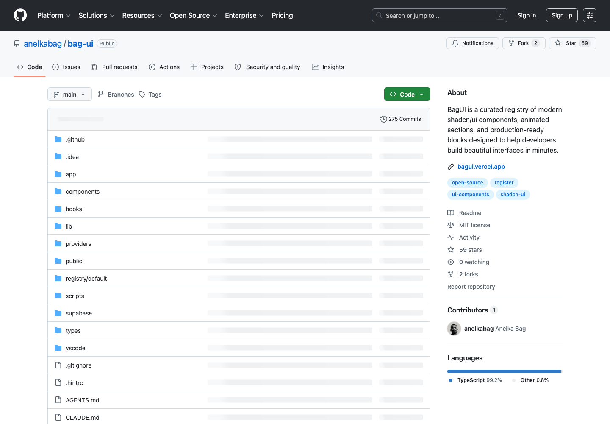

# 现代 UI 组件区块库：Bag UI

## 直观预览

> Bag UI GitHub 页面截图，直观看这是一个开源现代 UI 组件项目。

## 一句话价值

一个开源现代 UI 组件项目，适合给网站、落地页和 React 前端项目提供可拆解的组件区块参考。

## AI 选用指南

| 项目 | 选用说明 |
| --- | --- |
| 优先选用条件 | React/Next.js 项目要 hero、navbar、pricing、CTA、footer 等页面区块，并愿意复制改造源码。 |
| 不适合或暂缓条件 | 不能承诺所有在线资源免费；不为获取少量区块而复制整个展示站。 |
| 复用方式 | 复制源码；视觉参考 |
| 输入与产出 | 页面任务、需要的区块、现有主题 → 单个 registry 区块改造。 |
| 首次读取入口 | [本卡](./现代UI组件区块库-BagUI-2026-07-16.md) →「原始内容 / 链接」；[官方入口](https://github.com/anelkabag/bag-ui) |
| 同类选择依据 | BagUI 侧重页面区块；HeroUI 是控件基座；SmoothUI 更适合找局部动画组件。 对照：[现代 React 组件库：HeroUI](./现代React组件库-HeroUI-2026-07-23.md)、[shadcn 动画 React 组件库：SmoothUI](./Shadcn动画React组件库-SmoothUI-2026-08-22.md)。 |
| 接入前提与待核实项 | 2026-09-20 官方仓库确认 registry/default/blocks 与 ui；access.tier 区分 free/pro。README 克隆示例与当前仓库名不同，按当前代码入口核实，不照抄旧命令。 |
| 检索词 | BagUI Bag UI shadcn registry hero navbar pricing CTA footer |

> 选用说明整理于 2026-09-20：适用与比较为基于收藏证据的建议；正文中的版本、数量、价格与功能范围按原收录时间理解。本次未安装或运行所收藏的工具，当前环境安装状态另查。本次另作官方页面复核：官方仓库：registry 源码目录与 free/pro 分层；未测试复制安装。

## 内容摘要

Bag UI 是 `anelkabag/bag-ui` 开源项目，用户备注为“开源现代 UI 组件”。它适合和 BoardUI、Uiverse、Originkit 这类素材一起放进前端界面参考库：BoardUI 偏 dashboard 系统，Originkit 偏动态效果，Bag UI 则可以作为现代 UI 组件和区块的补充来源。

这类资源未来给 Codex 使用时，不应该整包照搬，而是让 Codex 根据当前项目类型挑选合适组件：例如 hero、pricing、feature card、testimonial、CTA、navbar、footer、dashboard card 等，再按项目已有技术栈重组。

## 为什么值得收藏

1. 开源 UI 组件适合学习现代前端组件结构、样式层级和区块组合。
2. 对 Codex 生成网站很实用：可以作为“组件区块参考”，帮助它避免只做单调卡片堆叠。
3. 可以和 Component Gallery 配合：Component Gallery 用于判断组件类型，Bag UI 用于寻找现代视觉实现。
4. 对 landing page、产品官网、工具站和小型 SaaS 页面都有复用价值。

## 未来可以怎么用

- 做产品官网时，参考其中的 hero、features、pricing、CTA、FAQ 等区块。
- 做 React 项目时，拆解组件结构、样式命名、布局和响应式策略。
- 给 Codex 做页面重组时，让它先选当前项目需要的区块，而不是把所有组件堆进页面。
- 和 Tabler Icons、Animated Buttons、Originkit 搭配，形成“组件结构 + 图标 + 按钮动效 + 局部动态效果”的组合。

## 原始内容 / 链接

- GitHub：[https://github.com/anelkabag/bag-ui](https://github.com/anelkabag/bag-ui)
- 用户提供短链：[https://t.co/jCZHy8je5i](https://t.co/jCZHy8je5i)
- 类型：开源现代 UI 组件项目
- 用户备注：开源现代 UI 组件

## 相关联想

- 和 Uiverse 一起看：Uiverse 更偏广义 UI kit，Bag UI 更适合作为开源组件项目参考。
- 和 Originkit 一起看：Bag UI 解决组件结构，Originkit 解决动态效果和微交互。
- 和 Component Gallery 一起看：先确定“该用什么组件”，再从 Bag UI 这类库寻找视觉实现方式。

## 适合反向调用的场景

- 我想给网站找现代 UI 组件参考。
- 我想让 Codex 根据项目需要挑选组件区块，不要堆满所有素材。
- 我想做一个产品官网、工具站或 SaaS landing page。
- 我想学习开源 UI 组件库的结构和样式组织方式。
