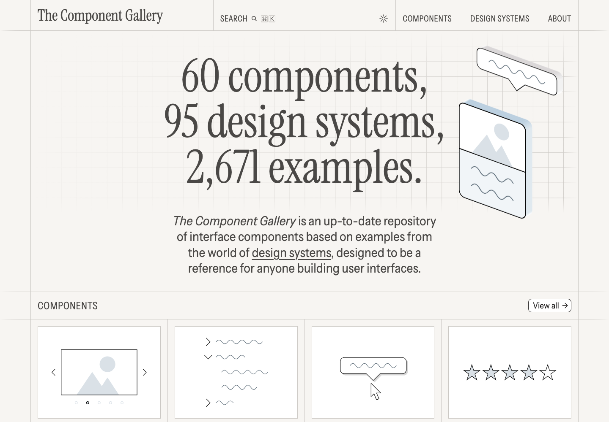

# 界面组件设计案例库：Component Gallery

## 直观预览

> Component Gallery 首屏截图，直观看它按组件类型组织 UI / UX 案例。

## 一句话价值

一个按组件类型组织的界面设计案例库，适合给网站和应用设计时查找组件学名、使用场景和多种真实示例。

## AI 选用指南

| 项目 | 选用说明 |
| --- | --- |
| 优先选用条件 | 界面设计前需要比较 tabs、表格、空状态等组件模式及真实案例，判断用什么控件承载任务。 |
| 不适合或暂缓条件 | 需要现成包和安装步骤时转向实现库；案例数量不代表适合当前任务。 |
| 复用方式 | 视觉参考；套用方法 |
| 输入与产出 | 用户操作、内容规模、状态 → 组件模式选择及选择理由。 |
| 首次读取入口 | [本卡](./界面组件设计案例库-Component-Gallery-2026-07-16.md) →「内容摘要」 |
| 同类选择依据 | Component Gallery 用于比较模式；NameThatUI 解决名称；HeroUI 是落地实现候选。 对照：[UI 元素命名视觉词典：NameThatUI](./UI元素命名视觉词典-NameThatUI-2026-07-18.md)、[现代 React 组件库：HeroUI](./现代React组件库-HeroUI-2026-07-23.md)。 |
| 接入前提与待核实项 | 案例来自不同设计系统，应读取原案例上下文；本卡不提供统一可安装源码。 |
| 检索词 | Component Gallery UX模式 tabs segmented control empty state data table |

> 选用说明整理于 2026-09-20：适用与比较为基于收藏证据的建议；正文中的版本、数量、价格与功能范围按原收录时间理解。本次未安装或运行所收藏的工具，当前环境安装状态另查。未对外部来源作全量实时复核。

## 内容摘要

Component Gallery 是一个界面组件参考库，用户备注为“60 个组件，2,671 个示例”。它的价值在于把界面拆成可命名、可比较、可复用的组件模式，而不是只看整页截图。对做 UI / UX 设计非常有用：当你不知道某个界面区域该用 tabs、segmented control、sidebar、breadcrumbs、empty state、toast 还是 data table 时，这类库能帮助快速找到合适组件类型和真实案例。

它尤其适合给 Codex 使用。很多 AI 生成页面失败，不是因为不会写 CSS，而是因为没有明确组件语言。Component Gallery 可以用来要求 Codex 先识别页面任务，再选择合适组件模式，并说明为什么不用其他组件。

## 为什么值得收藏

1. 它把 UI / UX 从“好不好看”拉回到“组件是否适合任务”，更适合做产品界面设计判断。
2. 大量示例可以帮助建立组件学名和使用边界，比如导航、筛选、表格、卡片、弹窗、空状态、通知等。
3. 对 Codex 很实用：可以让它参考组件案例库，先选组件，再写代码。
4. 能和 BoardUI、Tabler Icons、Colorable 组成一套更完整的界面设计工作流。

## 未来可以怎么用

- 做新页面前，先从 Component Gallery 找对应组件模式，再决定布局。
- 做已有页面改版时，检查当前组件是否用错：例如该用 data table 却用了卡片墙，该用 filter bar 却用了复杂弹窗。
- 给 Codex 下指令时，要求它使用准确组件名，并解释每个组件解决什么 UX 问题。
- 建立自己的组件术语库，方便以后快速描述“我要什么样的界面”。

## 原始内容 / 链接

- 官网：[https://component.gallery/](https://component.gallery/)
- 用户提供短链：[https://t.co/Z0CJPXUn2o](https://t.co/Z0CJPXUn2o)
- 类型：UI / UX 组件案例库
- 用户备注：60 个组件，2,671 个示例

## 相关联想

- 和 BoardUI 搭配：BoardUI 是 dashboard 设计系统，Component Gallery 是更通用的组件模式词典。
- 和 Tabler Icons 搭配：先确定组件和信息结构，再补充统一图标。
- 和 Colorable 搭配：组件结构确定后，用 Colorable 检查配色可读性。
- 适合纳入“让 Codex 自动匹配收藏设计素材”的提示词里，作为组件选择依据。

## 适合反向调用的场景

- 我想知道某个页面应该用什么组件。
- 我想让 Codex 先做 UX 组件选型，再写页面。
- 我想改造一个网站的信息架构和组件层级。
- 我想学习常见 UI 组件的学名、用法和真实案例。
