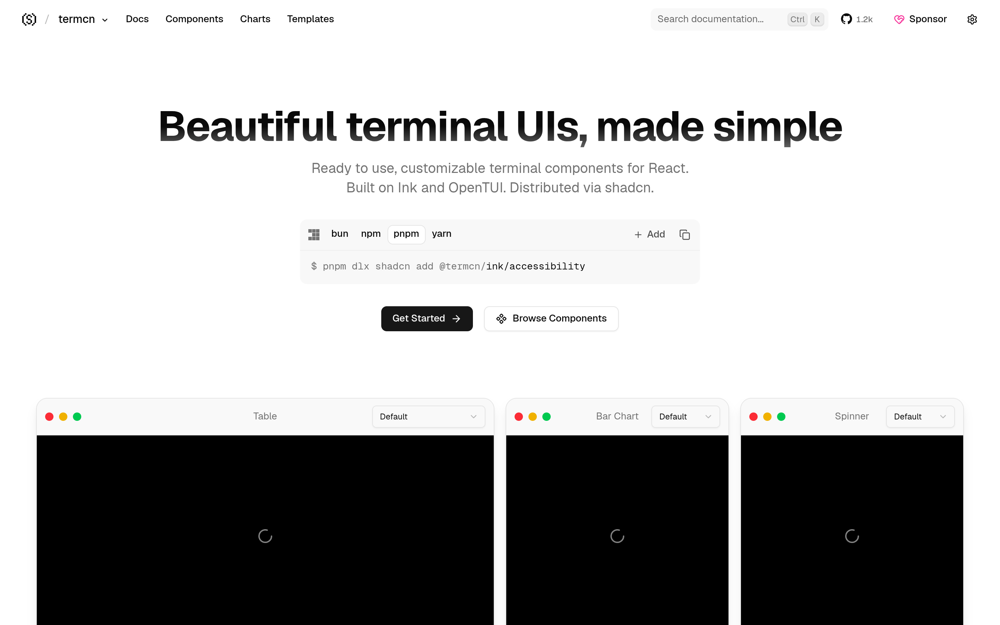

# 终端 UI 组件库：termcn

## 直观预览

> termcn 官网首页（1440×900）："Beautiful terminal UIs, made simple"——基于 Ink + OpenTUI 的 React 终端组件，走 shadcn 分发（`pnpm dlx shadcn add @termcn/ink/accessibility`），下方有 Table / Bar Chart / Spinner 组件预览。

## 一句话价值

"shadcn，但 for 终端"：基于 Ink + OpenTUI 的 React 终端 UI 组件库，走 shadcn registry 一条命令接入——做 CLI 工具、终端应用不用再手搓界面。

## AI 选用指南

| 项目 | 选用说明 |
| --- | --- |
| 优先选用条件 | 用 React（Ink）写 CLI 工具或终端应用，需要表格、图表、spinner、主题等现成组件；想要终端风视觉且不想手写布局。 |
| 不适合或暂缓条件 | 纯网页项目不适合（这是给终端用的）；非 React 技术栈用不上 Ink 版。 |
| 复用方式 | 安装依赖（shadcn registry）、视觉参考 |
| 输入与产出 | `pnpm dlx shadcn add @termcn/ink/<组件>` → 可直接用的终端 React 组件（含主题）。 |
| 首次读取入口 | [本卡](./终端UI组件库-termcn-2026-10-09.md) →「内容摘要」；官网 https://www.termcn.dev（Docs / Components / Charts / Templates）。 |
| 同类选择依据 | 库内暂无终端 UI 组件类收藏；与 [live-panel-skill](../../04-工具网站/开源项目/终端风动态架构图生成器-live-panel-skill-2026-10-05.md) 分工：live-panel 是"生成终端风视频"，termcn 是"给终端应用装 UI 组件"。 |
| 接入前提与待核实项 | MIT；基于 Ink（React for CLI）+ OpenTUI；未在本机安装验证。 |
| 检索词 | termcn 终端 UI 组件 Ink OpenTUI CLI shadcn terminal components |

> 核查记录：整理于 2026-10-09，基于官网首页 + llms.txt + GitHub（shadcn-labs/termcn，2026-04-03 创建，收录时 1179 stars，MIT）。未安装验证。

## 内容摘要

termcn（https://www.termcn.dev）是 shadcn-labs "*cn" 家族中的终端 UI 组件库。

- **技术栈**：基于 Ink（React for CLI）与 OpenTUI，走 shadcn registry 分发，接入就是 `pnpm dlx shadcn add @termcn/ink/<组件>`。
- **组件**：Table、Bar Chart、Spinner 等终端常用件（官网 Components / Charts / Templates 分区浏览）。
- **主题**：自带大量终端主题（Catppuccin、Dracula、Tokyo Night、Gruvbox 等），llms.txt 里列了 20+ 套。
- **仓库**：github.com/shadcn-labs/termcn，2026-04-03 建仓，收录时 1179 stars——"*cn" 家族里第二火（仅次于 pdfcn），MIT。
- 配套文档、MCP 支持、llms.txt + agent skill，AI 可读。

## 为什么值得收藏

1. **终端美学这条线齐了**：live-panel（生成终端风视频）→ termcn（终端应用装组件）→ Departure Mono / Paper Mono（终端字体）——从"看"到"用"到"字体"全链路。
2. **1179 stars**，家族第二火，不是冷门玩具。
3. **接入成本低**：shadcn 一条命令，和他现有工作流无缝。
4. 他天天泡终端、写 CLI 工具（n8n、各种脚本），迟早用得上。

## 未来可以怎么用

- 给自写的 CLI 工具（n8n 周边、数据脚本）套终端 UI，不再是白字黑底。
- 做终端风 demo/演示时直接装组件。
- 和 live-panel 搭配：一个负责"应用内终端 UI"，一个负责"对外展示的终端风视频"。

## 原始内容 / 链接

- 官网：https://www.termcn.dev
- 仓库：https://github.com/shadcn-labs/termcn（MIT，1179 stars，2026-04-03 创建）
- 发现链：X @shadcnlabs 推文（2026-10-07，10 个 *cn 站之一）→ 本站
- 未安装验证。

## 相关联想

- [终端风动态架构图生成器：live-panel-skill](../../04-工具网站/开源项目/终端风动态架构图生成器-live-panel-skill-2026-10-05.md)：生成终端风视频 vs 终端应用 UI 组件
- [React 着色器组件库：shadercn](../动效/React着色器组件库-shadercn-2026-10-07.md)：同属 *cn 家族（shadercn 已收）
- [像素风终端等宽字体：Departure Mono](../字体与排版/像素风终端等宽字体-Departure-Mono-2026-10-07.md) / [开源等宽字体：Paper Mono](../字体与排版/开源等宽字体-Paper-Mono-2026-10-09.md)：终端字体双子星

## 适合反向调用的场景

- 用 React 写 CLI 工具，有没有现成的终端 UI 组件？
- 终端应用想换主题（Catppuccin/Dracula），有没有开箱方案？
- 我收藏过哪些终端相关的东西？
