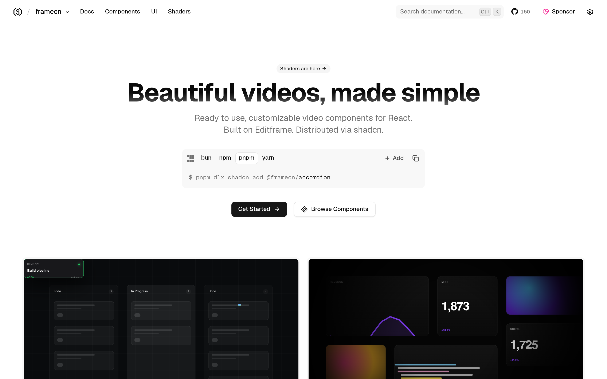

# 视频组件库：framecn

## 直观预览

> framecn 官网首页（1440×900）："Beautiful videos, made simple"——基于 Editframe 的 React 视频组件与 UI 原语（state atoms、transition hooks）。

## 一句话价值

"shadcn，但 for 视频"：基于 Editframe 的 React 视频组件库——视频播放器 UI、视频应用界面组件，不用再手搓播放器。

## AI 选用指南

| 项目 | 选用说明 |
| --- | --- |
| 优先选用条件 | React 项目需要视频播放/展示界面（播放器、视频列表、视频应用），想要现成 UI 原语而非手写。 |
| 不适合或暂缓条件 | 只做视频生成（不管播放界面）时不适合——那是 live-panel 的活；非 React 项目用不上。 |
| 复用方式 | 安装依赖（shadcn registry：视频组件 + UI 原语） |
| 输入与产出 | registry 安装 → 视频组件与 UI 原语（state atoms、transition hooks、主题）。 |
| 首次读取入口 | [本卡](./视频组件库-framecn-2026-10-09.md) →「内容摘要」；官网 https://www.framecn.dev（Concepts 页讲心智模型）。 |
| 同类选择依据 | 库内暂无视频 UI 组件类收藏；与 [live-panel-skill](../../04-工具网站/开源项目/终端风动态架构图生成器-live-panel-skill-2026-10-05.md) 分工：live-panel 是"生成视频"，framecn 是"视频的播放/展示界面"。 |
| 接入前提与待核实项 | MIT；基于 Editframe；未在本机安装验证。 |
| 检索词 | framecn 视频组件 React Editframe 播放器 UI shadcn |

> 核查记录：整理于 2026-10-09，基于官网首页 + llms.txt + GitHub（shadcn-labs/framecn，2026-05-04 创建，收录时 150 stars，MIT）。未安装验证。

## 内容摘要

framecn（https://www.framecn.dev）是 shadcn-labs "*cn" 家族中的视频组件库。

- **技术栈**：基于 Editframe，copy-paste 视频组件 + UI 原语，shadcn CLI 安装。
- **心智模型**：state atoms、transition hooks、theming、core exports（官网 Concepts 页）。
- **仓库**：github.com/shadcn-labs/framecn，2026-05-04 建仓，收录时 150 stars，MIT。

## 为什么值得收藏

1. **和 live-panel 不撞**：live-panel 是"生成视频"，framecn 是"视频播放/展示界面"——一管生产、一管展示。
2. 他做 bot（视频素材）、以后可能做视频类产品，播放器 UI 是现成的。
3. *cn 家族拼图之一，收齐 10 站。

## 未来可以怎么用

- 素材库/终审表里的视频预览播放器。
- 以后做视频类产品/落地页的播放器 UI。
- live-panel 生成的视频，配 framecn 的播放器展示。

## 原始内容 / 链接

- 官网：https://www.framecn.dev
- 仓库：https://github.com/shadcn-labs/framecn（MIT，150 stars，2026-05-04 创建）
- 发现链：X @shadcnlabs 推文（2026-10-07，10 个 *cn 站之一）→ 本站
- 未安装验证。

## 相关联想

- [终端风动态架构图生成器：live-panel-skill](../../04-工具网站/开源项目/终端风动态架构图生成器-live-panel-skill-2026-10-05.md)：生成视频 vs 视频展示界面
- [React 着色器组件库：shadercn](../动效/React着色器组件库-shadercn-2026-10-07.md)：同属 *cn 家族

## 适合反向调用的场景

- React 项目要一个好看的视频播放器，有没有组件库？
- live-panel 生成视频、framecn 做播放界面，怎么分工？
- shadcn-labs 的 *cn 家族里，和视频相关的有哪些？
