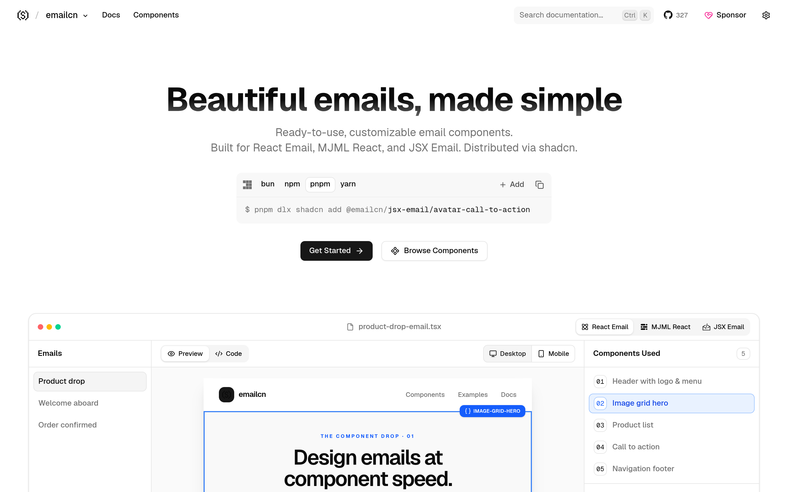

# 邮件组件库：emailcn

## 直观预览

> emailcn 官网首页（1440×900）："Beautiful emails, made simple"——React Email / MJML React / JSX Email 的 copy-paste 组件，带主题与字体。

## 一句话价值

"shadcn，但 for 邮件"：React Email / MJML React / JSX Email 的邮件组件库——通知邮件、营销邮件的模板不用再从零写 HTML table。

## AI 选用指南

| 项目 | 选用说明 |
| --- | --- |
| 优先选用条件 | 需要发设计过的邮件（产品通知、bot 提醒、营销邮件），想要组件化模板而非手写 table 布局。 |
| 不适合或暂缓条件 | 只发纯文本邮件时不适合；已有邮件模板体系且够用时没必要换。 |
| 复用方式 | 安装依赖（emailcn registry：组件/区块/主题/字体）、视觉参考 |
| 输入与产出 | registry 安装 → 可直接用的邮件组件与主题（React Email / MJML React / JSX Email 三选一）。 |
| 首次读取入口 | [本卡](./邮件组件库-emailcn-2026-10-09.md) →「内容摘要」；官网 https://www.emailcn.run。 |
| 同类选择依据 | 库内暂无邮件组件类收藏；与 React Email 官方模板的关系：emailcn 是按 shadcn 哲学包好的组件层。 |
| 接入前提与待核实项 | MIT；三套底座（React Email / MJML React / JSX Email）；未在本机安装验证。 |
| 检索词 | emailcn 邮件组件 React Email MJML 邮件模板 通知邮件 |

> 核查记录：整理于 2026-10-09，基于官网首页 + llms.txt + GitHub（shadcn-labs/emailcn，2026-04-17 创建，收录时 327 stars，MIT）。未安装验证。

## 内容摘要

emailcn（https://www.emailcn.run）是 shadcn-labs "*cn" 家族中的邮件组件库。

- **三套底座**：React Email、MJML React、JSX Email——copy-paste 组件，走 shadcn CLI。
- **内容**：邮件组件、区块、主题、字体 helper，带 changelog。
- **仓库**：github.com/shadcn-labs/emailcn，2026-04-17 建仓，收录时 327 stars，MIT。

## 为什么值得收藏

1. **邮件是他的现有链路**：bot 素材新增邮件提醒、GitHub 热榜邮件都在发，现在是裸文本/简陋模板。
2. **组件化**：通知邮件、日报邮件想做得好看时直接有模板。
3. *cn 家族拼图之一。

## 未来可以怎么用

- bot 素材提醒邮件、晨间简报邮件的美化模板。
- iPhone 库存监控的有货通知邮件（Bark 之外的邮件通道）。
- xiegao2.0 产品化后的用户通知邮件。

## 原始内容 / 链接

- 官网：https://www.emailcn.run
- 仓库：https://github.com/shadcn-labs/emailcn（MIT，327 stars，2026-04-17 创建）
- 发现链：X @shadcnlabs 推文（2026-10-07，10 个 *cn 站之一）→ 本站
- 未安装验证。

## 相关联想

- [React 着色器组件库：shadercn](../动效/React着色器组件库-shadercn-2026-10-07.md)：同属 *cn 家族
- 通知链路：Bark（即时推送）+ emailcn（邮件模板）可搭配

## 适合反向调用的场景

- 产品通知邮件想做得好看，有没有组件库？
- React Email 的模板每次手写太烦，有没有包好的？
- shadcn-labs 的 *cn 家族里，和邮件相关的有哪些？
