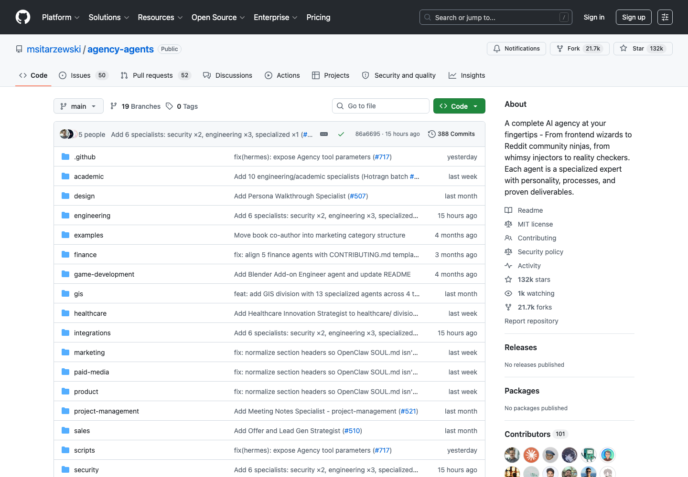

# AI 专业角色 Agent 库：Agency Agents

## 直观预览



> GitHub 首屏截图，直观看它是一个覆盖工程、设计、营销、产品、安全、销售等领域的专业 AI Agent 角色库。本卡已保存源码 zip 和 Git bundle，防止项目变动或删除。

## 一句话价值

一个把“AI 代理应该扮演什么专业角色、遵守什么规则、交付什么结果、如何装进不同工具”系统化整理的大型 Agent 角色库，适合拆成自己的 Codex / Claude Code / Cursor 专业团队能力层。

## AI 选用指南

| 项目 | 选用说明 |
| --- | --- |
| 优先选用条件 | 要设计专业 Agent 的角色、职责、输入输出和评审标准，或规划多角色分工。 |
| 不适合或暂缓条件 | 单步任务不必组建团队；角色 Markdown 不意味着客户端已经支持或安装该 Agent。 |
| 复用方式 | 套用方法；读取角色模板 |
| 输入与产出 | 任务边界与交付物 → 少量角色说明及交接约定。 |
| 首次读取入口 | [本卡](./AI专业角色Agent库-Agency-Agents-2026-07-16.md) →「内容摘要」 |
| 同类选择依据 | Agency Agents 提供角色素材；YAO Meta Skill 用于封装和评估重复能力；Vibe 开发心得用于项目执行纪律。 对照：[Agent Skill 全生命周期工程化框架：YAO Meta Skill](../Skills/Agent-Skill全生命周期工程化框架-YAO-Meta-Skill-2026-08-05.md)、[AI 协作执行心得：Vibe 开发 5 条](../工作流/AI协作执行心得-Vibe开发-2026-07-03.md)。 |
| 接入前提与待核实项 | 先查看目标角色文件，再确认客户端格式；转换与安装脚本需读后使用，收藏中的多 Agent 示例不自动授权并行执行。 |
| 检索词 | Agency Agents agent roster PM QA reviewer 角色提示词 多代理 分工 |

> 选用说明整理于 2026-09-20：适用与比较为基于收藏证据的建议；正文中的版本、数量、价格与功能范围按原收录时间理解。本次未安装或运行所收藏的工具，当前环境安装状态另查。未对外部来源作全量实时复核。

## 内容摘要

`msitarzewski/agency-agents` 官方定位是 `The Agency: AI Specialists Ready to Transform Your Workflow`。它不是单个提示词，也不是只给 Claude Code 用的小集合，而是一套按专业分工组织的 AI agent roster。每个 agent 文件通常包含 frontmatter、身份设定、角色记忆、核心使命、关键规则、工作流、交付物、成功指标和沟通风格。

我本次读取到的仓库里有 17 个主要 division，约 256 个 agent markdown 文件。分类覆盖很广：

- Engineering：52 个，包含 Frontend Developer、Backend Architect、AI Engineer、Code Reviewer、Multi-Agent Systems Architect、SRE、Prompt Engineer、API Platform Engineer 等。
- Design：9 个，包含 UI Designer、UX Researcher、UX Architect、Brand Guardian、Visual Storyteller、Whimsy Injector 等。
- Marketing：36 个，覆盖 SEO、小红书、抖音、B站、知乎、LinkedIn、内容创作、AI citation / AEO 等。
- Specialized：55 个，覆盖 orchestration、automation governance、business strategy、customer success 等泛业务角色。
- 另外还有 Academic、Finance、Game Development、GIS、Healthcare、Paid Media、Product、Project Management、Sales、Security、Spatial Computing、Support、Testing 等。

项目提供多种使用路径：可以直接复制 agent markdown 到 Claude Code / GitHub Copilot，也可以通过 `scripts/convert.sh` 和 `scripts/install.sh` 转换并安装到 Antigravity、Gemini CLI、OpenCode、OpenClaw、Cursor、Aider、Windsurf、Kimi Code、Qwen Code、Codex、Osaurus、Hermes、Mistral Vibe 等工具。README 还提到有桌面 App `Agency Agents`，支持 macOS / Linux / Windows，用于浏览和安装整套 roster。

## 为什么值得收藏

1. **它是一个大型 agent 角色设计样本**  
   很多 agent/prompt 仓库只给几句指令，这个项目的 agent 文件更像“岗位说明书 + 工作流 + 质量标准 + 交付物模板”。这对自己设计 Codex agent、subagent、skill 或 AGENTS 规则很有参考价值。

2. **角色覆盖完整，适合做“AI 专业团队”素材库**  
   它不是只覆盖工程，还覆盖设计、营销、产品、销售、财务、安全、GIS、空间计算、医疗、项目管理等。未来遇到复杂任务时，可以从这里选择多个角色组合，而不是让一个泛用 AI 什么都做。

3. **多工具适配做得很值得研究**  
   仓库提供 integrations 和转换脚本，可面向 Claude Code、Cursor、Codex、Gemini CLI、OpenCode、Aider、Windsurf 等不同工具输出不同格式。这对“同一套 agent 定义如何跨工具复用”很有启发。

4. **有明确的 agent 设计方法论**  
   例如 `Multi-Agent Systems Architect` 强调拓扑、上下文预算、失败模式、权限边界、可观测性和 eval；`UX Architect` 强调 CSS 系统、布局框架、响应式策略和主题系统；`Agents Orchestrator` 强调 PM -> ArchitectUX -> Dev/QA loop -> Integration 的流水线。这些都能拆成自己的执行规则。

5. **适合和现有收藏形成互补**  
   它可以和 `rnskill`、`emilkowalski Skills`、`web-clone`、`ai-website-cloner`、`OpenConnector` 一起组成“Codex 能力素材栈”：角色库、设计判断、网站复刻、连接器网关、多 agent 编排。

## 未来可以怎么用

- **做 Codex 专业模式库**：从里面挑选 `Frontend Developer`、`UX Architect`、`Code Reviewer`、`Product Manager`、`Multi-Agent Systems Architect` 等角色，改写成自己的 Codex agent 规则。
- **做项目启动时的分工模板**：复杂项目可以先选 PM、UX Architect、Frontend、Backend、QA、Content、Growth 等角色，再明确每个角色的输入输出。
- **做提示词质量对照表**：以后写 agent 规则时，不只写“你是某专家”，还要补身份、使命、关键规则、交付物、成功指标、失败边界。
- **做多 agent 工作流参考**：参考 `Agents Orchestrator` 的阶段式流程，把任务拆成项目分析、架构设计、开发、QA、集成验证。
- **做 AI 工具生态研究**：研究它如何把一套 agent markdown 转换成 Cursor rules、Codex TOML、Gemini agents、OpenCode agents、Windsurf rules 等格式。
- **给 glint.red 或自己的工具项目使用**：如果要做一个“按任务自动匹配 AI 专家”的产品，这个库可以作为角色分类、标签、能力描述和安装流程的参考。

## 原始内容 / 链接

- GitHub：[https://github.com/msitarzewski/agency-agents](https://github.com/msitarzewski/agency-agents)
- 桌面 App 官网：[https://agencyagents.app](https://agencyagents.app)
- App Releases：[https://github.com/msitarzewski/agency-agents-app/releases/latest](https://github.com/msitarzewski/agency-agents-app/releases/latest)
- License：MIT
- 当前读取到的最近提交：`86a6695 Add 6 specialists: security ×2, engineering ×3, specialized ×1 (#720)`
- 当前读取到的 agent markdown 数量：约 256 个
- 当前读取到的 division 数量：17 个
- 支持工具：Claude Code、GitHub Copilot、Antigravity、Gemini CLI、OpenCode、OpenClaw、Cursor、Aider、Windsurf、Kimi Code、Qwen Code、Codex、Osaurus、Hermes、Mistral Vibe 等
- 本地 GitHub 截图：[Agency-Agents-2026-07-16.png](../../_附件/收藏预览/Agency-Agents-2026-07-16.png)
- 完整 Git 仓库 bundle：[2026-07-16-agency-agents-full-repo.bundle](../../_附件/项目备份/agency-agents/2026-07-16-agency-agents-full-repo.bundle)
- 源码 zip：[2026-07-16-agency-agents-source.zip](../../_附件/项目备份/agency-agents/2026-07-16-agency-agents-source.zip)
- refs 记录：[2026-07-16-agency-agents-refs.txt](../../_附件/项目备份/agency-agents/2026-07-16-agency-agents-refs.txt)
- 最近提交记录：[2026-07-16-agency-agents-log.txt](../../_附件/项目备份/agency-agents/2026-07-16-agency-agents-log.txt)

### 本地备份恢复方式

```bash
git clone _附件/项目备份/agency-agents/2026-07-16-agency-agents-full-repo.bundle agency-agents
```

或：

```bash
unzip _附件/项目备份/agency-agents/2026-07-16-agency-agents-source.zip -d agency-agents-source
```

## 相关联想

- 和 `rnskill` 的关系：rnskill 更像小而实用的中文 Skill 集合；Agency Agents 是跨行业的角色库和安装体系。
- 和 `emilkowalski Skills` 的关系：emilkowalski 更偏设计工程和前端质感；Agency Agents 覆盖完整团队角色，可以把设计工程角色纳入更大的协作流。
- 和 `OpenConnector` 的关系：OpenConnector 解决 agent 访问外部工具的连接层；Agency Agents 解决 agent 自身的角色分工和行为规范。
- 和 `web-clone` / `ai-website-cloner` 的关系：后两者是具体任务工作流；Agency Agents 可以提供执行这些工作流时的角色拆分。
- 可以继续沉淀一个“我自己的 Codex 专业团队”：只挑 10-20 个最常用角色，避免一次性安装 256 个造成选择负担。

## 适合反向调用的场景

- 我想给 Codex 增加专业角色，有没有现成 agent 设计参考？
- 我想做一个多 agent 工作流，应该怎么拆 PM、架构、开发、QA、营销、设计角色？
- 我想把 Claude Code / Cursor / Codex / Gemini 的 agent 规则统一管理，有没有跨工具适配样本？
- 我想学习高质量 agent markdown 应该包含哪些部分。
- 我想做一个“AI 专家团队”产品或工具，有没有角色分类和能力描述参考？
- 我想从收藏里挑几个适合项目开发、UI 设计、内容营销的 agent 模板。
