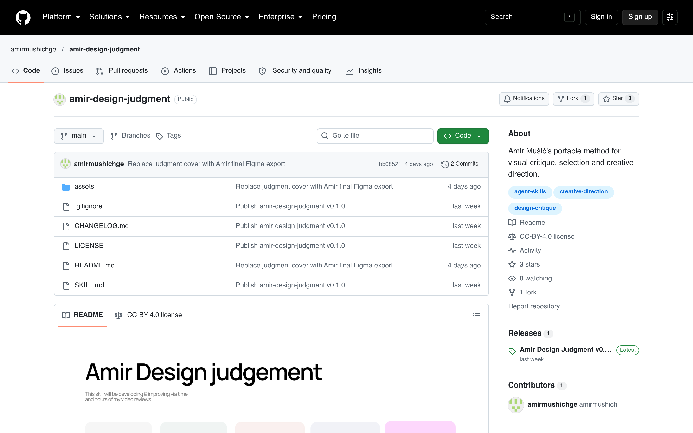

# AI 设计评审 Skill：Amir Design Judgment

## 直观预览

> GitHub 仓库页（1440×900）：amirmushichge/amir-design-judgment，v0.1.0，SKILL.md，CC-BY-4.0，topics：agent-skills / creative-direction / design-critique。

## 一句话价值

把"设计师的评审眼光"装进 SKILL.md：前大厂品牌设计师把自己的视觉评审方法提炼成可移植文件——看得见的细节 → 感知效果 → 与任务/品牌的契合度 → 决策 → 下一步动作；给有视觉能力的 AI 助手用，评审设计稿、多方案选优、指导改稿。

## AI 选用指南

| 项目 | 选用说明 |
| --- | --- |
| 优先选用条件 | 需要 AI 评审视觉稿（海报、落地页、封面）、多方案二选一、改稿方向指导时；想给 Agent 补"审美判断"能力。 |
| 不适合或暂缓条件 | 纯文字/代码评审用不上；v0.1 早期版本，效果取决于 assistant 和 brief 质量，不保证"作者本人 verdict"。 |
| 复用方式 | 安装 Skill（`~/.agents/skills/amir-design-judgment/SKILL.md`）、套用方法 |
| 输入与产出 | SKILL.md + 作品 + 目标/受众/品牌规则 → 评审意见：保留什么、先改什么（按优先级）。 |
| 首次读取入口 | [本卡](./AI设计评审Skill-Amir-Design-Judgment-2026-10-09.md) →「内容摘要」；仓库 https://github.com/amirmushichge/amir-design-judgment（SKILL.md 可直读）。 |
| 同类选择依据 | 库内 Skill：hairline/live-panel（执行型）vs 本 skill（评审判断型）；与 [Design with AI 方法论卡](./AI设计选型方法论-Design-with-AI-2026-10-09.md)的关系：那篇是方法论，这篇是方法论落地的 skill 文件。 |
| 接入前提与待核实项 | CC BY 4.0（署名可用商用）；需要 vision-capable 的助手；v0.1，评审质量待实测。 |
| 检索词 | Amir Design Judgment 设计评审 skill SKILL.md 视觉评审 design critique |

> 核查记录：整理于 2026-10-09，基于仓库 README 全文 + SKILL.md 用法说明。未实际安装测试评审效果。

## 内容摘要

Amir Design Judgment（https://github.com/amirmushichge/amir-design-judgment）是 AmirMušić 把自己的设计评审方法做成可移植 Skill 的开源项目，v0.1.0。

- **核心链路**：看得见的细节 → 感知效果 → 与任务和品牌的契合度 → 决策 → 下一步动作。先看整体，再看能改变决策的细节，最后回到整体。
- **覆盖面**：构图、字体排版、图像工艺、品牌表达、动效；v0.1  distilled 自作者的真实评审记录。
- **用法**：把 SKILL.md 丢给有视觉能力的助手（Codex 放 `~/.agents/skills/amir-design-judgment/SKILL.md`），附上作品 + 目标/受众/品牌规则。
- **三种 prompt 模式**：评审一张稿、多方案选优、对照上一版指导改稿（"改动解决了主要问题吗？有没有顾此失彼？下三个动作按优先级"）。
- **仓库**：2026-10-02 建仓，收录时 3 stars，CC BY 4.0（署名可商用改编）。

## 为什么值得收藏

1. **"规范型 skill"的活例子**：[Design with AI 卡](./AI设计选型方法论-Design-with-AI-2026-10-09.md)里讲的 DESIGN_SKILL.md 理念，这就是落地文件——不是讲道理，是真有一个 SKILL.md 能装。
2. **补他的评审能力**：他让 AI 生成视觉（封面、海报、落地页）越来越多，缺的正是"谁来评审"——这个 skill 就是评审员。
3. **可直接装**：单文件 SKILL.md，Codex 路径都写好了，零成本试用。

## 未来可以怎么用

- bot 封面/海报生成后，用这个 skill 做 AI 评审再发布。
- xiegao2.0 出配图时，多方案让它选优。
- 对照它的"细节→感知→契合度→决策→动作"链路，训练自己的设计评审 prompt。

## 原始内容 / 链接

- 仓库：https://github.com/amirmushichge/amir-design-judgment（CC BY 4.0，3 stars，2026-10-02 创建）
- SKILL.md 直链：https://github.com/amirmushichge/amir-design-judgment/releases/latest/download/SKILL.md
- 出处：X @amirmushich《Design with AI: Which models are best?》
- 未实际测试评审效果。

## 相关联想

- [AI 设计选型方法论：Design with AI（AmirMušić）](./AI设计选型方法论-Design-with-AI-2026-10-09.md)：方法论 → 落地 skill 文件
- [概念品牌手册：Luka brandbook](../../01-界面设计/灵感库/概念品牌手册-Luka-brandbook-2026-10-09.md)：同一作者的品牌手册，可作为评审时的品牌规则输入
- [等距线框插画生成 Skill：hairline](../../01-界面设计/动效/等距线框插画生成Skill-hairline-2026-10-07.md)：执行型 skill vs 评审型 skill

## 适合反向调用的场景

- AI 生成了几版海报/封面，让 AI 自己评审选优？
- 有没有现成的"设计评审" skill？
- "规范型 skill"长什么样，有没有实例？
