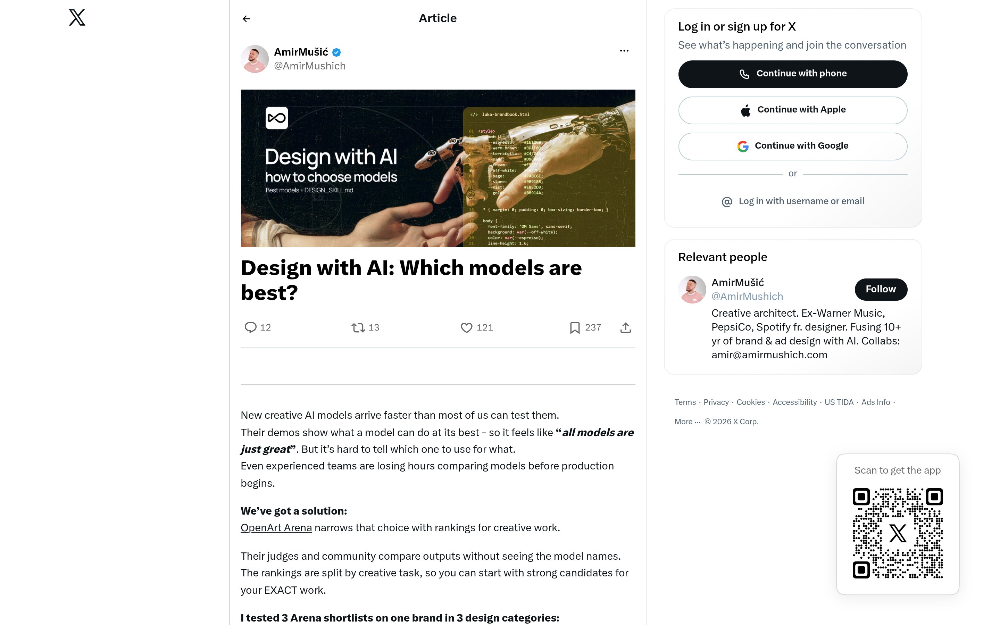

# AI 设计选型方法论：Design with AI（AmirMušić）

## 直观预览

> X 长文《Design with AI: Which models are best?》（1440×900 截图）：作者 AmirMušić（@AmirMushich，认证账号，前 Warner Music / PepsiCo / Spotify 设计师），2026-10-07 发布。封面："Design with AI / how to choose models / Best models + DESIGN_SKILL.md"。

## 一句话价值

"别再为设计挑模型，先建一个设计技能"：前大厂品牌设计师的方法论——用 OpenArt Arena 按创意任务盲测排名选模型；更深一层是 DESIGN_SKILL.md：把品牌/设计规范写成 skill 文件，由它指挥调度各模型干活（接近 Claude skills 理念）。

## AI 选用指南

| 项目 | 选用说明 |
| --- | --- |
| 优先选用条件 | 需要为具体创意任务（广告图、产品图、动效、剪辑）选 AI 生图/视频模型时，先查 OpenArt Arena 的任务榜；想把"品牌设计规范"沉淀为可复用的 Skill 时，参考 DESIGN_SKILL.md 思路。 |
| 不适合或暂缓条件 | 只做纯文字/代码任务时用不上；已有固定模型工作流且效果稳定时没必要换。 |
| 复用方式 | 使用工具（OpenArt Arena 查榜）、套用方法（DESIGN_SKILL.md 模式） |
| 输入与产出 | 创意任务 → Arena 任务榜 → 1-2 个候选模型 → 免费版实测；品牌规范 → DESIGN_SKILL.md → skill 指挥多模型协作。 |
| 首次读取入口 | [本卡](./AI设计选型方法论-Design-with-AI-2026-10-09.md) →「内容摘要」；原文 https://x.com/amirmushich/status/2107862807290974645；榜单 https://openart.ai（Arena）。 |
| 同类选择依据 | 库内 Skill 类：hairline / live-panel / fluid-functionalism 都是"执行型 skill"；这篇讲的是"规范型 skill"（DESIGN_SKILL.md 存品牌规范、指挥模型）——两种 skill 分工不同。 |
| 接入前提与待核实项 | OpenArt Arena 2026-09-15 上线，榜单随模型迭代更新，选型时以最新榜为准；DESIGN_SKILL.md 为作者方法论，无开源实现。 |
| 检索词 | Design with AI OpenArt Arena DESIGN_SKILL.md 模型选型 创意任务排名 AmirMushich |

> 核查记录：整理于 2026-10-09，基于 X 原文全文（浏览器实读，未登录）+ OpenArt Arena 官方介绍（openart.ai/blog/what-is-openart-arena）交叉验证。评论区被登录墙挡住，未读。

## 内容摘要

AmirMušić（前 Warner Music / PepsiCo / Spotify 品牌设计师）的 X 长文，解决"创意 AI 模型太多测不过来"的问题。

**问题**：新模型出得比人测得快；官方 demo 只展示最佳状态，让人觉得"每个模型都很棒"，但实际不知道哪个适合哪种活。

**方案一：OpenArt Arena**（openart.ai 的公开榜单）
- 按创意任务分榜排名：广告、影视、动画、动效、产品图、平面设计、剪辑、唇形同步等，不搞"一个总分"。
- 盲测：28 位专家评委 + 约 1000 名 tastemaker，不看模型名只看输出，按任务标准打分；Bradley–Terry 模型算分，带置信区间。
- 2026-09-15 上线；首期：视频榜 Seedance 2.5 领先，剪辑 Wan 3.0 第一；图像榜平面设计/修图 GPT Image 2 第一，综合 Seedream 5.0 Pro 第一。
- 作者实测：用 3 个 Arena 短名单给同一品牌做 3 类设计，对比验证。

**方案二（更深）：Design with AI Playbook**
- 核心观点：与其"为设计挑选模型"，不如先构建一个"设计技能"——用 DESIGN_SKILL.md 描述品牌/设计规范，由这个 skill 调用并指挥各类模型工作。
- 理念最接近 Anthropic 的 Claude skills。

**操作步骤**：先看 Arena 排名为每个任务挑 1-2 个模型 → 在 Arena 免费版里实测 → 遇到失败案例再针对性研究。

## 为什么值得收藏

1. **DESIGN_SKILL.md 正中他的工作流**：他现在就在造各种 skill（hairline、live-panel、fluid-functionalism）——这篇把"规范型 skill"讲透了：skill 存的不是执行步骤，而是品牌/设计规范，由 skill 去指挥模型。这是他 skill 体系里缺的一块拼图。
2. **模型选型有标尺了**：以后做 bot 封面、AI 生图需求，不用再凭感觉试模型，先查 Arena 任务榜。
3. **"路由问题"视角**：选模型不是"哪个最强"，而是"哪个适合这个任务"——和他"工具不替我做判断、只做信息供给"的哲学一致。

## 未来可以怎么用

- 给 xiegao2.0 / bot 做一个 DESIGN_SKILL.md：把"温暖治愈"的视觉规范写进去，让 skill 指挥生图模型。
- 需要 AI 生图时（封面、配图），先查 OpenArt Arena 对应任务榜再选模型。
- 把"规范型 skill"（存规范、指挥模型）和"执行型 skill"（hairline 那种直接干活）的分工写进他的 skill 方法论。

## 原始内容 / 链接

- 原文：https://x.com/amirmushich/status/2107862807290974645（X 长文，2026-10-07）
- OpenArt Arena：https://openart.ai（榜单介绍：https://openart.ai/blog/what-is-openart-arena/）
- 作者：AmirMušić @AmirMushich（x.com/amirmushich）

## 相关联想

- [等距线框插画生成 Skill：hairline](../../01-界面设计/动效/等距线框插画生成Skill-hairline-2026-10-07.md)：执行型 skill vs 规范型 skill（DESIGN_SKILL.md）
- [终端风动态架构图生成器：live-panel-skill](../../04-工具网站/开源项目/终端风动态架构图生成器-live-panel-skill-2026-10-05.md)：同上，执行型
- [流体功能主义组件库：Fluid Functionalism](../../01-界面设计/动效/流体功能主义组件库-Fluid-Functionalism-2026-10-09.md)：自带 Agent Skill，可对比两种 skill 设计

## 适合反向调用的场景

- 做 AI 生图/视频，不知道哪个模型适合具体任务？
- "规范型 skill"和"执行型 skill"有什么区别？
- 有没有按创意任务排名的 AI 模型榜单？
