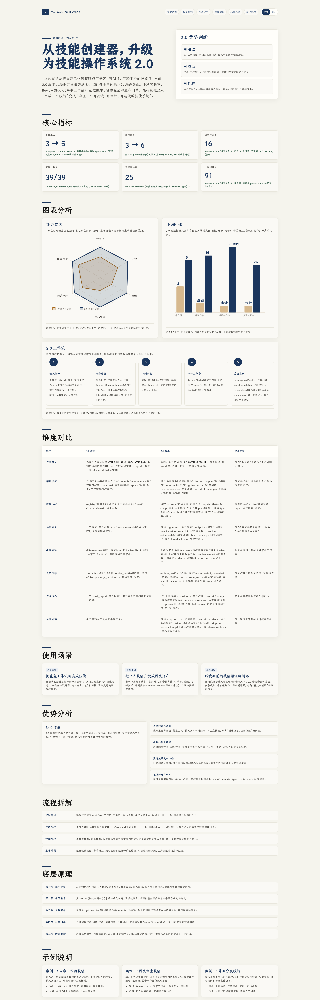

# Agent Skill 全生命周期工程化框架：YAO Meta Skill

## 直观预览

> 项目内置的 1.0 与 2.0 中文对比预览，展示从 Skill 创建器扩展到“Skill 操作系统”的能力、评估、发布门禁与持续迭代链路。

## 一句话价值

把零散的工作流、提示词或 SOP 变成可复用 Agent Skill，并用意图澄清、结构拆分、编译适配、评测、发布门禁和使用反馈覆盖其完整生命周期的工程化框架。

## AI 选用指南

| 项目 | 选用说明 |
| --- | --- |
| 优先选用条件 | 已有重复工作流，需要做成可触发、可评估、可维护或跨客户端分发的 Skill。 |
| 不适合或暂缓条件 | 一次性任务或简单提示词不默认套完整治理框架。 |
| 复用方式 | 读取 Skill；套用方法 |
| 输入与产出 | 重复任务、输入输出、失败样例 → Skill 结构、评测与发布检查。 |
| 首次读取入口 | [本卡](./Agent-Skill全生命周期工程化框架-YAO-Meta-Skill-2026-08-05.md) →「内容摘要」；随后读取[本地历史资料](../../_附件/项目备份/yao-meta-skill/SKILL-2026-08-05.md) |
| 同类选择依据 | YAO 管能力生命周期；Agency Agents 提供角色内容；Vibe 开发心得约束项目执行。 对照：[AI 专业角色 Agent 库：Agency Agents](../Agents规则/AI专业角色Agent库-Agency-Agents-2026-07-16.md)、[AI 协作执行心得：Vibe 开发 5 条](../工作流/AI协作执行心得-Vibe开发-2026-07-03.md)。 |
| 接入前提与待核实项 | 本地备份只证明历史流程；先选适当复杂度再核查脚本依赖与目标客户端。未确认安装状态。 |
| 检索词 | YAO Meta Skill Skill IR scaffold 触发评测 生命周期 跨平台 |

> 选用说明整理于 2026-09-20：适用与比较为基于收藏证据的建议；正文中的版本、数量、价格与功能范围按原收录时间理解。本次未安装或运行所收藏的工具，当前环境安装状态另查。未对外部来源作全量实时复核。

## 内容摘要

`yaojingang/yao-meta-skill` 是一个面向 Agent Skill 的元 Skill。它不只生成 `SKILL.md`，还尝试把一个可复用能力当作需要维护的工程资产：先确认任务、输出、排除项、约束和标准，再按复杂度选择 Scaffold、Production、Library 或 Governed 模式。

核心入口保持精简：通过 frontmatter `description` 路由，把具体方法放在 `references/`，逻辑放在 `scripts/`，证据和评审页放在 `reports/`。其方法强调“一次性任务不必创建 Skill”，必须存在重复使用价值和明确输出契约才进入封装。

对于生产、共享或高信任场景，项目提供 Skill IR、面向 OpenAI / Claude / 通用 Agent Skills / VS Code 的编译适配、触发与输出评测、基准可复现检查、信任与权限检查、包验证、安装模拟、Review Studio、版本升级检查和采用漂移报告。它还区分“已获得的证据”和“缺失证据”，避免把计划中的人工或外部验证写成已证实的结论。

项目主语言为 Python，MIT 许可。收藏时 GitHub 显示 2,234 Stars、213 Forks，默认分支为 `main`；保存的主分支 HEAD 为 `e15472e1f5dc`（2026-07-16）。

## 为什么值得收藏

1. 把 Skill 从一份长提示词提升为可维护的能力包，明确入口、资源、脚本、评测和报告各自的边界。
2. “轻量优先”的原则有实际价值：一次性任务不强行 Skill 化，风险和复用需求增加时才逐层增加结构与门禁。
3. 触发评测、输出质量、安装模拟、权限探测和证据账本，适合作为团队共享 Skill 的发布前检查维度。
4. 以平台无关的 Skill IR 配合目标编译器，提供了避免被单一 Agent 客户端格式锁定的参考路径。
5. 对中文 Agent Skill 设计尤其有用：入口文档内已明确中文对话与澄清风格，同时保留可审计的工程约束。

## 未来可以怎么用

- 把稳定重复的工作流，例如素材收录、项目启动、网页复刻、发布检查或周报生成，先写成任务与输出契约，再判断是否值得封装为 Skill。
- 给共享 Skill 设置最小发布门槛：触发词是否准确、输出是否可验收、权限是否显式、安装是否能模拟、声明是否有证据支撑。
- 设计跨 Codex、Claude Code 等客户端复用的能力时，先抽出平台无关的语义和资源，再补各平台适配层。
- 借鉴“Skill 采用漂移”思路，定期根据真实失败模式和使用反馈收敛规则，而不是持续堆叠指令。
- 对小型个人 Skill 只取其轻量方法；不必照搬完整报告、遥测或治理结构，以免流程成本超过收益。

## 原始内容 / 链接

- GitHub：[yaojingang/yao-meta-skill](https://github.com/yaojingang/yao-meta-skill)
- 项目说明：`YAO = Yielding AI Outcomes`，用于可复用 Agent Skill 的工程、评估、治理和可移植性。
- 作者：`yaojingang` / Yao Team
- 默认分支：`main`
- 收藏时 HEAD：`e15472e1f5dc`（2026-07-16，`Merge pull request #13 from apple-ouyang/codex/avoid-nested-skill-discovery`）
- 收藏时 Star / Fork：2,234 / 213
- 许可证：MIT
- 本地预览：[YAO元Skill-版本对比预览-2026-08-05.png](../../_附件/收藏预览/YAO元Skill-版本对比预览-2026-08-05.png)
- README 快照：[README-2026-08-05.md](../../_附件/项目备份/yao-meta-skill/README-2026-08-05.md)
- Skill 快照：[SKILL-2026-08-05.md](../../_附件/项目备份/yao-meta-skill/SKILL-2026-08-05.md)
- LICENSE 快照：[LICENSE-2026-08-05](../../_附件/项目备份/yao-meta-skill/LICENSE-2026-08-05)
- 源码快照：[yao-meta-skill-source-2026-08-05.zip](../../_附件/项目备份/yao-meta-skill/yao-meta-skill-source-2026-08-05.zip)
- 远程元数据快照：[refs-2026-08-05.json](../../_附件/项目备份/yao-meta-skill/refs-2026-08-05.json)
- 收藏状态：只收藏，未安装。

## 相关联想

- 与 [[AI专业角色Agent库-Agency-Agents-2026-07-16]] 形成互补：Agency Agents 提供可选角色库，YAO Meta Skill 提供把高频角色或工作流打造成可评测、可发布能力包的方法。
- 与 [[网站复刻真源码优先方法论-web-clone-2026-07-09]] 形成结构参考：后者是明确领域的执行 Skill，前者可用来审视该类 Skill 的触发、输出、证据和维护边界。
- 可将 Vault 中反复出现的“卡片生成 + 预览 + 索引 + Git 同步”提炼成专用 Skill，但应先定义哪些输入和失败场景需要人确认。

## 适合反向调用的场景

- 我有一套重复工作流，什么时候值得做成 Agent Skill？
- 如何给团队共享的 Skill 设计触发评测和输出验收？
- 我想让一个 Skill 同时适配 Codex 和 Claude Code，应如何拆分结构？
- 我需要 Skill 的发布、安装、权限和证据检查清单。
- 收藏里有没有适合把流程资产化、建立 Skill 治理体系的参考？
