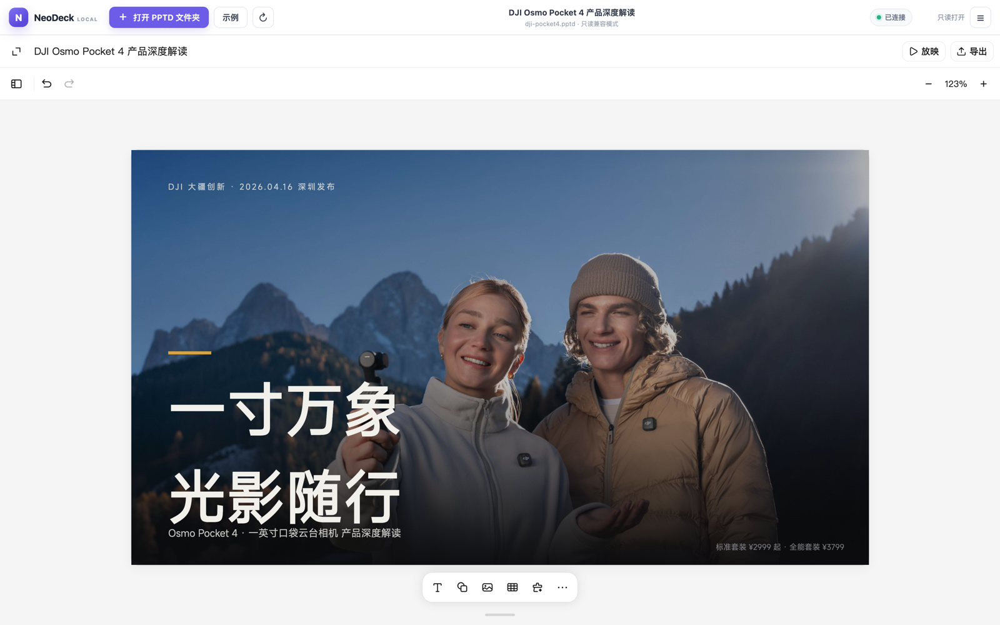

# Kimi Slides 兼容 PPT 生成 Skill：open-kimi-ppt

## 直观预览



> 项目提供的 NeoDeck Local 编辑器界面：打开一个 PPTD 项目文件夹后，可在浏览器中编辑并导出 PPTX。

## 一句话价值

一个面向 Codex、Claude Code、Cursor 等 Agent 的非官方 Kimi Slides 兼容 Skill，以 YAML 版 PPTD 描述演示文稿，默认同时交付可继续编辑的 PPTD 项目与可使用的 PPTX 成品。

## 内容摘要

`Binaryify/open-kimi-ppt-skill` 让兼容 `SKILL.md` 的 Agent 创建、编辑、复刻、读取和导出演示文稿。它不只是导出单一文件：默认产物包括一个完整 PPTD 项目目录和对应 PPTX。PPTD 是面向 Agent 的 YAML 演示文稿 DSL，保留主题、页面布局、元素位置和资源引用；每页自包含，便于局部修改。

项目提供本地编辑器命令，默认只监听 `127.0.0.1:55173`。浏览器需由用户明确选择并授权完整项目文件夹，写入范围限制在 `.pptd` 与 `.page` 文件；但编辑器本身、远程图片或字体仍可能访问对应的外部服务。

收藏时默认分支为 `main`，HEAD 为 `995e76c6c2a8213dc8eaadf05e4d56a0f71bf7c4`，GitHub API 显示 490 Stars、144 Forks，许可证为 MIT。本次只收藏与备份，**未安装、未运行**该 Skill。

## 为什么值得收藏

1. 把“生成内容”和“可编辑交付”一起处理：完整 PPTD 项目可持续修改，PPTX 用于直接交付。
2. PPTD 比直接拼 OOXML 或只生成整页图片更适合 Agent 迭代，同时保留文本、形状和图片的二次编辑空间。
3. Skill 的生成、视觉质检、本地编辑、导出、权限边界与文件交付规则很完整，适合拆解为复杂 Agent 工作流样本。
4. 已保存源码 zip、完整 Git bundle、README、核心 Skill、PPTD 规范和校验清单；即使原项目删除，也可以从 Vault 离线恢复。

## 详细使用教程

### 1. 安装前检查

先确认 Node.js 为 18 或更高版本：

```bash
node --version
```

只选择一种安装方式。默认目录是 `~/.agents/skills/open-kimi-ppt`，大多数兼容 Agent 可共享该目录；不要一开始同时安装到 Codex、Claude Code、Cursor 的多个目录，否则升级时容易混乱。

### 2. 安装

让已具备安装权限的 Agent 执行安装，或在终端运行：

```bash
npx open-kimi-ppt-skills install
```

只有 Agent 不识别默认目录时才指定目标目录，例如 Codex：

```bash
npx open-kimi-ppt-skills install --target ~/.codex/skills
```

安装完成后，让 Agent 明确读取该 Skill；不要把仓库 README 当作已安装成功的证据。

### 3. 用结构化需求生成 PPT

Prompt 至少交代主题、受众、页数、目标、风格和素材限制。可直接使用下面的骨架：

```text
使用 open-kimi-ppt 制作一份关于【主题】的【页数】页 PPT。
受众是【受众】，目标是【汇报/路演/培训/决策】。
视觉风格为【例如：深色科技、极简留白、杂志排版】。
素材来源【仅使用我提供的文件 / 可检索公开素材】。
参考【附件中的 PPTX / 截图 / 品牌规范】的配色、字体和版式。
交付完整可编辑 PPTD 项目及对应 PPTX；导出前逐页检查文字溢出、遮挡、出界、对比度和图片比例。
```

风格或参考模板不可省略：只给主题会让 Agent 自由发挥，稳定性明显较低。使用第三方图片、字体或模板时，另行确认授权范围。

### 4. 验收交付物是否完整

默认项目应保持如下结构，而不是只拿一个 `.pptd` 文件：

```text
deck/
  deck.pptd
  pages/
    *.page
  media/
  deck.pptx
```

验收时确认 `deck.pptd`、`pages/` 与被引用的 `media/` 同在；再打开 `deck.pptx` 检查能否查看、文本/形状能否编辑。对每页依次确认图片未变形、文字未压住主体、元素未出界、对比度足够、层级/页边距一致、长文本未溢出、无异常遮挡。

### 5. 本地编辑与手动导出

启动编辑器：

```bash
npx open-kimi-ppt-skills serve --open
```

默认地址是 [http://127.0.0.1:55173/](http://127.0.0.1:55173/)。在编辑器中选择完整 PPTD 项目文件夹。若需改端口：

```bash
npx open-kimi-ppt-skills serve --port 56000
```

需要可写访问时使用 Chromium 系浏览器；不支持 File System Access API 的浏览器会退回只读文件夹上传。完成后用 `Ctrl+C` 停止本地服务。

### 6. 更新而不影响既有项目

升级已安装 Skill 时使用：

```bash
npx open-kimi-ppt-skills@latest install --force
```

如果最初使用 `--target`，更新也要带上同一目标路径。该命令更新 Skill 文件，不应替代对既有 PPTD/PPTX 项目的独立备份；升级后用一个小样本重新导出并做视觉验收。

### 7. 安全、兼容与许可边界

- 它不是 Kimi 或 Moonshot AI 的官方项目，依赖公开前端资源与兼容协议，Kimi 更新后可能失效。
- PPTD 会交给公开 Kimi 网页编辑器处理；远程图片、字体和编辑器资源可能产生网络请求。涉密内容不要默认上传或引用外部资源。
- 本地服务仅监听回环地址，但“本地监听”不等于离线导出。
- 即使 PPTX ZIP 校验通过，也要在 PowerPoint、WPS 或 Keynote 的目标环境中抽查动画、字体和版式；不同软件并非完全一致。
- 源码遵循 MIT 许可证；Kimi、Kimi Slides 商标和服务条款不随该许可证转移。

## 本地备份与恢复教程

为避免项目删除导致无法追溯，本次已保存到 [项目备份目录](../../_附件/项目备份/open-kimi-ppt-skill/)。核心恢复顺序如下。

1. 先进入备份目录并校验：`shasum -a 256 -c SHA256SUMS-2026-08-06.txt`。
2. 优先恢复完整历史：`git clone open-kimi-ppt-skill-main-2026-08-06.bundle open-kimi-ppt-skill`。
3. 进入恢复目录后核对：`git rev-parse HEAD` 应为 `995e76c6c2a8213dc8eaadf05e4d56a0f71bf7c4`，`git status` 应干净。
4. 只需浏览源码时，可执行 `unzip -t open-kimi-ppt-skill-main-2026-08-06.zip` 后解压；zip 不保留可直接操作的 Git 历史，不能替代 bundle。
5. 恢复后如需转存到自己的远程仓库，先加一个新远程再推送 `main`；完整命令与注意事项见 [恢复说明](../../_附件/项目备份/open-kimi-ppt-skill/恢复说明-2026-08-06.md)。

## 原始内容 / 链接

- GitHub：[Binaryify/open-kimi-ppt-skill](https://github.com/Binaryify/open-kimi-ppt-skill)
- README 快照：[README-2026-08-06.md](../../_附件/项目备份/open-kimi-ppt-skill/README-2026-08-06.md)
- English README 快照：[README_EN-2026-08-06.md](../../_附件/项目备份/open-kimi-ppt-skill/README_EN-2026-08-06.md)
- 核心 Skill 快照：[SKILL-2026-08-06.md](../../_附件/项目备份/open-kimi-ppt-skill/SKILL-2026-08-06.md)
- PPTD 格式规范：[reference-pptd-2026-08-06.md](../../_附件/项目备份/open-kimi-ppt-skill/reference-pptd-2026-08-06.md)
- 许可证快照：[LICENSE-2026-08-06.txt](../../_附件/项目备份/open-kimi-ppt-skill/LICENSE-2026-08-06.txt)
- 完整 Git 恢复包：[open-kimi-ppt-skill-main-2026-08-06.bundle](../../_附件/项目备份/open-kimi-ppt-skill/open-kimi-ppt-skill-main-2026-08-06.bundle)
- 源码 zip：[open-kimi-ppt-skill-main-2026-08-06.zip](../../_附件/项目备份/open-kimi-ppt-skill/open-kimi-ppt-skill-main-2026-08-06.zip)
- 校验清单：[SHA256SUMS-2026-08-06.txt](../../_附件/项目备份/open-kimi-ppt-skill/SHA256SUMS-2026-08-06.txt)
- 恢复说明：[恢复说明-2026-08-06.md](../../_附件/项目备份/open-kimi-ppt-skill/恢复说明-2026-08-06.md)
- 收藏状态：只收藏与备份，未安装。

## 相关联想

- 与 [[可编辑演示文稿生成Skill-DashiAI-PPT-2026-07-08]] 形成两条 PPT 生产路径：DashiAI PPT 更偏 HTML 演示生成与编辑，open-kimi-ppt 更强调 PPTD 中间格式、原生 PPTX 与 Kimi 兼容编辑器。
- 可把它和 [[单色数据可视化Skill-Lieflat-Charts-2026-07-23]] 串成“研究/运营数据 -> 图表 -> 结构化演示 -> PPTD/PPTX 交付”的内容生产线。
- 其“默认交付可编辑源项目 + 最终成品”的规则也适合成为其他 Agent 生成资产的标准，例如视频工程、网页源代码和设计源文件不能只交付导出物。

## 适合反向调用的场景

- 我需要一个能用 Codex 生成、又能在 PowerPoint 中继续修改的 PPT 工作流。
- 我想把一份研究报告或产品方案变成 PPT，怎样给 Agent 更稳定的需求？
- 我想用浏览器继续编辑 PPTD 项目并手动导出 PPTX。
- 我需要一套生成 PPT 后的视觉验收清单。
- 原 GitHub 项目消失后，如何从 Vault 里的 Git bundle 和 zip 恢复？
